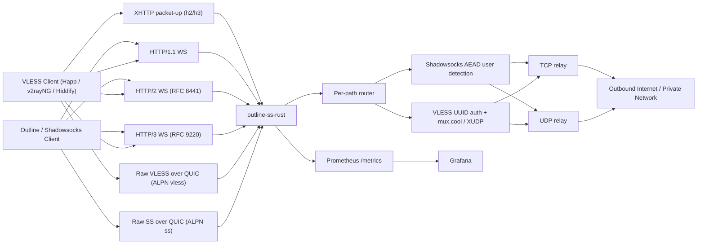

<p align="center">
  
</p>

# outline-ss-rust

`outline-ss-rust` is a production-oriented Rust implementation of a WebSocket-based Shadowsocks relay inspired by `outline-ss-server`.

It is designed for deployments that need modern WebSocket transports, multi-user routing, per-user policy controls, and observability without carrying the full Outline management plane.

*Русская версия: [README.ru.md](README.ru.md)*

## Overview

This server accepts Shadowsocks AEAD or VLESS traffic encapsulated inside WebSocket binary frames and relays it to arbitrary TCP or UDP destinations.

It supports:

- WebSocket over HTTP/1.1
- WebSocket over HTTP/2 via RFC 8441 Extended CONNECT
- WebSocket over HTTP/3 via RFC 9220 Extended CONNECT
- Shadowsocks AEAD (including SS-2022) over WebSocket — TCP and UDP
- VLESS over WebSocket — TCP, UDP, and mux.cool with XUDP per-packet addressing (xray / Happ / Hiddify-compatible)
- VLESS over XHTTP, both `packet-up` (long-lived GET + sequenced POSTs) and `stream-one` (single full-duplex POST) — selected per-session by `?mode=` in the request URL, with `X-Padding` and SSE-style masquerade headers; designed for CDNs that block WebSocket upgrades (xray / sing-box / Hiddify-compatible)
- Cross-transport session resumption that also covers XHTTP — a parked VLESS upstream re-attaches across an XHTTP reconnect, including a carrier switch (h3→h2 fallback)
- Multiple users with independent Shadowsocks passwords and/or VLESS UUIDs
- Per-user cipher selection
- Per-user TCP, UDP, and VLESS WebSocket paths
- Per-user Linux `fwmark` on outbound sockets
- IPv4 and IPv6 listeners, upstream targets, and client URLs
- Prometheus metrics and a ready-made Grafana dashboard
- Outline-compatible dynamic access key generation for Shadowsocks WebSocket clients and `vless://` link generation for VLESS clients
- Optional built-in TLS for the HTTP/1.1 and HTTP/2 listener
- Optional built-in QUIC/TLS listener for HTTP/3

## Supported Features

| Area | Status | Notes |
| --- | --- | --- |
| Shadowsocks AEAD TCP | Supported | Stream mode over WebSocket binary frames |
| Shadowsocks AEAD UDP | Supported | One UDP packet per WebSocket binary frame |
| Ciphers | Supported | `aes-128-gcm`, `aes-256-gcm`, `chacha20-ietf-poly1305`, `2022-blake3-aes-128-gcm`, `2022-blake3-aes-256-gcm`, `2022-blake3-chacha20-poly1305` |
| Multi-user | Supported | Automatic user identification by successful decryption |
| Per-user cipher | Supported | Each user may override the global default |
| Per-user WebSocket paths | Supported | Independent `ws_path_tcp` and `ws_path_udp` |
| Per-user `fwmark` | Supported | Linux only, requires privileges for `SO_MARK` |
| HTTP/1.1 WebSocket | Supported | Plain `ws://` or `wss://` |
| HTTP/2 WebSocket | Supported | RFC 8441 Extended CONNECT |
| HTTP/3 WebSocket | Supported | RFC 9220 Extended CONNECT |
| Raw VLESS over QUIC | Supported | ALPN `vless`; bidi stream per TCP target, QUIC datagrams for UDP with session_id prefix |
| Raw Shadowsocks over QUIC | Supported | ALPN `ss`; bidi stream = one SS-AEAD TCP session, QUIC datagrams = SS-UDP packets |
| Built-in TLS for h1/h2 | Supported | Optional, on the main TCP listener |
| Built-in QUIC/TLS for h3 | Supported | Optional, on `h3_listen` (may reuse the `listen` port over UDP); ALPN list is configurable |
| IPv6 | Supported | Listener, upstream resolution, and access key generation |
| Prometheus metrics | Supported | Dedicated listener and low-cardinality labels |
| Grafana dashboard | Supported | Ready-made JSON dashboard included |
| Outline dynamic access keys | Supported | `ssconf://` + generated YAML |
| VLESS over WebSocket | Supported | TCP, UDP, mux.cool with XUDP per-packet addressing (xray/happ/hiddify-compatible), up to 8 concurrent sub-connections; available over HTTP/1.1, HTTP/2, and HTTP/3 |
| VLESS over XHTTP packet-up | Supported | Long-lived GET + sequenced POSTs sharing one HTTP/2 (or HTTP/3) connection; reorder buffer absorbs out-of-order POSTs; downlink ring survives mid-flight GET drops (CDN ~100 s cut-off); `X-Padding` + SSE-style masquerade headers (`text/event-stream`, `Cache-Control: no-store`, `X-Accel-Buffering: no`) |
| VLESS over XHTTP stream-one | Supported | Single bidirectional request: request body = uplink, response body = downlink. Selected by `?mode=stream-one` in the request URL on the same base path. Requires h2 or h3 (h1 returns 505); on h3 the bidi stream is split via `RequestStream::split` so uplink and downlink halves run on dedicated tasks |
| XHTTP cross-transport session resumption | Supported | Server mints `X-Outline-Session` on first contact, parks the VLESS upstream when the carrier drops, and re-attaches on the next `X-Outline-Resume` — including across a carrier switch (e.g. client failed h3 → re-dialed h2 with the same token) |
| HTTP fallback (camouflage) | Supported | Reverse-proxies unmatched HTTP/1.1 + HTTP/2 requests to an upstream backend (haproxy / nginx / caddy) instead of returning 404, so the listener is indistinguishable from a regular web service. Optional HAProxy PROXY-protocol v1/v2 prefix preserves the real client IP for upstream logs/ACLs |
| SNI fallback (L4 camouflage) | Supported | Peeks ClientHello on the TLS listener and splices foreign-SNI connections (raw TCP, including the captured ClientHello) to a backend that holds its own cert. Sister of the HTTP fallback, one OSI layer below. nginx-style wildcards in `match_sni`; PROXY-protocol v1/v2 strongly recommended so the backend sees the real peer IP |
| VLESS REALITY / XTLS / Vision | Not supported | Out of scope |
| VLESS / Shadowsocks raw over QUIC | Supported | No WebSocket / no HTTP/3 framing; selected by ALPN (`vless`, `ss`) on the same `h3_listen` port |
| Outline management API | Not supported | Data plane only |
| SIP003 plugin negotiation | Not supported | Out of scope |

## Architecture

High-level architecture documentation is available in [docs/ARCHITECTURE.md](docs/ARCHITECTURE.md).

Quick view:



## Repository Layout

- [src/server/](src/server): transport listeners, WebSocket upgrade handling, TCP and UDP relay logic
- [src/crypto/](src/crypto): Shadowsocks AEAD stream and UDP packet encryption/decryption
- [src/config/](src/config): CLI, environment, and TOML configuration loading
- [src/access_key.rs](src/access_key.rs): Outline dynamic access key and YAML generation
- [src/metrics/](src/metrics): Prometheus exporter and metric families
- [src/protocol.rs](src/protocol.rs): Shadowsocks wire format helpers (SOCKS-style target address)
- [src/nat.rs](src/nat.rs): UDP NAT session table
- [src/fwmark.rs](src/fwmark.rs): Linux SO_MARK helpers for outbound sockets
- [config.toml](config.toml): example production configuration
- [systemd/outline-ss-rust.service](systemd/outline-ss-rust.service): production-oriented systemd unit
- [grafana/outline-ss-rust-dashboard.json](grafana/outline-ss-rust-dashboard.json): ready-made Grafana dashboard
- [PATCHES.md](PATCHES.md): local crate patches used by the HTTP/3 stack

## Transport Model

### TCP

The TCP endpoint carries a standard Shadowsocks AEAD stream over WebSocket binary frames:

1. The client opens a WebSocket connection on the user-specific or global TCP path.
2. The client sends encrypted Shadowsocks stream data in binary frames.
3. The server buffers and decrypts the stream until a complete target address is available.
4. The server connects to the target and relays bytes bidirectionally.

WebSocket frame boundaries are ignored. The encrypted stream may be fragmented arbitrarily.

### UDP

The UDP endpoint expects exactly one Shadowsocks AEAD UDP packet per WebSocket binary frame:

1. The client opens a WebSocket connection on the user-specific or global UDP path.
2. Each binary frame contains one encrypted UDP packet.
3. The server decrypts the packet, extracts the target address, and forwards the datagram.
4. Each received upstream response is returned as its own encrypted WebSocket binary frame.

Each incoming datagram is dispatched to an independent relay task. At most 256 concurrent relay tasks are allowed per WebSocket connection. Datagrams that arrive when the limit is reached are silently dropped and logged at `warn` level. This prevents unbounded goroutine growth when a client sends bursts faster than upstream DNS or target hosts can respond.

**UDP NAT table:** the server maintains a persistent UDP socket per `(user_id, fwmark, target_addr)` triple shared across all WebSocket sessions for that user. This means:

- The upstream source port is stable for the lifetime of the NAT entry — stateful UDP protocols (QUIC, DTLS, some game and VoIP protocols) work correctly.
- Unsolicited upstream responses (server-initiated pushes, QUIC stream continuations) are delivered to the currently active WebSocket session even if they arrive between datagrams.
- After a WebSocket reconnect, the existing upstream socket is reused immediately — no new UDP handshake or association required on the upstream side.

NAT entries are evicted after `tuning.udp_nat_idle_timeout_secs` (default 300 seconds under the `large` profile) of no outbound traffic. A background task scans for idle entries every 60 seconds.

### Raw VLESS / Shadowsocks over QUIC (no WebSocket)

When `[server.h3]` advertises additional ALPN protocols, the same QUIC endpoint multiplexes more than just HTTP/3. Each QUIC connection is dispatched by the negotiated ALPN:

- `h3` — HTTP/3 + WebSocket-over-HTTP/3 (default, unchanged).
- `vless` — VLESS framed directly on QUIC bidirectional streams. One bidi stream carries one VLESS request: TCP target gets full-duplex byte splicing on the same stream, UDP target uses the bidi stream as a control/lifetime anchor and exchanges packets as QUIC datagrams prefixed with a 4-byte big-endian session_id allocated by the server in the VLESS response header `[VERSION, 0x00, session_id]`. The `mux.cool` command is rejected — open multiple QUIC streams instead.
- `ss` — Shadowsocks AEAD framed directly on QUIC. One bidi stream is one SS-AEAD TCP session (identical wire format to the plain TCP listener — first chunk identifies the user); each QUIC datagram is one SS-AEAD UDP packet, also identical to the plain UDP listener and routed through the same NAT table.

Configure with `alpn = ["h3", "vless", "ss"]` under `[server.h3]`. Datagrams must be enabled on the QUIC endpoint (the server enables them automatically when `h3_listen` is set).

## User Model

Each user can define:

- `id`
- `password`
- `method`
- `fwmark`
- `ws_path_tcp`
- `ws_path_udp`

If a user does not specify `method`, `ws_path_tcp`, or `ws_path_udp`, the server falls back to the top-level defaults.

This allows deployments such as:

- different users on different WebSocket paths
- different users on different ciphers
- different users with different Linux routing policy via `fwmark`

## Configuration

The server reads `config.toml` from the current directory by default. You can override it with `--config`.

Example:

```bash
cargo run -- --config ./config.toml
```

A ready-to-edit example is available in [config.toml](config.toml).

Listener configuration is explicit: if none of `listen`, `h3_listen`, or `ss_listen` is configured, the server exits with a configuration error. Only the listeners you set are started.

## Build Shortcuts

For musl cross-builds the repository uses `cargo-zigbuild` via predefined Cargo aliases in `.cargo/config.toml`. This avoids the more fragile "plain `cargo build --target ...`" path and keeps the working setup explicit.

Available short aliases:

```bash
cargo build-musl-x86_64
cargo release-musl-x86_64
cargo build-musl-aarch64
cargo release-musl-aarch64
cargo build-musl-arm
cargo release-musl-arm
cargo build-musl-armv7
cargo release-musl-armv7
```

The aliases expand to the corresponding `cargo zigbuild --target ...` commands for the musl targets currently available on stable via Rustup: `x86_64`, `aarch64`, `arm`, and `armv7`.

Legacy MIPS note: `mips` and `mipsel` are no longer available through the current stable Rustup target set. If you still need those builds, use a pinned older toolchain or a dedicated `build-std`-based flow instead of the default stable shortcuts and release workflows.

### Top-Level Settings

| Key | Purpose |
| --- | --- |
| `listen` | Optional main TCP listener for HTTP/1.1 and HTTP/2 |
| `ss_listen` | Optional plain Shadowsocks TCP+UDP listener for classic `ss://` clients |
| `[server].cert_path` / `[server].key_path` | Optional built-in TLS for the main listener (default cert when no SNI matches). The legacy keys `tls_cert_path` / `tls_key_path` still parse as aliases for backward compat |
| `[[server.certs]]` | Optional list of additional cert/key pairs selected by SNI on the main listener. Each entry: `cert_path`, `key_path`, optional `sni = [...]`. When `sni` is omitted, names are derived from the certificate's SAN (and Subject CN as a last-resort fallback). Wildcards in SAN are skipped (the resolver matches SNIs exactly) — list each hostname explicitly when needed |
| `h3_listen` | Optional QUIC listener address for HTTP/3 (and, when ALPN list extends, raw VLESS/SS over QUIC); must be set explicitly when HTTP/3 is enabled |
| `[server.h3].cert_path` / `[server.h3].key_path` | Default cert for the QUIC listener. When the `[server.h3]` table omits them, the QUIC listener inherits the cert/key from `[server]` so a single cert block can cover both transports |
| `[[server.h3.certs]]` | SNI-selected cert array for the QUIC listener; same shape as `[[server.certs]]`. When the `[server.h3]` table omits this array entirely, it inherits `[[server.certs]]` |
| `[server.h3].alpn` | List of ALPN protocols advertised on the QUIC endpoint. Allowed values: `"h3"` (HTTP/3 + WebSocket-over-HTTP/3), `"vless"` (raw VLESS framed on QUIC streams), `"ss"` (raw Shadowsocks AEAD framed on QUIC streams). Defaults to `["h3"]` |
| `metrics_listen` | Optional Prometheus listener |
| `metrics_path` | Prometheus endpoint path |
| `prefer_ipv4_upstream` | Prefer IPv4 for upstream DNS resolution and connects; useful when IPv6 paths are broken |
| `outbound_ipv6_prefix` | Optional IPv6 CIDR (e.g. `2001:db8:dead::/64`). When set, each upstream IPv6 TCP connect and UDP NAT socket binds to a random address drawn from this prefix instead of the kernel-default interface source. Typical setup: `ip -6 addr add 2001:db8:dead::1/64 dev eth0` so the whole /64 is on-link — `IPV6_FREEBIND` (set automatically on Linux) then lets `bind()` pick any address from the prefix. As a fallback when FREEBIND is unavailable, add an AnyIP route: `ip -6 route add local 2001:db8:dead::/64 dev lo`. IPv4 upstreams are unaffected |
| `outbound_ipv6_interface` | Alternative to `outbound_ipv6_prefix` for DHCPv6 / SLAAC deployments where the prefix is not known statically. Names a network interface (e.g. `eth0`); the pool is the set of global-unicast IPv6 addresses **currently assigned to that interface** (as reported by `getifaddrs(3)`), and each outbound socket binds to one picked at random. Only addresses actually configured on the host are used, so inbound return traffic works under ordinary SLAAC without AnyIP routes or NDP proxying. Pairs well with kernel privacy extensions (`sysctl -w net.ipv6.conf.<iface>.use_tempaddr=2`): each rotated temporary address appears on the interface and is picked up on the next refresh, giving macOS/Android-style per-connection source randomisation for free. Only `2000::/3` addresses enter the pool — loopback, link-local, ULA (`fc00::/7`), multicast, IPv4-mapped, discard (`100::/64`) and other non-global ranges are filtered out. Mutually exclusive with `outbound_ipv6_prefix`. If the pool is empty at bind time, the socket falls back to the kernel-default wildcard bind and a `DEBUG` log entry is emitted. Linux and macOS only |
| `outbound_ipv6_refresh_secs` | Interval in seconds between re-enumerations of `outbound_ipv6_interface`'s address pool. Default: `30`. Ignored when `outbound_ipv6_interface` is not set |
| `tuning_profile` | Named resource-limit preset: `small` / `medium` / `large` (default). Scales H2/H3 flow-control windows, stream caps, session/NAT timeouts and the global UDP relay task cap |
| `[tuning]` | Per-field overrides on top of the selected profile. See `tuning.*` keys below |
| `tuning.client_active_ttl_secs` | TTL in seconds used to compute `client_active` / `client_up` |
| `tuning.udp_nat_idle_timeout_secs` | How long a UDP NAT entry is kept alive after the last outbound datagram (default depends on profile; `300` on `large`) |
| `tuning.udp_max_concurrent_relay_tasks` | Process-wide cap on in-flight UDP relay tasks across all WebSocket sessions. `0` disables the global cap |
| `tuning.udp_replay_max_sessions` | Maximum concurrent SS-2022 anti-replay session windows (default depends on profile; `262144` on `large`). Packets bearing a new `client_session_id` are dropped once the cap is reached, bounding memory against a client that rotates session IDs to inflate the store. `0` disables the cap |
| `tuning.ws_data_channel_capacity` | Per-session bounded mpsc capacity (in chunks) for the WebSocket writer fan-in (upstream-reader → WS-writer for TCP relay, NAT-reader → WS-writer for UDP relay). Defaults: `16` / `64` / `128` for `small` / `medium` / `large`. Sized too low and a momentary WS writer stall back-pressures the upstream read, visible as video buffer underrun; sized too high inflates worst-case per-session memory residency (`capacity × 16 KiB` for TCP). Tune up for high-bandwidth single-tenant deployments, down for memory-constrained hosts with many concurrent sessions |
| `tuning.h2_*` / `tuning.h3_*` | Fine-grained H2/H3 flow-control windows, stream limits and socket buffers — see `TuningProfile` in `src/config/mod.rs` |
| `ws_path_tcp` | Default TCP WebSocket path |
| `ws_path_udp` | Default UDP WebSocket path |
| `ws_path_vless` | Optional VLESS-over-WebSocket TCP path on the main HTTP/1.1/HTTP/2 listener |
| `xhttp_path_vless` | Optional VLESS-over-XHTTP base path. Server registers `<base>/{id}` for each base; `{id}` is an opaque per-session token chosen by the client. Distinct from `ws_path_vless` |
| `http_root_auth` | Enable OpenConnect-style HTTP Basic auth on `/`; after 3 failed passwords it returns `403`, while non-root paths still return `404` |
| `http_root_realm` | Text shown in the HTTP Basic password prompt for `/`; default is `Authorization required` |
| `public_host` | Public host used for generated Outline access keys |
| `public_scheme` | `ws` or `wss` for generated client URLs |
| `access_key_url_base` | Base URL where generated YAML files will be hosted |
| `access_key_file_extension` | File extension for generated Outline client config files; default is `.yaml` |
| `print_access_keys` | Print dynamic Outline configs and exit |
| `write_access_keys_dir` | Write per-user Outline YAML files into the specified directory and exit |
| `method` | Default Shadowsocks cipher |
| `password` | Single-user fallback password or base64 PSK for `2022-*` methods |
| `fwmark` | Single-user fallback `fwmark` |
| `users[].password` | Optional per-user Shadowsocks password |
| `users[].vless_id` | Optional per-user VLESS UUID |
| `users[].ws_path_vless` | Optional per-user VLESS WebSocket path; falls back to top-level `ws_path_vless` |
| `users[].xhttp_path_vless` | Optional per-user VLESS XHTTP base path; falls back to top-level `xhttp_path_vless` |
| `users[].enabled` | Optional `bool` toggle. `false` blocks the user (no routes, no auth) without deleting the entry. Default: `true` |
| `[control]` | Optional runtime user-management HTTP endpoint (feature `control`, on by default). See [Control Plane](#control-plane) |
| `control.listen` | Socket address for the control listener, e.g. `127.0.0.1:7001`. Bound on its own socket — keep it off the public internet |
| `control.token` | Bearer token required on every request. Prefer `control.token_file` for secrets management |
| `control.token_file` | Path to a file containing the bearer token; mutually exclusive with `control.token` |
| `[dashboard]` | Optional browser UI on a separate listener; proxies to configured control instances without exposing tokens to the browser |
| `dashboard.listen` | Socket address for the dashboard listener, e.g. `127.0.0.1:7002` |
| `dashboard.request_timeout_secs` | Timeout for dashboard-to-control requests. Default: `15` |
| `dashboard.refresh_interval_secs` | Auto-refresh interval for the dashboard UI, in seconds. Default: `10` |
| `dashboard.instances[].name` | Display name for a managed instance |
| `dashboard.instances[].control_url` | Base `http://` or `https://` URL of that instance's control listener |
| `dashboard.instances[].token` / `token_file` | Bearer token used server-side when proxying to that control listener |

### Per-User Settings

```toml
[[users]]
id = "alice"
password = "change-me"
fwmark = 1001
method = "aes-256-gcm"
ws_path_tcp = "/alice/tcp"
ws_path_udp = "/alice/udp"
vless_id = "550e8400-e29b-41d4-a716-446655440000"
ws_path_vless = "/alice/vless"
xhttp_path_vless = "/alice/xh"
```

For `2022-blake3-aes-128-gcm`, `2022-blake3-aes-256-gcm`, and `2022-blake3-chacha20-poly1305`, `password` must be a base64-encoded raw PSK of exactly 16, 32, and 32 bytes respectively, for example `openssl rand -base64 32`.

### VLESS over XHTTP

For deployments behind a CDN that blocks WebSocket upgrades, configure VLESS over XHTTP alongside (or instead of) the WS path. The server registers `<xhttp_path_vless>/{id}` for every base; `{id}` is an opaque per-session token chosen by the client. The same `vless_id` works on both carriers — pick whichever has the better path on a given network.

```toml
[server]
listen = "0.0.0.0:443"
cert_path = "/etc/letsencrypt/live/example/fullchain.pem"
key_path  = "/etc/letsencrypt/live/example/privkey.pem"

[websocket]
# Optional: keep the WS path for clients on direct connections.
ws_path_vless = "/vless"
# Required for XHTTP. Distinct from `ws_path_vless`.
xhttp_path_vless = "/xh"

[[users]]
id = "alice"
vless_id = "550e8400-e29b-41d4-a716-446655440000"
```

The same `xhttp_path_vless` listener serves both XHTTP wire modes; the client picks the carrier per session via the URL query:

| Mode | URL the client dials | What goes where |
| --- | --- | --- |
| `packet-up` (default) | `https://example.com/xh/<id>` | `GET <id>` is the long-lived downlink; many short `POST <id>` with `X-Xhttp-Seq: N` carry the uplink. A reorder buffer absorbs out-of-order POSTs. The downlink ring survives mid-flight GET drops (CDN ~100 s cut-off) — the next GET on the same `<id>` resumes from the unread cursor. |
| `stream-one` | `https://example.com/xh/<id>?mode=stream-one` | A single bidirectional `POST <id>?mode=stream-one`: request body = uplink, response body = downlink. Requires h2 or h3 (h1 returns 505). On h3 the bidi QUIC stream is split into send/recv halves running on dedicated tasks. |

Cross-transport session resumption is opt-in (set `[session_resumption].enabled = true`) and works across an XHTTP reconnect, including a carrier switch — for example, a client whose h3 dial just failed can fall back to h2 carrying the same `X-Outline-Resume` token, and the server re-attaches the parked VLESS upstream instead of opening a new one to the target. The `X-Outline-Session` token the server emits on first contact is surfaced on every subsequent GET/POST/stream-one response on that session, so a reconnect-attach picks it up without state on the client side beyond the token itself.

The dynamic access-key generator emits two `vless://...?type=xhttp&path=...` URIs per user when `xhttp_path_vless` is set — one for `mode=packet-up` (file `<user>-vless-xhttp.<ext>`) and one for `mode=stream-one` (file `<user>-vless-xhttp-stream-one.<ext>`). xray, sing-box, Hiddify, v2rayNG, and Shadowrocket all accept both URIs as-is, so the user can pick whichever wire mode survives the network they land on.

### VLESS over WebSocket/TLS

The VLESS inbound accepts VLESS over WebSocket on the main HTTP/1.1 or HTTP/2 listener and, when configured, on the QUIC HTTP/3 listener (`h3_listen`). Use TLS (`[server].cert_path` / `[server].key_path`) for public deployments; the VLESS layer itself is stateless UUID authentication and does not add encryption. Supported commands: TCP CONNECT, UDP (length-prefixed datagrams), and mux.cool with XUDP per-packet addressing (xray-style multiplexing, up to 8 concurrent sub-connections per session; XUDP `GlobalID` is accepted but not yet reused across reconnects). REALITY, XTLS, Vision, flow, fallback, and sniffing are intentionally not implemented.

```toml
[server]
listen = "0.0.0.0:443"
cert_path = "/etc/letsencrypt/live/example/fullchain.pem"
key_path  = "/etc/letsencrypt/live/example/privkey.pem"

[websocket]
ws_path_tcp = "/tcp"
ws_path_udp = "/udp"
ws_path_vless = "/vless"

[[users]]
id = "alice"
vless_id = "550e8400-e29b-41d4-a716-446655440000"
ws_path_vless = "/alice-vless"
```

Example client URI for Happ, v2rayNG, or Hiddify:

```text
vless://550e8400-e29b-41d4-a716-446655440000@example.com:443?type=ws&security=tls&path=%2Falice-vless&encryption=none#example:alice
```

Keep VLESS and Shadowsocks WebSocket paths distinct. A `[[users]]` entry may have both `password` for Shadowsocks and `vless_id` for VLESS, or only `vless_id` for a VLESS-only user. `users[].ws_path_vless` overrides the top-level `ws_path_vless`.

### Control Plane

The optional `control` feature (enabled by default) exposes a small HTTP API for managing `[[users]]` at runtime. Mutations are applied atomically to the live WebSocket data plane (via `ArcSwap`) and persisted back to the config file the server was loaded from, so they survive restart.

```toml
[control]
listen = "127.0.0.1:7001"
token_file = "/etc/outline-ss-rust/control.token"
```

Every request must carry `Authorization: Bearer <token>` — bind the listener to loopback or a management network only. Equivalent CLI flags exist: `--control-listen`, `--control-token`, `--control-token-file` (and `OUTLINE_SS_CONTROL_*` env vars). Build with `--no-default-features` to drop the control module entirely.

The same feature can also serve a browser dashboard on a separate listener. The dashboard keeps per-server control tokens in the process config and proxies browser actions to the configured `/control` endpoints.

```toml
[dashboard]
listen = "127.0.0.1:7002"
request_timeout_secs = 15
refresh_interval_secs = 10

[[dashboard.instances]]
name = "local"
control_url = "http://127.0.0.1:7001"
token_file = "/etc/outline-ss-rust/control.token"

[[dashboard.instances]]
name = "edge-02"
control_url = "https://10.0.0.12:7001"
token_file = "/etc/outline-ss-rust/edge-02.control.token"
```

Open `http://127.0.0.1:7002/dashboard`.

| Method | Path | Purpose |
| --- | --- | --- |
| `GET` | `/control/users` | List users (metadata only — no secrets in the response) |
| `POST` | `/control/users` | Create a user. Body: `{ "id": "...", "password": "...", "vless_id": "...", "method": "...", "fwmark": 0, "ws_path_tcp": "/...", "ws_path_udp": "/...", "ws_path_vless": "/...", "enabled": true }` — at least one of `password`/`vless_id` is required |
| `GET` | `/control/users/{id}` | Get a single user's metadata |
| `DELETE` | `/control/users/{id}` | Remove the user |
| `POST` | `/control/users/{id}/block` | Disable a user (`enabled = false`) without deleting |
| `POST` | `/control/users/{id}/unblock` | Re-enable a blocked user |

```bash
curl -H "Authorization: Bearer $TOKEN" http://127.0.0.1:7001/control/users
curl -XPOST -H "Authorization: Bearer $TOKEN" -H 'Content-Type: application/json' \
  -d '{"id":"carol","password":"s3cret"}' http://127.0.0.1:7001/control/users
curl -XPOST -H "Authorization: Bearer $TOKEN" http://127.0.0.1:7001/control/users/carol/block
```

Limitations (v1):

- Per-user `ws_path_tcp` / `ws_path_udp` / `ws_path_vless` values must already exist in the startup config — the Axum/H3 routers only register paths known at boot. Introducing a brand-new path still requires a restart.
- The plain Shadowsocks listener (`ss_listen`) uses a startup snapshot of user keys and is not updated at runtime. WebSocket transports (TCP/UDP/VLESS) are.
- The implicit user synthesized from the top-level `password` field is not manageable here; add an explicit `[[users]]` entry instead.

When `http_root_auth = true`, a normal `GET /` responds with an HTTP Basic auth challenge. The username is ignored and the password is matched against the configured Shadowsocks users. `http_root_realm` controls the text shown in that password prompt. After three failed password attempts in the same browser session, the server returns `403 Forbidden`. Ordinary HTTP requests to any non-root path still return `404 Not Found`.

### Environment Variables

- `OUTLINE_SS_CONFIG`
- `OUTLINE_SS_LISTEN`
- `OUTLINE_SS_SS_LISTEN`
- `OUTLINE_SS_TLS_CERT_PATH`
- `OUTLINE_SS_TLS_KEY_PATH`
- `OUTLINE_SS_H3_LISTEN`
- `OUTLINE_SS_H3_CERT_PATH`
- `OUTLINE_SS_H3_KEY_PATH`
- `OUTLINE_SS_METRICS_LISTEN`
- `OUTLINE_SS_METRICS_PATH`
- `OUTLINE_SS_PREFER_IPV4_UPSTREAM`
- `OUTLINE_SS_OUTBOUND_IPV6_PREFIX`
- `OUTLINE_SS_OUTBOUND_IPV6_INTERFACE`
- `OUTLINE_SS_OUTBOUND_IPV6_REFRESH_SECS`
- `OUTLINE_SS_UDP_NAT_IDLE_TIMEOUT_SECS`
- `OUTLINE_SS_WS_PATH_TCP`
- `OUTLINE_SS_WS_PATH_UDP`
- `OUTLINE_SS_HTTP_ROOT_AUTH`
- `OUTLINE_SS_HTTP_ROOT_REALM`
- `OUTLINE_SS_PUBLIC_HOST`
- `OUTLINE_SS_PUBLIC_SCHEME`
- `OUTLINE_SS_ACCESS_KEY_URL_BASE`
- `OUTLINE_SS_PRINT_ACCESS_KEYS`
- `OUTLINE_SS_METHOD`
- `OUTLINE_SS_PASSWORD`
- `OUTLINE_SS_FWMARK`
- `OUTLINE_SS_USERS`
- `OUTLINE_SS_CONTROL_LISTEN`
- `OUTLINE_SS_CONTROL_TOKEN`
- `OUTLINE_SS_CONTROL_TOKEN_FILE`

`OUTLINE_SS_USERS` uses `id=password` entries separated by commas:

```bash
OUTLINE_SS_USERS=alice=secret1,bob=secret2
```

Per-user `method`, `fwmark`, `ws_path_tcp`, and `ws_path_udp` are configured in TOML rather than inside `OUTLINE_SS_USERS`.

If `ss_listen` is set, the server also exposes a classic Shadowsocks service on that address. It binds both TCP and UDP on the same port and reuses the same users, ciphers, `fwmark`, and UDP NAT behavior as the WebSocket transports.

## Deployment Modes

### 1. Plain WebSocket

Use this for testing or trusted private networks:

```toml
listen = "0.0.0.0:3000"
ws_path_tcp = "/tcp"
ws_path_udp = "/udp"
method = "chacha20-ietf-poly1305"
```

### 2. Built-In TLS for HTTP/1.1 and HTTP/2

```toml
[server]
listen = "0.0.0.0:5443"
cert_path = "/etc/outline-ss-rust/tls/fullchain.pem"
key_path  = "/etc/outline-ss-rust/tls/privkey.pem"

[websocket]
ws_path_tcp = "/tcp"
ws_path_udp = "/udp"
```

This serves `wss://` on the main TCP listener and supports RFC 8441 on the same socket.

To serve **multiple domains** off the same listener, list additional cert/key pairs in `[[server.certs]]`. The default `cert_path`/`key_path` above is returned when the inbound SNI matches none of the array entries (or when the client did not send an SNI at all):

```toml
[server]
listen = "0.0.0.0:5443"
cert_path = "/etc/letsencrypt/live/default.example.com/fullchain.pem"
key_path  = "/etc/letsencrypt/live/default.example.com/privkey.pem"

[[server.certs]]
cert_path = "/etc/letsencrypt/live/api.example.com/fullchain.pem"
key_path  = "/etc/letsencrypt/live/api.example.com/privkey.pem"
sni = ["api.example.com", "api2.example.com"]   # explicit list

[[server.certs]]
cert_path = "/etc/letsencrypt/live/shop.example.com/fullchain.pem"
key_path  = "/etc/letsencrypt/live/shop.example.com/privkey.pem"
# `sni` omitted — names are derived from the cert's SAN (and Subject CN
# as a last-resort fallback). Wildcard SAN entries are skipped.
```

The same shape applies to the QUIC listener via `[[server.h3.certs]]`. When the `[server.h3]` table omits both `cert_path`/`key_path` and the `certs` array, the QUIC listener inherits the TCP listener's cert configuration as-is, so a single block typically covers both transports.

**Automatic certificate reload.** Every configured cert/key file — the default pair and each `[[server.certs]]` / `[[server.h3.certs]]` entry — is watched on disk and reloaded in place when its contents change, with no restart or signal required. New connections pick up the renewed certificate within a few minutes (the files are polled every 5 minutes); connections already established keep the certificate they negotiated. This works out of the box with ACME renewals (certbot, lego, acme.sh, Caddy): the atomic rename / symlink swap those tools perform is detected automatically. If a reload fails — for example a certificate was rewritten before its matching key — the previously loaded certificate keeps serving and the error is logged, then the next consistent write is retried automatically.

### 3. Plain Shadowsocks Socket Service

```toml
listen = "0.0.0.0:3000"
ss_listen = "0.0.0.0:8388"
ws_path_tcp = "/tcp"
ws_path_udp = "/udp"
method = "chacha20-ietf-poly1305"
```

This keeps the existing WebSocket ingress and additionally exposes a native Shadowsocks TCP+UDP port for non-Outline clients.

### 4. Built-In HTTP/3

```toml
[server]
listen = "0.0.0.0:5443"
cert_path = "/etc/outline-ss-rust/tls/fullchain.pem"
key_path  = "/etc/outline-ss-rust/tls/privkey.pem"

[server.h3]
listen = "0.0.0.0:5443"
# `cert_path` / `key_path` (and any `[[server.h3.certs]]` array) are
# inherited from `[server]` when omitted, so a typical deployment
# only configures the cert once.
```

HTTP/3 always requires TLS and UDP reachability on the selected port.

### 5. HTTP Fallback to an External Web Server (Camouflage)

By default the server responds with `404 Not Found` to every request that does not hit a configured WebSocket / XHTTP / metrics path. Probes can spot this and tell the listener apart from an ordinary web service. The `[http_fallback]` block makes those unmatched requests look perfectly normal: they are reverse-proxied to an upstream backend (haproxy, nginx, caddy, …), so a casual `curl https://your-host/` or a TLS scanner sees whatever that backend serves.

```toml
[http_fallback]
backend = "http://127.0.0.1:8080"   # only http:// in MVP
# request_timeout_secs = 30
# add_x_forwarded_for = true
# add_x_forwarded_proto = true
# add_x_forwarded_host = true
# proxy_protocol = "v1"             # or "v2"; omit to disable
```

What gets proxied:

- Every request that does **not** match a configured WebSocket / XHTTP / metrics / control / dashboard route. The order of priority is unchanged: WebSocket and XHTTP routes first, then `http_root_auth` on `/` if enabled, then the fallback.
- Hop-by-hop headers (`Connection`, `Keep-Alive`, `TE`, `Trailers`, `Transfer-Encoding`, `Upgrade`, `Proxy-*`) are stripped on both directions, including any tokens listed in `Connection:`. The body streams in both directions.
- `Host` is rewritten to the backend authority so virtual hosts on the upstream resolve as if the request originated there (mirrors nginx's `proxy_set_header Host $proxy_host;`).
- `X-Forwarded-For`, `X-Forwarded-Proto`, and `X-Forwarded-Host` are appended/set per the toggles above. `X-Forwarded-Proto` reflects whether the inbound listener terminated TLS.

PROXY-protocol:

- Set `proxy_protocol = "v1"` (text) or `"v2"` (binary) to prepend the HAProxy PROXY-protocol header to the upstream TCP connection. The upstream MUST be configured to expect that exact version (`proxy_protocol on;` on nginx's `listen` directive, `accept-proxy` on haproxy's bind, etc.).
- The destination address in the header is the inbound listener's bind address. When that address is `0.0.0.0` / `[::]`, the encoder degrades to UNKNOWN (v1) / UNSPEC (v2) — it does not currently learn the per-connection local address.

Limitations:

- HTTP/3 fallback is not implemented; over `h3_listen` unmatched requests still return 404. There is no clean way to bridge h3 frames to an h1/h2 backend without a dedicated h3 client and a much larger framing translation layer; deferred until requested.
- Backend URL is `http://host:port` only. HTTPS upstreams and Unix-domain sockets can be added on demand.
- Under high request volume the fallback opens one upstream TCP connection per inbound request (no pooling). Camouflage traffic is rare-path, so this is fine in practice; if you intend to use the fallback as a real load balancer, terminate at the upstream instead.

### 6. SNI Routing for Foreign TLS Domains (L4 Camouflage)

The HTTP fallback above kicks in *after* TLS terminates on us — useful when the SNI is ours but the path/Host doesn't match a route. The `[sni_fallback]` block adds the layer below: peek the ClientHello *before* handshake and, when the SNI doesn't belong to us, splice the raw TCP stream (including the captured ClientHello) to a backend that handles foreign SNIs with its own cert. From a passive observer the listener now looks like an SNI-routed haproxy frontend.

Requires built-in TLS on the main TCP listener (`[server].cert_path` + `[server].key_path`, or at least one `[[server.certs]]` entry).

`match_sni` is **the whitelist of SNIs we terminate locally**. Anything in it is replayed into our own TLS stack (where the multi-cert resolver from §7 picks the cert); anything else is spliced to a backend. Whenever you add a domain to `[[server.certs]]`, mirror it into `match_sni` — otherwise its inbound traffic is redirected to the foreign-SNI backend even though we hold a cert for it.

**Routing rule (one sentence)** — a peeked SNI is resolved against an exact-match `HashMap` first, and only on miss against the wildcard list, finally falling back to the catch-all backend. **Exact always beats wildcard, regardless of which list declared it.** This lets you carve a single host out of a wildcard apex without ordering tricks: a wildcard `*.example.com` in `match_sni` keeps the apex local, and an exact `px.example.com` in a backend's `match_sni` peels just that one host off to the upstream (see "Carve-out pattern" below).

There are two backend formats. They are mutually exclusive.

**Single-backend** — every foreign SNI goes to one upstream. Compact, perfect for "ours vs the world":

```toml
[server]
listen = "0.0.0.0:443"
cert_path = "/etc/letsencrypt/live/your-host/fullchain.pem"
key_path  = "/etc/letsencrypt/live/your-host/privkey.pem"

[sni_fallback]
backend = "127.0.0.1:8443"               # haproxy / nginx / caddy
match_sni = ["vpn.example.com",
             "*.api.example.com"]        # required, nginx-style wildcards
# allow_no_sni = false                   # SNI-less connections → backend
# proxy_protocol = "v2"                  # v1 / v2 / omit. STRONGLY recommended
                                         # so the backend logs the real client IP
# max_client_hello_bytes = 8192          # close conn if ClientHello exceeds this
```

**Multi-backend** — different foreign SNIs go to different upstreams. Replace `backend = "..."` with one or more `[[sni_fallback.backends]]` tables. First match wins; an entry with no `match_sni` is a catch-all and must be the last one. `proxy_protocol` is set per-entry in this mode (the top-level key is rejected):

```toml
[sni_fallback]
match_sni = ["vpn.example.com"]          # stays on local TLS terminator
allow_no_sni = false
# max_client_hello_bytes = 8192

[[sni_fallback.backends]]
backend = "127.0.0.1:8443"
match_sni = ["nginx.example.com", "*.nginx.example.com"]
proxy_protocol = "v2"

[[sni_fallback.backends]]
backend = "127.0.0.1:9443"
match_sni = ["caddy.example.com"]

[[sni_fallback.backends]]
backend = "127.0.0.1:10443"
# no `match_sni` → catch-all; must be the last entry
```

**Carve-out pattern** — exact-first lookup makes "wildcard for the apex, but route this one host elsewhere" trivial. Local owns everything under `*.example.com`, except `px.example.com`, which goes to a separate upstream:

```toml
[sni_fallback]
match_sni = ["*.example.com"]            # apex → local TLS terminator
allow_no_sni = false

[[sni_fallback.backends]]
backend = "127.0.0.1:10443"
match_sni = ["px.example.com"]           # exact carve-out wins over the apex wildcard
proxy_protocol = "v2"

[[sni_fallback.backends]]
backend = "127.0.0.1:11443"              # catch-all for everything outside *.example.com
proxy_protocol = "v1"
```

With this config: `cloud.example.com` and `m.example.com` terminate locally (wildcard hit on `match_sni`), `px.example.com` is spliced to `:10443` (exact hit beats the apex wildcard), and `evil.com` lands on `:11443` (catch-all).

How dispatch decides:

1. Read just enough bytes off the inbound socket to feed `rustls::server::Acceptor` a full ClientHello. Anything larger than `max_client_hello_bytes` is treated as malformed and the connection is closed (intentionally — junk does not get forwarded so it can't poison backend logs).
2. **Exact-match table** — every exact entry from `match_sni` and from each `[[sni_fallback.backends]].match_sni` is indexed in a single `HashMap` at startup. The peeked SNI is looked up there first; a hit resolves the route in O(1). Local entries are inserted before backend entries, so an SNI claimed by both wins for local; among backends, declaration order wins (mirrors the historical priority).
3. **Wildcard scan** — on a miss, the dispatcher scans wildcards (`*.foo.bar`, case-insensitive, one label to the left) in priority order: local first, then backends in declaration order. The first hit resolves the route.
4. **Catch-all / give-up** — on a miss for both, fall through to the catch-all backend (the single-backend `backend = "..."` form always behaves like a catch-all; in multi-backend mode it's the entry with no `match_sni`). If there is no catch-all and nothing matched, the connection is dropped with a `WARN` log. SNI-less connections take the same `allow_no_sni` shortcut: `true` → local, `false` → catch-all.
5. Local route → captured bytes are replayed into our TLS terminator via a `PrependStream` wrapper; the multi-cert resolver from §7 selects the cert and everything downstream (`[http_fallback]`, websocket / xhttp, …) runs as on a non-spliced connection. Backend route → open a fresh TCP connection, optionally prepend a HAProxy PROXY-protocol header, write the captured ClientHello, then `tokio::io::copy_bidirectional` until either side closes.

PROXY-protocol on this layer is much more useful than on `[http_fallback]`: we forward raw TCP bytes, so without it the backend sees `127.0.0.1` as the peer for every spliced connection — log/ACL/rate-limit blind. As with `[http_fallback]`, the destination address in the header is the inbound listener's bind address (degrades to UNKNOWN / UNSPEC for `0.0.0.0` / `[::]`).

Limitations:

- TLS only. Plain (non-TLS) `[server] listen` cannot dispatch on SNI because there is no SNI to dispatch on. Validation rejects this configuration.
- The destination port in the PROXY header is the listener bind port, not the per-connection local port.
- Wildcard matching in `match_sni` is one-label-left only (nginx-style). No mid-segment wildcards, no full regex. (The §7 cert resolver matches SNIs exactly — wildcard SAN entries are skipped there.)
- The HTTP/3 listener is not affected — h3 SNI is parsed by quinn before our code sees it; routing it would need separate plumbing.

### 7. Multiple Certificates per Listener (SNI-Based Cert Selection)

`[sni_fallback]` decides whether a connection is *ours* or belongs to a foreign backend. A complementary problem is hosting **several of our own domains** on a single listener — for example `vpn.example.com` and `api.example.com` on the same `:443` socket, each presenting its own Let's Encrypt cert. The `[[server.certs]]` and `[[server.h3.certs]]` arrays cover this case directly, with the same shape on both transports:

```toml
[server]
listen = "0.0.0.0:443"
# Default cert returned when the inbound SNI matches no entry below
# (and when the client did not send an SNI at all).
cert_path = "/etc/letsencrypt/live/default.example.com/fullchain.pem"
key_path  = "/etc/letsencrypt/live/default.example.com/privkey.pem"

[[server.certs]]
cert_path = "/etc/letsencrypt/live/vpn.example.com/fullchain.pem"
key_path  = "/etc/letsencrypt/live/vpn.example.com/privkey.pem"
sni = ["vpn.example.com"]                       # explicit list

[[server.certs]]
cert_path = "/etc/letsencrypt/live/api.example.com/fullchain.pem"
key_path  = "/etc/letsencrypt/live/api.example.com/privkey.pem"
# `sni` omitted — derived from the cert's SAN

[server.h3]
listen = "0.0.0.0:443"
# `cert_path` / `key_path` and `[[server.h3.certs]]` are inherited
# from `[server]` when the table omits them, so the QUIC listener
# automatically gets the same domain set as the TCP listener.
```

How it works:

- The listener installs a custom rustls `ResolvesServerCert`. At handshake time the server reads the inbound SNI from the ClientHello, lowercases it, and looks up the per-SNI `CertifiedKey`. Matching is **exact, case-insensitive** — wildcard SAN entries like `*.example.com` are skipped during loading (`rustls`'s resolver does not match wildcards) and surfaced as a `WARN` log; list each hostname explicitly in `sni = [...]` if you need a wildcard cert to apply to specific names.
- When `sni = [...]` is present, those names alone are registered (the cert's SAN is **not** auto-merged in). When `sni` is omitted, names are derived from the certificate's `subjectAltName` DNS entries (and Subject CN as a last-resort fallback, only if no DNS SAN is present).
- A SNI that matches no array entry — or a ClientHello with no SNI extension at all — returns the default `cert_path` / `key_path`. If no default is configured, the handshake fails (`unrecognized_name`).
- The QUIC listener inherits the TCP listener's array when `[server.h3]` omits `certs` entirely. An explicit empty `certs = []` on the H3 side opts out of inheritance.
- This is **layer-7** cert selection — different certs, same listener, same process. It is independent of `[sni_fallback]` (which forwards foreign SNIs **without** terminating TLS at all). Both can be on at once: foreign SNIs go to the spliced backend, while every SNI listed in `match_sni` (or absent and `allow_no_sni = true`) is terminated locally with the cert chosen by the SNI resolver.

## Client Config Generation

Shadowsocks WebSocket clients use dynamic access keys that point to a YAML configuration document rather than a simple `ss://` URI. VLESS users get importable `vless://` client links.

Generate them with:

```bash
cargo run -- \
  --print-access-keys \
  --config ./config.toml
```

Or write one config file per generated protocol/user pair into a directory:

```bash
cargo run -- \
  --write-access-keys-dir ./keys \
  --config ./config.toml
```

For each Shadowsocks user the server prints:

- a YAML transport config
- a suggested filename such as `alice.yaml`
- a `config_url`
- an `ssconf://` access key URL

For each VLESS user the server prints:

- a `vless://` URI suitable for Happ, v2rayNG, and Hiddify
- a suggested filename such as `alice-vless.yaml`
- an optional `config_url` when `access_key_url_base` is set

When `write_access_keys_dir` is set, the server writes the config files to that directory and prints the absolute file path for each generated client config. A user with both `password` and `vless_id` produces two files.

The generated filename extension defaults to `.yaml`, but can be changed with `access_key_file_extension`, for example `.txt` or `.conf`.

The generated Shadowsocks YAML automatically reflects:

- the effective user cipher
- the effective TCP path
- the effective UDP path
- the global public host and scheme

The generated VLESS URI automatically reflects:

- `vless_id`
- effective VLESS WebSocket path
- the global public host and scheme
- `security=tls` for `public_scheme = "wss"` and `security=none` for `ws`

## Observability

### Prometheus

Expose metrics on a dedicated listener:

```toml
metrics_listen = "127.0.0.1:9090"
metrics_path = "/metrics"

[tuning]
client_active_ttl_secs = 300
```

Example scrape config:

```yaml
scrape_configs:
  - job_name: outline-ss-rust
    static_configs:
      - targets:
          - 127.0.0.1:9090
```

The metrics set includes:

- WebSocket upgrades and disconnects by transport and HTTP protocol
- Per-client authenticated session counters
- Per-client `last seen` timestamps
- Per-client `client_active` / `client_up` gauges derived from a configurable TTL
- Active WebSocket sessions
- WebSocket session duration
- Encrypted WebSocket frame and byte counters
- Per-user TCP authenticated session counts
- Per-user TCP upstream connect success/error counts and latency
- Active outbound TCP connections
- Per-user TCP payload throughput in both directions
- Per-user UDP success, timeout, and error counts
- Per-user UDP replay drops (Shadowsocks-2022 anti-replay)
- Per-user UDP relay latency
- Per-user UDP payload throughput
- Aggregate per-client payload throughput across TCP and UDP
- UDP response datagram counts
- Process RSS / virtual memory gauges
- Process thread count
- Virtual memory category gauges for anonymous, file-backed, stack, and special mappings
- Top virtual mapping size / gap gauges from `/proc/self/smaps`

The bundled binary uses `mimalloc` as its global allocator. On Linux this usually moves allocator-managed memory into anonymous mappings instead of the traditional `[heap]` region, so allocator-focused `[heap]` and trim metrics are not exported. Use RSS plus the anonymous mapping gauges for allocator-related memory tracking.
- Build and configuration info

### Grafana

Import [grafana/outline-ss-rust-dashboard.json](grafana/outline-ss-rust-dashboard.json) into Grafana.

The dashboard covers:

- active sessions and active TCP upstreams
- TCP connect error ratio
- UDP timeout and error ratio
- WebSocket upgrade and disconnect rates
- per-client session rates and last seen
- currently active clients derived from TTL
- aggregate per-client traffic across TCP and UDP
- TCP connect p95 latency
- TCP and UDP throughput by user
- UDP request rate and response datagram rate
- UDP replay drops by user and protocol

## HTTP/3 Performance Tuning

The server requests 32 MB OS UDP socket buffers (send and receive). On most systems the kernel silently caps the actual size at a lower value. If the log shows a warning like:

```
HTTP/3 UDP receive buffer capped by OS — increase net.core.rmem_max
```

raise the OS limits before starting the service.

**Linux:**

```bash
sysctl -w net.core.rmem_max=33554432
sysctl -w net.core.wmem_max=33554432
```

To persist across reboots, add to `/etc/sysctl.d/99-quic.conf`:

```
net.core.rmem_max=33554432
net.core.wmem_max=33554432
```

**macOS:**

```bash
sysctl -w kern.ipc.maxsockbuf=33554432
```

### Internal QUIC constants

| Constant | Value | Purpose |
| --- | --- | --- |
| UDP socket buffer (send + recv) | 32 MB | Absorbs packet bursts; primary defense against OS-level drops |
| QUIC stream receive window | 16 MB | Throughput ceiling per stream at high RTT |
| QUIC connection receive window | 64 MB | Aggregate throughput ceiling per connection |
| WebSocket write buffer | 512 KB | Batches outbound data to reduce syscall overhead |
| WebSocket backpressure limit | 16 MB | Maximum buffered data before a slow-client connection is dropped |
| Max UDP payload size | 1 350 bytes | Safe value for internet paths; avoids IP fragmentation |
| QUIC ping interval | 10 s | Keeps connections alive through NAT and firewalls |
| QUIC idle timeout | 120 s | Maximum inactivity before the server closes a connection |

## Production Operations

### `install.sh`

For a basic production install on Linux you can use the bundled [install.sh](install.sh) script. Run it as `root` on the target host:

```bash
curl -fsSL https://raw.githubusercontent.com/balookrd/outline-ss-rust/main/install.sh -o install.sh
chmod +x install.sh
./install.sh --help
sudo ./install.sh
```

Install modes:

- Default: installs the latest stable server release for the current architecture
- `CHANNEL=nightly`: installs the rolling nightly prerelease
- `VERSION=v1.2.3`: installs a specific stable tag

Examples:

```bash
./install.sh --help
sudo ./install.sh
sudo CHANNEL=nightly ./install.sh
sudo VERSION=v1.2.3 ./install.sh
```

What the script does:

- detects the host architecture and downloads the latest GitHub release artifact
- installs the binary to `/usr/local/bin/outline-ss-rust`
- creates the `outline-ss-rust` system user and group if they do not exist yet
- creates `/etc/outline-ss-rust` and `/var/lib/outline-ss-rust`
- downloads `config.toml` and the bundled systemd unit from the same release tag
- reloads systemd manager configuration with `daemon-reload`
- does not start the service automatically on the first install
- automatically restarts the service during upgrades if it was already running

After the first install:

1. Edit `/etc/outline-ss-rust/config.toml`.
2. Start the service manually with `sudo systemctl enable --now outline-ss-rust`.
3. Check status with `systemctl status outline-ss-rust --no-pager`.
4. Check logs with `journalctl -u outline-ss-rust -e --no-pager`.

The script is safe to re-run for upgrades: it downloads the selected release, replaces the binary, preserves the existing config, and automatically restarts `outline-ss-rust.service` if it was already active. If the service was stopped, the script leaves it stopped.

Supported release architectures currently match GitHub CI artifacts: `x86_64-unknown-linux-musl` and `aarch64-unknown-linux-musl`.

Useful overrides:

- `CHANNEL=stable|nightly`: choose the release channel; default is `stable`
- `VERSION=v1.2.3`: pin the install to a specific stable tag
- `REPO=owner/name`: install from another GitHub repository or fork
- `SERVICE_NAME=custom.service`: use a different unit name
- `INSTALL_BIN_DIR=/path`: install the binary outside `/usr/local/bin`
- `CONFIG_DIR=/path`: keep configuration outside `/etc/outline-ss-rust`
- `STATE_DIR=/path`: use a different state directory
- `SERVICE_USER=name` and `SERVICE_GROUP=name`: run the service under a different account

`VERSION` and `CHANNEL=nightly` are mutually exclusive.

### systemd

A production-oriented systemd unit is included at [systemd/outline-ss-rust.service](systemd/outline-ss-rust.service).

Typical installation flow:

1. Install the binary to `/usr/local/bin/outline-ss-rust`.
2. Install the configuration file to `/etc/outline-ss-rust/config.toml`.
3. Copy the unit file to `/etc/systemd/system/outline-ss-rust.service`.
4. Create a dedicated service account:
   `sudo useradd --system --home /var/lib/outline-ss-rust --shell /usr/sbin/nologin outline-ss-rust`
5. Create the required directories:
   `sudo install -d -o outline-ss-rust -g outline-ss-rust /var/lib/outline-ss-rust /etc/outline-ss-rust`
6. Reload and enable the service:
   `sudo systemctl daemon-reload && sudo systemctl enable --now outline-ss-rust`

The unit includes:

- automatic restart on failure
- journald logging
- elevated `LimitNOFILE`
- `LimitSTACK=8M` to avoid oversized anonymous thread-stack reservations
- `CAP_NET_BIND_SERVICE` and `CAP_NET_ADMIN`
- conservative systemd hardening flags

If you do not use privileged ports or `fwmark`, you can reduce the capability set.

On Linux, the bundled runtime also pins Tokio worker and blocking thread stacks to 2 MiB so the process does not inherit very large per-thread virtual stack mappings from the host environment.

### Logging

The service uses `tracing` for structured logs. The bundled systemd unit pins:

```text
RUST_LOG=outline_ss_rust=info,tower_http=info
```

Use `debug` only during troubleshooting because WebSocket connection lifecycle logs become much more verbose.

### Security Notes

- Use `wss://` in production unless you are on a trusted private network.
- Protect `metrics_listen`; do not expose it publicly unless you add your own access controls.
- HTTP/3 requires public UDP reachability on the selected port.
- `fwmark` works only on Linux and requires sufficient privileges, typically `CAP_NET_ADMIN` or root.
- Keep TCP and UDP WebSocket paths distinct. The server validates this at startup.
- Shadowsocks-2022 UDP traffic is protected by a sliding-window anti-replay filter keyed on the per-session ID; duplicate `packet_id`s are dropped and counted in `outline_ss_udp_replay_dropped_total`. The store holds at most `tuning.udp_replay_max_sessions` distinct sessions — packets with new session IDs beyond that cap are dropped and counted in `outline_ss_udp_replay_store_full_dropped_total`, bounding memory against a client that rotates session IDs to inflate the store.
- Root HTTP authentication compares passwords in constant time.

## Compatibility Notes

- HTTP/2 WebSocket support relies on RFC 8441 Extended CONNECT.
- HTTP/3 WebSocket support relies on RFC 9220.
- The repository currently vendors and patches `h3` and `sockudo-ws` for HTTP/3 behavior needed by this project. Details are documented in [PATCHES.md](PATCHES.md).
- The vendored `sockudo-ws` patch now sends a QUIC FIN (via `AsyncWriteExt::shutdown`) after delivering the WebSocket Close frame. Without this, dropping the `SendStream` triggers `RESET_STREAM`, which some H3 clients and intermediaries treat as a connection-level error and respond with `H3_INTERNAL_ERROR`, tearing down the entire QUIC connection.
- QUIC idle timeout is 120 seconds and WebSocket ping interval is 10 seconds. These values are consistent between the QUIC transport layer and the WebSocket idle settings.
- The following QUIC close conditions are treated as benign (not counted as errors): `ApplicationClose: H3_NO_ERROR`, `ApplicationClose: 0x0`, QUIC stack internal errors from the http layer, and connection idle timeouts.

## Limitations

- No Outline management API
- No built-in user provisioning service
- No SIP003 plugin negotiation
- UDP NAT entries are shared across reconnects but not across different users or different target addresses
- The UDP transport model is one encrypted Shadowsocks UDP packet per WebSocket binary frame

## Development

Run the test suite:

```bash
cargo test
```

The project contains unit and smoke tests for:

- Shadowsocks stream encryption and UDP packet encryption
- mixed per-user cipher identification
- IPv6 TCP and UDP relay behavior
- HTTP/2 RFC 8441 WebSocket upgrade flow
- HTTP/3 RFC 9220 WebSocket upgrade flow

## License

See [LICENSE](LICENSE).
