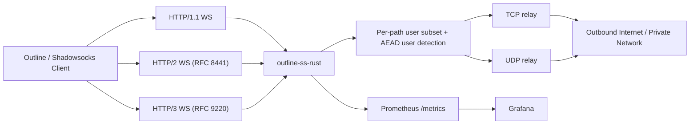

# outline-ss-rust

`outline-ss-rust` is a production-oriented Rust implementation of a WebSocket-based Shadowsocks relay inspired by `outline-ss-server`.

It is designed for deployments that need modern WebSocket transports, multi-user routing, per-user policy controls, and observability without carrying the full Outline management plane.

*Русская версия: [README.ru.md](README.ru.md)*

## Overview

This server accepts Shadowsocks AEAD traffic encapsulated inside WebSocket binary frames and relays it to arbitrary TCP or UDP destinations.

It supports:

- WebSocket over HTTP/1.1
- WebSocket over HTTP/2 via RFC 8441 Extended CONNECT
- WebSocket over HTTP/3 via RFC 9220 Extended CONNECT
- Multiple users with independent passwords
- Per-user cipher selection
- Per-user TCP and UDP WebSocket paths
- Per-user Linux `fwmark` on outbound sockets
- IPv4 and IPv6 listeners, upstream targets, and client URLs
- Prometheus metrics and a ready-made Grafana dashboard
- Outline-compatible dynamic access key generation for WebSocket clients
- Optional built-in TLS for the HTTP/1.1 and HTTP/2 listener
- Optional built-in QUIC/TLS listener for HTTP/3

## Supported Features

| Area | Status | Notes |
| --- | --- | --- |
| Shadowsocks AEAD TCP | Supported | Stream mode over WebSocket binary frames |
| Shadowsocks AEAD UDP | Supported | One UDP packet per WebSocket binary frame |
| Ciphers | Supported | `aes-128-gcm`, `aes-256-gcm`, `chacha20-ietf-poly1305`, `2022-blake3-aes-128-gcm`, `2022-blake3-aes-256-gcm`, `2022-blake3-chacha20-poly1305` |
| Multi-user | Supported | Automatic user identification by successful decryption |
| Per-user cipher | Supported | Each user may override the global default |
| Per-user WebSocket paths | Supported | Independent `ws_path_tcp` and `ws_path_udp` |
| Per-user `fwmark` | Supported | Linux only, requires privileges for `SO_MARK` |
| HTTP/1.1 WebSocket | Supported | Plain `ws://` or `wss://` |
| HTTP/2 WebSocket | Supported | RFC 8441 Extended CONNECT |
| HTTP/3 WebSocket | Supported | RFC 9220 Extended CONNECT |
| Built-in TLS for h1/h2 | Supported | Optional, on the main TCP listener |
| Built-in QUIC/TLS for h3 | Supported | Optional, on `h3_listen` or `listen` |
| IPv6 | Supported | Listener, upstream resolution, and access key generation |
| Prometheus metrics | Supported | Dedicated listener and low-cardinality labels |
| Grafana dashboard | Supported | Ready-made JSON dashboard included |
| Outline dynamic access keys | Supported | `ssconf://` + generated YAML |
| Outline management API | Not supported | Data plane only |
| SIP003 plugin negotiation | Not supported | Out of scope |

## Architecture

High-level architecture documentation is available in [docs/ARCHITECTURE.md](/Users/mmalykhin/Documents/outline-ss-rust/docs/ARCHITECTURE.md).

Quick view:



## Repository Layout

- [src/server.rs](/Users/mmalykhin/Documents/outline-ss-rust/src/server.rs): transport listeners, WebSocket upgrade handling, TCP and UDP relay logic
- [src/crypto.rs](/Users/mmalykhin/Documents/outline-ss-rust/src/crypto.rs): Shadowsocks AEAD stream and UDP packet encryption/decryption
- [src/config.rs](/Users/mmalykhin/Documents/outline-ss-rust/src/config.rs): CLI, environment, and TOML configuration loading
- [src/access_key.rs](/Users/mmalykhin/Documents/outline-ss-rust/src/access_key.rs): Outline dynamic access key and YAML generation
- [src/metrics.rs](/Users/mmalykhin/Documents/outline-ss-rust/src/metrics.rs): Prometheus exporter and metric families
- [config.toml](/Users/mmalykhin/Documents/outline-ss-rust/config.toml): example production configuration
- [systemd/outline-ss-rust.service](/Users/mmalykhin/Documents/outline-ss-rust/systemd/outline-ss-rust.service): production-oriented systemd unit
- [grafana/outline-ss-rust-dashboard.json](/Users/mmalykhin/Documents/outline-ss-rust/grafana/outline-ss-rust-dashboard.json): ready-made Grafana dashboard
- [PATCHES.md](/Users/mmalykhin/Documents/outline-ss-rust/PATCHES.md): local crate patches used by the HTTP/3 stack

## Transport Model

### TCP

The TCP endpoint carries a standard Shadowsocks AEAD stream over WebSocket binary frames:

1. The client opens a WebSocket connection on the user-specific or global TCP path.
2. The client sends encrypted Shadowsocks stream data in binary frames.
3. The server buffers and decrypts the stream until a complete target address is available.
4. The server connects to the target and relays bytes bidirectionally.

WebSocket frame boundaries are ignored. The encrypted stream may be fragmented arbitrarily.

### UDP

The UDP endpoint expects exactly one Shadowsocks AEAD UDP packet per WebSocket binary frame:

1. The client opens a WebSocket connection on the user-specific or global UDP path.
2. Each binary frame contains one encrypted UDP packet.
3. The server decrypts the packet, extracts the target address, and forwards the datagram.
4. Each received upstream response is returned as its own encrypted WebSocket binary frame.

Each incoming datagram is dispatched to an independent relay task. At most 256 concurrent relay tasks are allowed per WebSocket connection. Datagrams that arrive when the limit is reached are silently dropped and logged at `warn` level. This prevents unbounded goroutine growth when a client sends bursts faster than upstream DNS or target hosts can respond.

**UDP NAT table:** the server maintains a persistent UDP socket per `(user_id, fwmark, target_addr)` triple shared across all WebSocket sessions for that user. This means:

- The upstream source port is stable for the lifetime of the NAT entry — stateful UDP protocols (QUIC, DTLS, some game and VoIP protocols) work correctly.
- Unsolicited upstream responses (server-initiated pushes, QUIC stream continuations) are delivered to the currently active WebSocket session even if they arrive between datagrams.
- After a WebSocket reconnect, the existing upstream socket is reused immediately — no new UDP handshake or association required on the upstream side.

NAT entries are evicted after `udp_nat_idle_timeout_secs` (default 300 seconds) of no outbound traffic. A background task scans for idle entries every 60 seconds.

## User Model

Each user can define:

- `id`
- `password`
- `method`
- `fwmark`
- `ws_path_tcp`
- `ws_path_udp`

If a user does not specify `method`, `ws_path_tcp`, or `ws_path_udp`, the server falls back to the top-level defaults.

This allows deployments such as:

- different users on different WebSocket paths
- different users on different ciphers
- different users with different Linux routing policy via `fwmark`

## Configuration

The server reads `config.toml` from the current directory by default. You can override it with `--config`.

Example:

```bash
cargo run -- --config ./config.toml
```

A ready-to-edit example is available in [config.toml](/Users/mmalykhin/Documents/outline-ss-rust/config.toml).

### Top-Level Settings

| Key | Purpose |
| --- | --- |
| `listen` | Main TCP listener for HTTP/1.1 and HTTP/2 |
| `ss_listen` | Optional plain Shadowsocks TCP+UDP listener for classic `ss://` clients |
| `tls_cert_path` / `tls_key_path` | Optional built-in TLS for the main listener |
| `h3_listen` | Optional QUIC listener address for HTTP/3 |
| `h3_cert_path` / `h3_key_path` | Required to enable HTTP/3 |
| `metrics_listen` | Optional Prometheus listener |
| `metrics_path` | Prometheus endpoint path |
| `client_active_ttl_secs` | TTL in seconds used to compute `client_active` / `client_up` |
| `memory_trim_interval_secs` | On Linux, periodically refreshes jemalloc stats and enables jemalloc background purging if needed; default is `60`, `0` disables it |
| `udp_nat_idle_timeout_secs` | How long a UDP NAT entry is kept alive after the last outbound datagram; default is `300` (5 minutes) |
| `ws_path_tcp` | Default TCP WebSocket path |
| `ws_path_udp` | Default UDP WebSocket path |
| `public_host` | Public host used for generated Outline access keys |
| `public_scheme` | `ws` or `wss` for generated client URLs |
| `access_key_url_base` | Base URL where generated YAML files will be hosted |
| `access_key_file_extension` | File extension for generated Outline client config files; default is `.yaml` |
| `print_access_keys` | Print dynamic Outline configs and exit |
| `write_access_keys_dir` | Write per-user Outline YAML files into the specified directory and exit |
| `method` | Default Shadowsocks cipher |
| `password` | Single-user fallback password or base64 PSK for `2022-*` methods |
| `fwmark` | Single-user fallback `fwmark` |

### Per-User Settings

```toml
[[users]]
id = "alice"
password = "change-me"
fwmark = 1001
method = "aes-256-gcm"
ws_path_tcp = "/alice/tcp"
ws_path_udp = "/alice/udp"
```

For `2022-blake3-aes-128-gcm`, `2022-blake3-aes-256-gcm`, and `2022-blake3-chacha20-poly1305`, `password` must be a base64-encoded raw PSK of exactly 16, 32, and 32 bytes respectively, for example `openssl rand -base64 32`.

### Environment Variables

- `OUTLINE_SS_CONFIG`
- `OUTLINE_SS_LISTEN`
- `OUTLINE_SS_SS_LISTEN`
- `OUTLINE_SS_TLS_CERT_PATH`
- `OUTLINE_SS_TLS_KEY_PATH`
- `OUTLINE_SS_H3_LISTEN`
- `OUTLINE_SS_H3_CERT_PATH`
- `OUTLINE_SS_H3_KEY_PATH`
- `OUTLINE_SS_METRICS_LISTEN`
- `OUTLINE_SS_METRICS_PATH`
- `OUTLINE_SS_MEMORY_TRIM_INTERVAL_SECS`
- `OUTLINE_SS_UDP_NAT_IDLE_TIMEOUT_SECS`
- `OUTLINE_SS_WS_PATH_TCP`
- `OUTLINE_SS_WS_PATH_UDP`
- `OUTLINE_SS_PUBLIC_HOST`
- `OUTLINE_SS_PUBLIC_SCHEME`
- `OUTLINE_SS_ACCESS_KEY_URL_BASE`
- `OUTLINE_SS_PRINT_ACCESS_KEYS`
- `OUTLINE_SS_METHOD`
- `OUTLINE_SS_PASSWORD`
- `OUTLINE_SS_FWMARK`
- `OUTLINE_SS_USERS`

`OUTLINE_SS_USERS` uses `id=password` entries separated by commas:

```bash
OUTLINE_SS_USERS=alice=secret1,bob=secret2
```

Per-user `method`, `fwmark`, `ws_path_tcp`, and `ws_path_udp` are configured in TOML rather than inside `OUTLINE_SS_USERS`.

`memory_trim_interval_secs` is a process-level setting rather than a per-user setting. It is most useful on Linux systems using glibc, where a long-running proxy can keep a high RSS after peak traffic even though the memory is already free inside the allocator.

If `ss_listen` is set, the server also exposes a classic Shadowsocks service on that address. It binds both TCP and UDP on the same port and reuses the same users, ciphers, `fwmark`, and UDP NAT behavior as the WebSocket transports.

## Deployment Modes

### 1. Plain WebSocket

Use this for testing or trusted private networks:

```toml
listen = "0.0.0.0:3000"
ws_path_tcp = "/tcp"
ws_path_udp = "/udp"
method = "chacha20-ietf-poly1305"
```

### 2. Built-In TLS for HTTP/1.1 and HTTP/2

```toml
listen = "0.0.0.0:5443"
tls_cert_path = "/etc/outline-ss-rust/tls/fullchain.pem"
tls_key_path = "/etc/outline-ss-rust/tls/privkey.pem"
ws_path_tcp = "/tcp"
ws_path_udp = "/udp"
```

This serves `wss://` on the main TCP listener and supports RFC 8441 on the same socket.

### 3. Plain Shadowsocks Socket Service

```toml
listen = "0.0.0.0:3000"
ss_listen = "0.0.0.0:8388"
ws_path_tcp = "/tcp"
ws_path_udp = "/udp"
method = "chacha20-ietf-poly1305"
```

This keeps the existing WebSocket ingress and additionally exposes a native Shadowsocks TCP+UDP port for non-Outline clients.

### 4. Built-In HTTP/3

```toml
listen = "0.0.0.0:5443"
h3_listen = "0.0.0.0:5443"
h3_cert_path = "/etc/outline-ss-rust/tls/fullchain.pem"
h3_key_path = "/etc/outline-ss-rust/tls/privkey.pem"
```

HTTP/3 always requires TLS and UDP reachability on the selected port.

## Outline Client Access Keys

Outline WebSocket clients use dynamic access keys that point to a YAML configuration document rather than a simple `ss://` URI.

Generate them with:

```bash
cargo run -- \
  --print-access-keys \
  --config ./config.toml
```

Or write one YAML file per user into a directory:

```bash
cargo run -- \
  --write-access-keys-dir ./keys \
  --config ./config.toml
```

For each user the server prints:

- a YAML transport config
- a suggested filename such as `alice.yaml`
- a `config_url`
- an `ssconf://` access key URL

When `write_access_keys_dir` is set, the server writes the YAML files to that directory and prints the absolute file path for each generated client config.

The generated filename extension defaults to `.yaml`, but can be changed with `access_key_file_extension`, for example `.txt` or `.conf`.

The generated YAML automatically reflects:

- the effective user cipher
- the effective TCP path
- the effective UDP path
- the global public host and scheme

## Observability

### Prometheus

Expose metrics on a dedicated listener:

```toml
metrics_listen = "127.0.0.1:9090"
metrics_path = "/metrics"
client_active_ttl_secs = 300
```

Example scrape config:

```yaml
scrape_configs:
  - job_name: outline-ss-rust
    static_configs:
      - targets:
          - 127.0.0.1:9090
```

The metrics set includes:

- WebSocket upgrades and disconnects by transport and HTTP protocol
- Per-client authenticated session counters
- Per-client `last seen` timestamps
- Per-client `client_active` / `client_up` gauges derived from a configurable TTL
- Active WebSocket sessions
- WebSocket session duration
- Encrypted WebSocket frame and byte counters
- Per-user TCP authenticated session counts
- Per-user TCP upstream connect success/error counts and latency
- Active outbound TCP connections
- Per-user TCP payload throughput in both directions
- Per-user UDP success, timeout, and error counts
- Per-user UDP relay latency
- Per-user UDP payload throughput
- Aggregate per-client payload throughput across TCP and UDP
- UDP response datagram counts
- Process RSS / virtual memory gauges
- Heap allocated / free gauges from jemalloc allocator stats on Linux
- Allocator trim counters and last trim before/after RSS gauges
- Allocator support gauges so dashboards can distinguish unsupported features from real zero values
- Build and configuration info

### Grafana

Import [grafana/outline-ss-rust-dashboard.json](/Users/mmalykhin/Documents/outline-ss-rust/grafana/outline-ss-rust-dashboard.json) into Grafana.

The dashboard covers:

- active sessions and active TCP upstreams
- TCP connect error ratio
- UDP timeout and error ratio
- WebSocket upgrade and disconnect rates
- per-client session rates and last seen
- currently active clients derived from TTL
- aggregate per-client traffic across TCP and UDP
- TCP connect p95 latency
- TCP and UDP throughput by user
- UDP request rate and response datagram rate

## HTTP/3 Performance Tuning

The server requests 32 MB OS UDP socket buffers (send and receive). On most systems the kernel silently caps the actual size at a lower value. If the log shows a warning like:

```
HTTP/3 UDP receive buffer capped by OS — increase net.core.rmem_max
```

raise the OS limits before starting the service.

**Linux:**

```bash
sysctl -w net.core.rmem_max=33554432
sysctl -w net.core.wmem_max=33554432
```

To persist across reboots, add to `/etc/sysctl.d/99-quic.conf`:

```
net.core.rmem_max=33554432
net.core.wmem_max=33554432
```

**macOS:**

```bash
sysctl -w kern.ipc.maxsockbuf=33554432
```

### Internal QUIC constants

| Constant | Value | Purpose |
| --- | --- | --- |
| UDP socket buffer (send + recv) | 32 MB | Absorbs packet bursts; primary defense against OS-level drops |
| QUIC stream receive window | 16 MB | Throughput ceiling per stream at high RTT |
| QUIC connection receive window | 64 MB | Aggregate throughput ceiling per connection |
| WebSocket write buffer | 512 KB | Batches outbound data to reduce syscall overhead |
| WebSocket backpressure limit | 16 MB | Maximum buffered data before a slow-client connection is dropped |
| Max UDP payload size | 1 350 bytes | Safe value for internet paths; avoids IP fragmentation |
| QUIC ping interval | 10 s | Keeps connections alive through NAT and firewalls |
| QUIC idle timeout | 120 s | Maximum inactivity before the server closes a connection |

## Production Operations

### systemd

A production-oriented systemd unit is included at [systemd/outline-ss-rust.service](/Users/mmalykhin/Documents/outline-ss-rust/systemd/outline-ss-rust.service).

Typical installation flow:

1. Install the binary to `/usr/local/bin/outline-ss-rust`.
2. Install the configuration file to `/etc/outline-ss-rust/config.toml`.
3. Copy the unit file to `/etc/systemd/system/outline-ss-rust.service`.
4. Create a dedicated service account:
   `sudo useradd --system --home /var/lib/outline-ss-rust --shell /usr/sbin/nologin outline-ss-rust`
5. Create the required directories:
   `sudo install -d -o outline-ss-rust -g outline-ss-rust /var/lib/outline-ss-rust /etc/outline-ss-rust`
6. Reload and enable the service:
   `sudo systemctl daemon-reload && sudo systemctl enable --now outline-ss-rust`

The unit includes:

- automatic restart on failure
- journald logging
- elevated `LimitNOFILE`
- `CAP_NET_BIND_SERVICE` and `CAP_NET_ADMIN`
- conservative systemd hardening flags

If you do not use privileged ports or `fwmark`, you can reduce the capability set.

### Logging

The service uses `tracing` for structured logs. The bundled systemd unit pins:

```text
RUST_LOG=outline_ss_rust=info,tower_http=info
```

Use `debug` only during troubleshooting because WebSocket connection lifecycle logs become much more verbose.

### Security Notes

- Use `wss://` in production unless you are on a trusted private network.
- Protect `metrics_listen`; do not expose it publicly unless you add your own access controls.
- HTTP/3 requires public UDP reachability on the selected port.
- `fwmark` works only on Linux and requires sufficient privileges, typically `CAP_NET_ADMIN` or root.
- Keep TCP and UDP WebSocket paths distinct. The server validates this at startup.

## Compatibility Notes

- HTTP/2 WebSocket support relies on RFC 8441 Extended CONNECT.
- HTTP/3 WebSocket support relies on RFC 9220.
- The repository currently vendors and patches `h3` and `sockudo-ws` for HTTP/3 behavior needed by this project. Details are documented in [PATCHES.md](/Users/mmalykhin/Documents/outline-ss-rust/PATCHES.md).
- The vendored `sockudo-ws` patch now sends a QUIC FIN (via `AsyncWriteExt::shutdown`) after delivering the WebSocket Close frame. Without this, dropping the `SendStream` triggers `RESET_STREAM`, which some H3 clients and intermediaries treat as a connection-level error and respond with `H3_INTERNAL_ERROR`, tearing down the entire QUIC connection.
- QUIC idle timeout is 120 seconds and WebSocket ping interval is 10 seconds. These values are consistent between the QUIC transport layer and the WebSocket idle settings.
- The following QUIC close conditions are treated as benign (not counted as errors): `ApplicationClose: H3_NO_ERROR`, `ApplicationClose: 0x0`, QUIC stack internal errors from the http layer, and connection idle timeouts.

## Limitations

- No Outline management API
- No built-in user provisioning service
- No SIP003 plugin negotiation
- UDP NAT entries are shared across reconnects but not across different users or different target addresses
- The UDP transport model is one encrypted Shadowsocks UDP packet per WebSocket binary frame

## Development

Run the test suite:

```bash
cargo test
```

The project contains unit and smoke tests for:

- Shadowsocks stream encryption and UDP packet encryption
- mixed per-user cipher identification
- IPv6 TCP and UDP relay behavior
- HTTP/2 RFC 8441 WebSocket upgrade flow
- HTTP/3 RFC 9220 WebSocket upgrade flow

## License

See [LICENSE](/Users/mmalykhin/Documents/outline-ss-rust/LICENSE).
