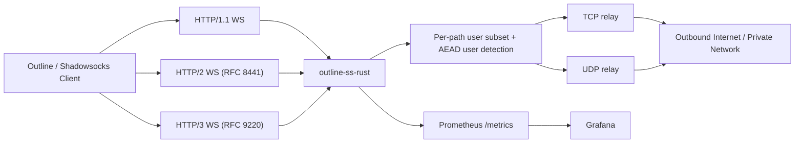

# outline-ss-rust

`outline-ss-rust` — ориентированная на production Rust-реализация WebSocket-релея на базе Shadowsocks, вдохновлённая `outline-ss-server`.

Проект предназначен для инсталляций, которым нужны современные WebSocket-транспорты, маршрутизация по нескольким пользователям, управление политикой на уровне пользователя и наблюдаемость — без полного стека управления Outline.

---

*English version: [README.md](README.md)*

## Обзор

Сервер принимает Shadowsocks AEAD-трафик, инкапсулированный в бинарные фреймы WebSocket, и ретранслирует его к произвольным TCP- или UDP-назначениям.

Поддерживается:

- WebSocket over HTTP/1.1
- WebSocket over HTTP/2 — RFC 8441 Extended CONNECT
- WebSocket over HTTP/3 — RFC 9220 Extended CONNECT
- Несколько пользователей с независимыми паролями
- Выбор шифра на уровне пользователя
- Индивидуальные TCP и UDP WebSocket-пути на пользователя
- Linux `fwmark` на исходящих сокетах на уровне пользователя
- IPv4 и IPv6: слушатели, upstream-цели и генерация client URL
- Метрики Prometheus и готовый дашборд Grafana
- Генерация Outline-совместимых динамических ключей доступа для WebSocket-клиентов
- Опциональный встроенный TLS для HTTP/1.1 и HTTP/2
- Опциональный встроенный QUIC/TLS-слушатель для HTTP/3

## Поддерживаемые возможности

| Область | Статус | Примечание |
| --- | --- | --- |
| Shadowsocks AEAD TCP | Поддерживается | Потоковый режим через бинарные WebSocket-фреймы |
| Shadowsocks AEAD UDP | Поддерживается | Один UDP-пакет на бинарный WebSocket-фрейм |
| Шифры | Поддерживается | `chacha20-ietf-poly1305`, `aes-256-gcm` |
| Multi-user | Поддерживается | Автоматическая идентификация по успешной расшифровке |
| Шифр на пользователя | Поддерживается | Каждый пользователь может переопределить глобальный |
| WebSocket-пути на пользователя | Поддерживается | Независимые `ws_path_tcp` и `ws_path_udp` |
| `fwmark` на пользователя | Поддерживается | Только Linux, требует привилегий для `SO_MARK` |
| HTTP/1.1 WebSocket | Поддерживается | Обычный `ws://` или `wss://` |
| HTTP/2 WebSocket | Поддерживается | RFC 8441 Extended CONNECT |
| HTTP/3 WebSocket | Поддерживается | RFC 9220 Extended CONNECT |
| Встроенный TLS для h1/h2 | Поддерживается | Опционально, на основном TCP-слушателе |
| Встроенный QUIC/TLS для h3 | Поддерживается | Опционально, на `h3_listen` или `listen` |
| IPv6 | Поддерживается | Слушатель, upstream-резолвинг, генерация ключей |
| Метрики Prometheus | Поддерживается | Отдельный слушатель, метки с низкой кардинальностью |
| Дашборд Grafana | Поддерживается | Готовый JSON-дашборд в репозитории |
| Outline динамические ключи | Поддерживается | `ssconf://` + генерируемый YAML |
| Outline management API | Не поддерживается | Только data plane |
| SIP003 plugin negotiation | Не поддерживается | Вне области применения |

## Архитектура

Подробная документация по архитектуре находится в [docs/ARCHITECTURE.md](docs/ARCHITECTURE.md).

Краткая схема:



## Структура репозитория

- [src/server.rs](src/server.rs): транспортные слушатели, обработка WebSocket Upgrade, логика TCP и UDP relay
- [src/crypto.rs](src/crypto.rs): шифрование/расшифровка Shadowsocks AEAD для потоков и UDP-пакетов
- [src/config.rs](src/config.rs): загрузка конфигурации из CLI, переменных окружения и TOML
- [src/access_key.rs](src/access_key.rs): генерация Outline динамических ключей и YAML
- [src/metrics.rs](src/metrics.rs): экспортёр Prometheus и семейства метрик
- [config.toml](config.toml): пример production-конфигурации
- [systemd/outline-ss-rust.service](systemd/outline-ss-rust.service): production-ориентированный systemd unit
- [grafana/outline-ss-rust-dashboard.json](grafana/outline-ss-rust-dashboard.json): готовый Grafana-дашборд
- [PATCHES.md](PATCHES.md): локальные патчи крейтов для HTTP/3 стека

## Транспортная модель

### TCP

TCP-эндпоинт переносит стандартный Shadowsocks AEAD-поток в бинарных WebSocket-фреймах:

1. Клиент открывает WebSocket-соединение на TCP-пути пользователя или глобальном.
2. Клиент отправляет зашифрованные данные Shadowsocks-потока в бинарных фреймах.
3. Сервер буферизует и расшифровывает поток до получения полного целевого адреса.
4. Сервер подключается к цели и ретранслирует байты в обоих направлениях.

Границы WebSocket-фреймов игнорируются. Зашифрованный поток может быть фрагментирован произвольно.

### UDP

UDP-эндпоинт ожидает ровно один Shadowsocks AEAD UDP-пакет на бинарный WebSocket-фрейм:

1. Клиент открывает WebSocket-соединение на UDP-пути пользователя или глобальном.
2. Каждый бинарный фрейм содержит один зашифрованный UDP-пакет.
3. Сервер расшифровывает пакет, извлекает целевой адрес и пересылает датаграмму.
4. Каждый полученный ответ от upstream возвращается как отдельный зашифрованный WebSocket-фрейм.

Каждая входящая датаграмма отправляется в отдельную relay-задачу. Максимум 256 одновременных relay-задач на WebSocket-соединение. Датаграммы, поступающие при достижении лимита, молча отбрасываются и логируются на уровне `warn`.

**UDP NAT-таблица:** сервер поддерживает постоянный UDP-сокет на тройку `(user_id, fwmark, target_addr)`, разделяемый между всеми WebSocket-сессиями данного пользователя. Это означает:

- Upstream source port стабилен на протяжении жизни NAT-записи — статeful UDP-протоколы (QUIC, DTLS, игровые и VoIP-протоколы) работают корректно.
- Несолицитированные upstream-ответы доставляются в активную WebSocket-сессию даже при поступлении между датаграммами.
- После переподключения WebSocket существующий upstream-сокет используется повторно без новых UDP-рукопожатий.

NAT-записи вытесняются через `udp_nat_idle_timeout_secs` (по умолчанию 300 секунд) отсутствия исходящего трафика. Фоновая задача сканирует неактивные записи каждые 60 секунд.

## Модель пользователей

Каждый пользователь может задать:

- `id`
- `password`
- `method`
- `fwmark`
- `ws_path_tcp`
- `ws_path_udp`

Если пользователь не указывает `method`, `ws_path_tcp` или `ws_path_udp`, сервер использует глобальные значения по умолчанию.

Это позволяет организовать:

- разных пользователей на разных WebSocket-путях
- разных пользователей с разными шифрами
- разных пользователей с разной политикой маршрутизации Linux через `fwmark`

## Конфигурация

По умолчанию сервер читает `config.toml` из текущего каталога. Переопределить путь можно флагом `--config`.

Пример запуска:

```bash
cargo run -- --config ./config.toml
```

Готовый пример конфигурации — в [config.toml](config.toml).

### Параметры верхнего уровня

| Ключ | Назначение |
| --- | --- |
| `listen` | Основной TCP-слушатель для HTTP/1.1 и HTTP/2 |
| `tls_cert_path` / `tls_key_path` | Опциональный встроенный TLS для основного слушателя |
| `h3_listen` | Опциональный QUIC-слушатель для HTTP/3 |
| `h3_cert_path` / `h3_key_path` | Обязательны для включения HTTP/3 |
| `metrics_listen` | Опциональный Prometheus-слушатель |
| `metrics_path` | Путь Prometheus-эндпоинта |
| `client_active_ttl_secs` | TTL в секундах для вычисления `client_active` / `client_up` |
| `memory_trim_interval_secs` | На Linux периодически обновляет статистику jemalloc и включает фоновую очистку; по умолчанию `60`, `0` — отключить |
| `udp_nat_idle_timeout_secs` | Время жизни UDP NAT-записи после последней исходящей датаграммы; по умолчанию `300` |
| `ws_path_tcp` | Глобальный TCP WebSocket-путь |
| `ws_path_udp` | Глобальный UDP WebSocket-путь |
| `public_host` | Публичный хост для генерации Outline-ключей |
| `public_scheme` | `ws` или `wss` для генерируемых client URL |
| `access_key_url_base` | Базовый URL для хостинга генерируемых YAML-файлов |
| `print_access_keys` | Вывести динамические Outline-конфигурации и завершить работу |
| `method` | Глобальный шифр Shadowsocks по умолчанию |
| `password` | Пароль в режиме одного пользователя |
| `fwmark` | `fwmark` в режиме одного пользователя |

### Параметры пользователя

```toml
[[users]]
id = "alice"
password = "change-me"
fwmark = 1001
method = "aes-256-gcm"
ws_path_tcp = "/alice/tcp"
ws_path_udp = "/alice/udp"
```

### Переменные окружения

- `OUTLINE_SS_CONFIG`
- `OUTLINE_SS_LISTEN`
- `OUTLINE_SS_TLS_CERT_PATH`
- `OUTLINE_SS_TLS_KEY_PATH`
- `OUTLINE_SS_H3_LISTEN`
- `OUTLINE_SS_H3_CERT_PATH`
- `OUTLINE_SS_H3_KEY_PATH`
- `OUTLINE_SS_METRICS_LISTEN`
- `OUTLINE_SS_METRICS_PATH`
- `OUTLINE_SS_MEMORY_TRIM_INTERVAL_SECS`
- `OUTLINE_SS_UDP_NAT_IDLE_TIMEOUT_SECS`
- `OUTLINE_SS_WS_PATH_TCP`
- `OUTLINE_SS_WS_PATH_UDP`
- `OUTLINE_SS_PUBLIC_HOST`
- `OUTLINE_SS_PUBLIC_SCHEME`
- `OUTLINE_SS_ACCESS_KEY_URL_BASE`
- `OUTLINE_SS_PRINT_ACCESS_KEYS`
- `OUTLINE_SS_METHOD`
- `OUTLINE_SS_PASSWORD`
- `OUTLINE_SS_FWMARK`
- `OUTLINE_SS_USERS`

`OUTLINE_SS_USERS` использует записи вида `id=password`, разделённые запятыми:

```bash
OUTLINE_SS_USERS=alice=secret1,bob=secret2
```

Параметры `method`, `fwmark`, `ws_path_tcp` и `ws_path_udp` на уровне пользователя задаются только в TOML.

`memory_trim_interval_secs` — параметр уровня процесса. Полезен на Linux-системах с glibc, где долгоживущий прокси сохраняет высокий RSS после пиковой нагрузки.

## Режимы развёртывания

### 1. Простой WebSocket

Для тестирования или доверенных приватных сетей:

```toml
listen = "0.0.0.0:3000"
ws_path_tcp = "/tcp"
ws_path_udp = "/udp"
method = "chacha20-ietf-poly1305"
```

### 2. Встроенный TLS для HTTP/1.1 и HTTP/2

```toml
listen = "0.0.0.0:5443"
tls_cert_path = "/etc/outline-ss-rust/tls/fullchain.pem"
tls_key_path = "/etc/outline-ss-rust/tls/privkey.pem"
ws_path_tcp = "/tcp"
ws_path_udp = "/udp"
```

Обслуживает `wss://` на основном TCP-слушателе с поддержкой RFC 8441 на том же сокете.

### 3. Встроенный HTTP/3

```toml
listen = "0.0.0.0:5443"
h3_listen = "0.0.0.0:5443"
h3_cert_path = "/etc/outline-ss-rust/tls/fullchain.pem"
h3_key_path = "/etc/outline-ss-rust/tls/privkey.pem"
```

HTTP/3 всегда требует TLS и доступности UDP на выбранном порту.

## Настройка производительности HTTP/3

Сервер запрашивает у ОС UDP-сокетные буферы по 32 МБ (приём и отправка). На большинстве систем ядро молча ограничивает реальный размер. Если в логах появляется предупреждение вида:

```
HTTP/3 UDP receive buffer capped by OS — increase net.core.rmem_max
```

до запуска сервиса необходимо поднять системные лимиты.

**Linux:**

```bash
sysctl -w net.core.rmem_max=33554432
sysctl -w net.core.wmem_max=33554432
```

Для сохранения после перезагрузки добавьте в `/etc/sysctl.d/99-quic.conf`:

```
net.core.rmem_max=33554432
net.core.wmem_max=33554432
```

**macOS:**

```bash
sysctl -w kern.ipc.maxsockbuf=33554432
```

### Внутренние QUIC-константы

| Параметр | Значение | Назначение |
| --- | --- | --- |
| UDP socket buffer (отправка + приём) | 32 МБ | Поглощение всплесков пакетов; основная защита от дропов на уровне ОС |
| Окно приёма QUIC-потока | 16 МБ | Потолок пропускной способности на поток при высоком RTT |
| Окно приёма QUIC-соединения | 64 МБ | Агрегированный потолок пропускной способности на соединение |
| Буфер записи WebSocket | 512 КБ | Батчинг исходящих данных для снижения накладных расходов на syscall |
| Порог backpressure WebSocket | 16 МБ | Максимум буферизованных данных до дропа соединения с медленным клиентом |
| Максимальный размер UDP-payload | 1 350 байт | Безопасное значение для интернет-путей; исключает IP-фрагментацию |
| Интервал QUIC ping | 10 с | Поддерживает соединения через NAT и файрволы |
| QUIC idle timeout | 120 с | Максимальное время неактивности до закрытия соединения сервером |

## Ключи доступа Outline

Outline WebSocket-клиенты используют динамические ключи доступа, ссылающиеся на YAML-документ конфигурации вместо простого `ss://` URI.

Генерация:

```bash
cargo run -- \
  --print-access-keys \
  --config ./config.toml
```

Для каждого пользователя сервер выводит:

- YAML-конфигурацию транспорта
- предлагаемое имя файла, например `alice.yaml`
- `config_url`
- `ssconf://` URL ключа доступа

Генерируемый YAML автоматически отражает:

- эффективный шифр пользователя
- эффективный TCP-путь
- эффективный UDP-путь
- глобальный публичный хост и схему

## Наблюдаемость

### Prometheus

Публикация метрик на отдельном слушателе:

```toml
metrics_listen = "127.0.0.1:9090"
metrics_path = "/metrics"
client_active_ttl_secs = 300
```

Пример конфигурации scrape:

```yaml
scrape_configs:
  - job_name: outline-ss-rust
    static_configs:
      - targets:
          - 127.0.0.1:9090
```

Набор метрик включает:

- WebSocket Upgrade и разрывы по транспорту и HTTP-протоколу
- Счётчики аутентифицированных сессий на клиента
- Временны́е метки `last seen` на клиента
- Счётчики `client_active` / `client_up` на основе настраиваемого TTL
- Активные WebSocket-сессии
- Продолжительность WebSocket-сессий
- Счётчики зашифрованных фреймов и байт WebSocket
- Счётчики TCP-сессий по пользователям
- Количество успешных/неуспешных TCP upstream-подключений и задержка
- Активные исходящие TCP-соединения
- Пропускная способность TCP payload по направлениям и пользователям
- Успешные/таймаут/ошибочные UDP-события по пользователям
- Задержка UDP relay по пользователям
- Пропускная способность UDP payload по пользователям
- Агрегированная пропускная способность на клиента по TCP и UDP
- Счётчики ответных UDP-датаграмм
- RSS/виртуальная память процесса
- Статистика кучи аллокатора jemalloc (Linux)
- Счётчики trim аллокатора и метрики RSS до/после trim
- Служебные метрики для разграничения неподдерживаемых функций от реальных нулевых значений на дашбордах
- Информация о сборке и конфигурации

### Grafana

Импортируйте [grafana/outline-ss-rust-dashboard.json](grafana/outline-ss-rust-dashboard.json) в Grafana.

Дашборд охватывает:

- активные сессии и активные TCP upstream
- доля TCP connect error
- доля UDP timeout и error
- WebSocket upgrade и disconnect rate
- скорость сессий на клиента и `last seen`
- активные клиенты по TTL
- агрегированный трафик на клиента (TCP + UDP)
- TCP connect p95 latency
- TCP и UDP throughput по пользователям
- скорость UDP-запросов и ответных датаграмм

## Production-эксплуатация

### systemd

Production-ориентированный systemd unit находится в [systemd/outline-ss-rust.service](systemd/outline-ss-rust.service).

Типичная процедура установки:

1. Установить бинарник в `/usr/local/bin/outline-ss-rust`.
2. Установить конфигурацию в `/etc/outline-ss-rust/config.toml`.
3. Скопировать unit-файл в `/etc/systemd/system/outline-ss-rust.service`.
4. Создать выделенный системный аккаунт:
   `sudo useradd --system --home /var/lib/outline-ss-rust --shell /usr/sbin/nologin outline-ss-rust`
5. Создать необходимые каталоги:
   `sudo install -d -o outline-ss-rust -g outline-ss-rust /var/lib/outline-ss-rust /etc/outline-ss-rust`
6. Перечитать конфигурацию и включить сервис:
   `sudo systemctl daemon-reload && sudo systemctl enable --now outline-ss-rust`

Unit включает:

- автоматический перезапуск при сбое
- логирование через journald
- увеличенный `LimitNOFILE`
- `CAP_NET_BIND_SERVICE` и `CAP_NET_ADMIN`
- консервативные флаги hardening systemd

Если привилегированные порты и `fwmark` не используются, набор capabilities можно уменьшить.

### Логирование

Сервис использует `tracing` для структурированных логов. Bundled systemd unit задаёт:

```text
RUST_LOG=outline_ss_rust=info,tower_http=info
```

Используйте уровень `debug` только при отладке — логи жизненного цикла WebSocket-соединений становятся значительно подробнее.

### Безопасность

- Используйте `wss://` в production, если только не работаете в доверенной приватной сети.
- Защитите `metrics_listen`; не публикуйте его без дополнительных средств контроля доступа.
- HTTP/3 требует публичной доступности UDP на выбранном порту.
- `fwmark` работает только на Linux и требует достаточных привилегий — обычно `CAP_NET_ADMIN` или root.
- TCP и UDP WebSocket-пути должны быть различными. Сервер проверяет это при запуске.

## Замечания о совместимости

- Поддержка WebSocket через HTTP/2 опирается на RFC 8441 Extended CONNECT.
- Поддержка WebSocket через HTTP/3 опирается на RFC 9220.
- Репозиторий вендорит и патчит `h3` и `sockudo-ws` для поведения HTTP/3, необходимого проекту. Подробности — в [PATCHES.md](PATCHES.md).
- Вендоризованный патч `sockudo-ws` отправляет QUIC FIN (через `AsyncWriteExt::shutdown`) после доставки WebSocket Close-фрейма. Без этого дроп `SendStream` инициирует `RESET_STREAM`, который ряд H3-клиентов и промежуточных узлов трактует как ошибку уровня соединения и отвечает `H3_INTERNAL_ERROR`, разрывая всё QUIC-соединение.
- QUIC idle timeout — 120 секунд, интервал WebSocket ping — 10 секунд. Значения согласованы между QUIC transport layer и WebSocket idle-настройками.
- Следующие условия закрытия QUIC считаются штатными (не учитываются как ошибки): `ApplicationClose: H3_NO_ERROR`, `ApplicationClose: 0x0`, внутренние ошибки QUIC-стека из HTTP-слоя и idle timeout соединения.

## Ограничения

- Нет Outline management API
- Нет встроенного сервиса провизии пользователей
- Нет SIP003 plugin negotiation
- UDP NAT-записи разделяются между переподключениями, но не между разными пользователями и разными целевыми адресами
- UDP-транспорт: один зашифрованный Shadowsocks UDP-пакет на бинарный WebSocket-фрейм

## Разработка

Запуск тестов:

```bash
cargo test
```

Проект содержит unit- и smoke-тесты для:

- шифрования Shadowsocks-потоков и UDP-пакетов
- идентификации пользователей со смешанными шифрами
- поведения IPv6 TCP и UDP relay
- HTTP/2 RFC 8441 WebSocket upgrade flow
- HTTP/3 RFC 9220 WebSocket upgrade flow

## Лицензия

Смотрите [LICENSE](LICENSE).
