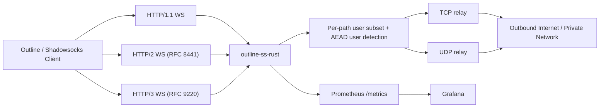

# outline-ss-rust

`outline-ss-rust` — ориентированная на production Rust-реализация WebSocket-релея на базе Shadowsocks, вдохновлённая `outline-ss-server`.

Проект предназначен для инсталляций, которым нужны современные WebSocket-транспорты, маршрутизация по нескольким пользователям, управление политикой на уровне пользователя и наблюдаемость — без полного стека управления Outline.

---

*English version: [README.md](README.md)*

## Обзор

Сервер принимает Shadowsocks AEAD-трафик, инкапсулированный в бинарные фреймы WebSocket, и ретранслирует его к произвольным TCP- или UDP-назначениям.

Поддерживается:

- WebSocket over HTTP/1.1
- WebSocket over HTTP/2 — RFC 8441 Extended CONNECT
- WebSocket over HTTP/3 — RFC 9220 Extended CONNECT
- Несколько пользователей с независимыми паролями
- Выбор шифра на уровне пользователя
- Индивидуальные TCP и UDP WebSocket-пути на пользователя
- Linux `fwmark` на исходящих сокетах на уровне пользователя
- IPv4 и IPv6: слушатели, upstream-цели и генерация client URL
- Метрики Prometheus и готовый дашборд Grafana
- Генерация Outline-совместимых динамических ключей доступа для WebSocket-клиентов
- Опциональный встроенный TLS для HTTP/1.1 и HTTP/2
- Опциональный встроенный QUIC/TLS-слушатель для HTTP/3

## Поддерживаемые возможности

| Область | Статус | Примечание |
| --- | --- | --- |
| Shadowsocks AEAD TCP | Поддерживается | Потоковый режим через бинарные WebSocket-фреймы |
| Shadowsocks AEAD UDP | Поддерживается | Один UDP-пакет на бинарный WebSocket-фрейм |
| Шифры | Поддерживается | `aes-128-gcm`, `aes-256-gcm`, `chacha20-ietf-poly1305`, `2022-blake3-aes-128-gcm`, `2022-blake3-aes-256-gcm`, `2022-blake3-chacha20-poly1305` |
| Multi-user | Поддерживается | Автоматическая идентификация по успешной расшифровке |
| Шифр на пользователя | Поддерживается | Каждый пользователь может переопределить глобальный |
| WebSocket-пути на пользователя | Поддерживается | Независимые `ws_path_tcp` и `ws_path_udp` |
| `fwmark` на пользователя | Поддерживается | Только Linux, требует привилегий для `SO_MARK` |
| HTTP/1.1 WebSocket | Поддерживается | Обычный `ws://` или `wss://` |
| HTTP/2 WebSocket | Поддерживается | RFC 8441 Extended CONNECT |
| HTTP/3 WebSocket | Поддерживается | RFC 9220 Extended CONNECT |
| Встроенный TLS для h1/h2 | Поддерживается | Опционально, на основном TCP-слушателе |
| Встроенный QUIC/TLS для h3 | Поддерживается | Опционально, на `h3_listen`; может использовать тот же порт, что и `listen`, по UDP |
| IPv6 | Поддерживается | Слушатель, upstream-резолвинг, генерация ключей |
| Метрики Prometheus | Поддерживается | Отдельный слушатель, метки с низкой кардинальностью |
| Дашборд Grafana | Поддерживается | Готовый JSON-дашборд в репозитории |
| Outline динамические ключи | Поддерживается | `ssconf://` + генерируемый YAML |
| Outline management API | Не поддерживается | Только data plane |
| SIP003 plugin negotiation | Не поддерживается | Вне области применения |

## Архитектура

Подробная документация по архитектуре находится в [docs/ARCHITECTURE.md](docs/ARCHITECTURE.md).

Краткая схема:



## Структура репозитория

- [src/server/](src/server): транспортные слушатели, обработка WebSocket Upgrade, логика TCP и UDP relay
- [src/crypto/](src/crypto): шифрование/расшифровка Shadowsocks AEAD для потоков и UDP-пакетов
- [src/config/](src/config): загрузка конфигурации из CLI, переменных окружения и TOML
- [src/access_key.rs](src/access_key.rs): генерация Outline динамических ключей и YAML
- [src/metrics/](src/metrics): экспортёр Prometheus и семейства метрик
- [src/protocol.rs](src/protocol.rs): хелперы формата Shadowsocks (SOCKS-совместимый target address)
- [src/nat.rs](src/nat.rs): таблица UDP NAT-сессий
- [src/fwmark.rs](src/fwmark.rs): хелперы Linux SO_MARK для исходящих сокетов
- [config.toml](config.toml): пример production-конфигурации
- [systemd/outline-ss-rust.service](systemd/outline-ss-rust.service): production-ориентированный systemd unit
- [grafana/outline-ss-rust-dashboard.json](grafana/outline-ss-rust-dashboard.json): готовый Grafana-дашборд
- [PATCHES.ru.md](PATCHES.ru.md): локальные патчи крейтов для HTTP/3 стека

## Транспортная модель

### TCP

TCP-эндпоинт переносит стандартный Shadowsocks AEAD-поток в бинарных WebSocket-фреймах:

1. Клиент открывает WebSocket-соединение на TCP-пути пользователя или глобальном.
2. Клиент отправляет зашифрованные данные Shadowsocks-потока в бинарных фреймах.
3. Сервер буферизует и расшифровывает поток до получения полного целевого адреса.
4. Сервер подключается к цели и ретранслирует байты в обоих направлениях.

Границы WebSocket-фреймов игнорируются. Зашифрованный поток может быть фрагментирован произвольно.

### UDP

UDP-эндпоинт ожидает ровно один Shadowsocks AEAD UDP-пакет на бинарный WebSocket-фрейм:

1. Клиент открывает WebSocket-соединение на UDP-пути пользователя или глобальном.
2. Каждый бинарный фрейм содержит один зашифрованный UDP-пакет.
3. Сервер расшифровывает пакет, извлекает целевой адрес и пересылает датаграмму.
4. Каждый полученный ответ от upstream возвращается как отдельный зашифрованный WebSocket-фрейм.

Каждая входящая датаграмма отправляется в отдельную relay-задачу. Максимум 256 одновременных relay-задач на WebSocket-соединение. Датаграммы, поступающие при достижении лимита, молча отбрасываются и логируются на уровне `warn`.

**UDP NAT-таблица:** сервер поддерживает постоянный UDP-сокет на тройку `(user_id, fwmark, target_addr)`, разделяемый между всеми WebSocket-сессиями данного пользователя. Это означает:

- Upstream source port стабилен на протяжении жизни NAT-записи — статeful UDP-протоколы (QUIC, DTLS, игровые и VoIP-протоколы) работают корректно.
- Несолицитированные upstream-ответы доставляются в активную WebSocket-сессию даже при поступлении между датаграммами.
- После переподключения WebSocket существующий upstream-сокет используется повторно без новых UDP-рукопожатий.

NAT-записи вытесняются через `tuning.udp_nat_idle_timeout_secs` (по умолчанию 300 секунд в профиле `large`) отсутствия исходящего трафика. Фоновая задача сканирует неактивные записи каждые 60 секунд.

## Модель пользователей

Каждый пользователь может задать:

- `id`
- `password`
- `method`
- `fwmark`
- `ws_path_tcp`
- `ws_path_udp`

Если пользователь не указывает `method`, `ws_path_tcp` или `ws_path_udp`, сервер использует глобальные значения по умолчанию.

Это позволяет организовать:

- разных пользователей на разных WebSocket-путях
- разных пользователей с разными шифрами
- разных пользователей с разной политикой маршрутизации Linux через `fwmark`

## Конфигурация

По умолчанию сервер читает `config.toml` из текущего каталога. Переопределить путь можно флагом `--config`.

Пример запуска:

```bash
cargo run -- --config ./config.toml
```

Готовый пример конфигурации — в [config.toml](config.toml).

Модель листенеров теперь явная: если не задан ни один из `listen`, `h3_listen` или `ss_listen`, сервер завершится с ошибкой конфигурации. Поднимаются только те листенеры, которые явно указаны.

## Короткие команды сборки

Для musl cross-build в репозитории используются готовые Cargo aliases из `.cargo/config.toml`, которые запускают `cargo-zigbuild`. Это делает рабочий путь явным и не завязывает сборку на более хрупкий сценарий с обычным `cargo build --target ...`.

Доступные короткие aliases:

```bash
cargo build-musl-x86_64
cargo release-musl-x86_64
cargo build-musl-aarch64
cargo release-musl-aarch64
cargo build-musl-arm
cargo release-musl-arm
cargo build-musl-armv7
cargo release-musl-armv7
```

Эти команды разворачиваются в соответствующие вызовы `cargo zigbuild --target ...` для musl-таргетов, которые сейчас доступны на stable через Rustup: `x86_64`, `aarch64`, `arm` и `armv7`.

Примечание про legacy MIPS: таргеты `mips` и `mipsel` больше не входят в текущий stable-набор Rustup. Если они всё ещё нужны, используйте pinned старый toolchain или отдельный flow на базе `build-std`, а не стандартные stable-shortcuts и release-workflows.

### Параметры верхнего уровня

| Ключ | Назначение |
| --- | --- |
| `listen` | Опциональный основной TCP-слушатель для HTTP/1.1 и HTTP/2 |
| `ss_listen` | Опциональный plain Shadowsocks TCP+UDP слушатель для обычных `ss://` клиентов |
| `tls_cert_path` / `tls_key_path` | Опциональный встроенный TLS для основного слушателя |
| `h3_listen` | Опциональный QUIC-слушатель для HTTP/3; должен быть указан явно при включении HTTP/3 |
| `h3_cert_path` / `h3_key_path` | Обязательны для включения HTTP/3 |
| `metrics_listen` | Опциональный Prometheus-слушатель |
| `metrics_path` | Путь Prometheus-эндпоинта |
| `prefer_ipv4_upstream` | Предпочитать IPv4 для upstream DNS и connect; полезно, если IPv6-путь ломает трафик |
| `outbound_ipv6_prefix` | Опциональный IPv6 CIDR (например `2001:db8:dead::/64`). Если задан, каждый upstream IPv6 TCP-connect и UDP NAT-сокет биндится на случайный адрес из этого префикса вместо kernel-default источника. Типовая настройка: `ip -6 addr add 2001:db8:dead::1/64 dev eth0`, тогда весь /64 считается on-link — `IPV6_FREEBIND` (включается автоматически на Linux) позволит `bind()` взять любой адрес из префикса. Фолбэк, когда FREEBIND недоступен: добавить AnyIP-маршрут `ip -6 route add local 2001:db8:dead::/64 dev lo`. IPv4 upstreams не затрагиваются |
| `outbound_ipv6_interface` | Альтернатива `outbound_ipv6_prefix` для DHCPv6 / SLAAC-развёртываний, где префикс заранее неизвестен. Имя сетевого интерфейса (например `eth0`); каждый global-unicast IPv6 адрес на интерфейсе комбинируется со своей netmask в CIDR — случайные source-адреса выбираются **внутри этих префиксов** (как в prefix-режиме), а не из набора сконфигурированных ядром /128. Принимается любая непрерывная длина префикса (/48, /56, /60, /64, /96, /128…), читается через `getifaddrs(3)`. В пул попадают только адреса `2000::/3` — loopback, link-local, ULA (`fc00::/7`), multicast, IPv4-mapped, discard (`100::/64`) и прочие неглобальные диапазоны отфильтровываются. Пул периодически обновляется, поэтому адреса, добавленные/удалённые DHCPv6/SLAAC после старта, применяются без перезапуска. Взаимоисключим с `outbound_ipv6_prefix`. Если пул пуст в момент bind (на интерфейсе ещё нет global-unicast v6), сокет биндится wildcard kernel-default с записью `DEBUG` в лог — relay продолжает работать без random-source до следующего refresh. Только Linux и macOS |
| `outbound_ipv6_refresh_secs` | Интервал в секундах между переэнумерациями пула префиксов `outbound_ipv6_interface`. По умолчанию `30`. Игнорируется, если `outbound_ipv6_interface` не задан |
| `tuning_profile` | Именованный пресет ресурсных лимитов: `small` / `medium` / `large` (по умолчанию). Задаёт H2/H3 flow-control windows, лимиты стримов, таймауты сессий/NAT и глобальный cap UDP-relay-тасков |
| `[tuning]` | Per-field оверрайды поверх выбранного профиля. См. ключи `tuning.*` ниже |
| `tuning.client_active_ttl_secs` | TTL в секундах для вычисления `client_active` / `client_up` |
| `tuning.udp_nat_idle_timeout_secs` | Время жизни UDP NAT-записи после последней исходящей датаграммы (значение по умолчанию зависит от профиля; `300` для `large`) |
| `tuning.udp_max_concurrent_relay_tasks` | Глобальный cap на число одновременных UDP-relay-тасков по всем WebSocket-сессиям. `0` отключает cap |
| `tuning.h2_*` / `tuning.h3_*` | Тонкие настройки flow-control windows, лимитов стримов и сокет-буферов — см. `TuningProfile` в `src/config/mod.rs` |
| `ws_path_tcp` | Глобальный TCP WebSocket-путь |
| `ws_path_udp` | Глобальный UDP WebSocket-путь |
| `http_root_auth` | Включить OpenConnect-подобный HTTP Basic challenge на `/`; после 3 неверных паролей сервер отдаёт `403`, а не-корневые пути остаются `404` |
| `http_root_realm` | Текст в HTTP Basic запросе пароля для `/`; по умолчанию `Authorization required` |
| `public_host` | Публичный хост для генерации Outline-ключей |
| `public_scheme` | `ws` или `wss` для генерируемых client URL |
| `access_key_url_base` | Базовый URL для хостинга генерируемых YAML-файлов |
| `access_key_file_extension` | Расширение для генерируемых файлов клиентской Outline-конфигурации; по умолчанию `.yaml` |
| `print_access_keys` | Вывести динамические Outline-конфигурации и завершить работу |
| `write_access_keys_dir` | Записать per-user Outline YAML-файлы в указанный каталог и завершить работу |
| `method` | Глобальный шифр Shadowsocks по умолчанию |
| `password` | Пароль в режиме одного пользователя или base64 PSK для `2022-*` |
| `fwmark` | `fwmark` в режиме одного пользователя |

### Параметры пользователя

```toml
[[users]]
id = "alice"
password = "change-me"
fwmark = 1001
method = "aes-256-gcm"
ws_path_tcp = "/alice/tcp"
ws_path_udp = "/alice/udp"
```

Для `2022-blake3-aes-128-gcm`, `2022-blake3-aes-256-gcm` и `2022-blake3-chacha20-poly1305` параметр `password` должен содержать base64-кодированный сырой PSK длиной ровно 16, 32 и 32 байта соответственно, например `openssl rand -base64 32`.

Если `http_root_auth = true`, обычный `GET /` получает HTTP Basic challenge. Имя пользователя игнорируется, а пароль проверяется по настроенным Shadowsocks-пользователям. Параметр `http_root_realm` задаёт текст этого запроса пароля. После трёх неудачных попыток пароля в рамках одной браузерной сессии сервер начинает отвечать `403 Forbidden`. Обычные HTTP-запросы к любым не-корневым путям по-прежнему получают `404 Not Found`.

### Переменные окружения

- `OUTLINE_SS_CONFIG`
- `OUTLINE_SS_LISTEN`
- `OUTLINE_SS_SS_LISTEN`
- `OUTLINE_SS_TLS_CERT_PATH`
- `OUTLINE_SS_TLS_KEY_PATH`
- `OUTLINE_SS_H3_LISTEN`
- `OUTLINE_SS_H3_CERT_PATH`
- `OUTLINE_SS_H3_KEY_PATH`
- `OUTLINE_SS_METRICS_LISTEN`
- `OUTLINE_SS_METRICS_PATH`
- `OUTLINE_SS_PREFER_IPV4_UPSTREAM`
- `OUTLINE_SS_OUTBOUND_IPV6_PREFIX`
- `OUTLINE_SS_OUTBOUND_IPV6_INTERFACE`
- `OUTLINE_SS_OUTBOUND_IPV6_REFRESH_SECS`
- `OUTLINE_SS_UDP_NAT_IDLE_TIMEOUT_SECS`
- `OUTLINE_SS_WS_PATH_TCP`
- `OUTLINE_SS_WS_PATH_UDP`
- `OUTLINE_SS_HTTP_ROOT_AUTH`
- `OUTLINE_SS_HTTP_ROOT_REALM`
- `OUTLINE_SS_PUBLIC_HOST`
- `OUTLINE_SS_PUBLIC_SCHEME`
- `OUTLINE_SS_ACCESS_KEY_URL_BASE`
- `OUTLINE_SS_PRINT_ACCESS_KEYS`
- `OUTLINE_SS_METHOD`
- `OUTLINE_SS_PASSWORD`
- `OUTLINE_SS_FWMARK`
- `OUTLINE_SS_USERS`

`OUTLINE_SS_USERS` использует записи вида `id=password`, разделённые запятыми:

```bash
OUTLINE_SS_USERS=alice=secret1,bob=secret2
```

Параметры `method`, `fwmark`, `ws_path_tcp` и `ws_path_udp` на уровне пользователя задаются только в TOML.

Если задан `ss_listen`, сервер поднимает ещё и классический Shadowsocks-сервис на этом адресе. Он слушает и TCP, и UDP на одном порту и использует тех же пользователей, шифры, `fwmark` и тот же UDP NAT, что и WebSocket-транспорты.

## Режимы развёртывания

### 1. Простой WebSocket

Для тестирования или доверенных приватных сетей:

```toml
listen = "0.0.0.0:3000"
ws_path_tcp = "/tcp"
ws_path_udp = "/udp"
method = "chacha20-ietf-poly1305"
```

### 2. Встроенный TLS для HTTP/1.1 и HTTP/2

```toml
listen = "0.0.0.0:5443"
tls_cert_path = "/etc/outline-ss-rust/tls/fullchain.pem"
tls_key_path = "/etc/outline-ss-rust/tls/privkey.pem"
ws_path_tcp = "/tcp"
ws_path_udp = "/udp"
```

Обслуживает `wss://` на основном TCP-слушателе с поддержкой RFC 8441 на том же сокете.

### 3. Встроенный HTTP/3

```toml
listen = "0.0.0.0:5443"
h3_listen = "0.0.0.0:5443"
h3_cert_path = "/etc/outline-ss-rust/tls/fullchain.pem"
h3_key_path = "/etc/outline-ss-rust/tls/privkey.pem"
```

HTTP/3 всегда требует TLS и доступности UDP на выбранном порту.

## Настройка производительности HTTP/3

Сервер запрашивает у ОС UDP-сокетные буферы по 32 МБ (приём и отправка). На большинстве систем ядро молча ограничивает реальный размер. Если в логах появляется предупреждение вида:

```
HTTP/3 UDP receive buffer capped by OS — increase net.core.rmem_max
```

до запуска сервиса необходимо поднять системные лимиты.

**Linux:**

```bash
sysctl -w net.core.rmem_max=33554432
sysctl -w net.core.wmem_max=33554432
```

Для сохранения после перезагрузки добавьте в `/etc/sysctl.d/99-quic.conf`:

```
net.core.rmem_max=33554432
net.core.wmem_max=33554432
```

**macOS:**

```bash
sysctl -w kern.ipc.maxsockbuf=33554432
```

### Внутренние QUIC-константы

| Параметр | Значение | Назначение |
| --- | --- | --- |
| UDP socket buffer (отправка + приём) | 32 МБ | Поглощение всплесков пакетов; основная защита от дропов на уровне ОС |
| Окно приёма QUIC-потока | 16 МБ | Потолок пропускной способности на поток при высоком RTT |
| Окно приёма QUIC-соединения | 64 МБ | Агрегированный потолок пропускной способности на соединение |
| Буфер записи WebSocket | 512 КБ | Батчинг исходящих данных для снижения накладных расходов на syscall |
| Порог backpressure WebSocket | 16 МБ | Максимум буферизованных данных до дропа соединения с медленным клиентом |
| Максимальный размер UDP-payload | 1 350 байт | Безопасное значение для интернет-путей; исключает IP-фрагментацию |
| Интервал QUIC ping | 10 с | Поддерживает соединения через NAT и файрволы |
| QUIC idle timeout | 120 с | Максимальное время неактивности до закрытия соединения сервером |

## Ключи доступа Outline

Outline WebSocket-клиенты используют динамические ключи доступа, ссылающиеся на YAML-документ конфигурации вместо простого `ss://` URI.

Генерация:

```bash
cargo run -- \
  --print-access-keys \
  --config ./config.toml
```

Или запись по одному YAML-файлу на пользователя в каталог:

```bash
cargo run -- \
  --write-access-keys-dir ./keys \
  --config ./config.toml
```

Для каждого пользователя сервер выводит:

- YAML-конфигурацию транспорта
- предлагаемое имя файла, например `alice.yaml`
- `config_url`
- `ssconf://` URL ключа доступа

Если задан `write_access_keys_dir`, сервер записывает YAML-файлы в этот каталог и выводит полный путь к каждому сгенерированному клиентскому конфигу.

Расширение файлов по умолчанию — `.yaml`, но его можно изменить через `access_key_file_extension`, например на `.txt` или `.conf`.

Генерируемый YAML автоматически отражает:

- эффективный шифр пользователя
- эффективный TCP-путь
- эффективный UDP-путь
- глобальный публичный хост и схему

## Наблюдаемость

### Prometheus

Публикация метрик на отдельном слушателе:

```toml
metrics_listen = "127.0.0.1:9090"
metrics_path = "/metrics"

[tuning]
client_active_ttl_secs = 300
```

Пример конфигурации scrape:

```yaml
scrape_configs:
  - job_name: outline-ss-rust
    static_configs:
      - targets:
          - 127.0.0.1:9090
```

Набор метрик включает:

- WebSocket Upgrade и разрывы по транспорту и HTTP-протоколу
- Счётчики аутентифицированных сессий на клиента
- Временны́е метки `last seen` на клиента
- Счётчики `client_active` / `client_up` на основе настраиваемого TTL
- Активные WebSocket-сессии
- Продолжительность WebSocket-сессий
- Счётчики зашифрованных фреймов и байт WebSocket
- Счётчики TCP-сессий по пользователям
- Количество успешных/неуспешных TCP upstream-подключений и задержка
- Активные исходящие TCP-соединения
- Пропускная способность TCP payload по направлениям и пользователям
- Успешные/таймаут/ошибочные UDP-события по пользователям
- Задержка UDP relay по пользователям
- Пропускная способность UDP payload по пользователям
- Агрегированная пропускная способность на клиента по TCP и UDP
- Счётчики ответных UDP-датаграмм
- RSS/виртуальная память процесса
- Оценка resident/non-resident памяти для Linux `[heap]` mapping
- Legacy-метрики trim/support аллокатора, чтобы дашборды различали неподдерживаемые функции и реальные нули
- Информация о сборке и конфигурации

### Grafana

Импортируйте [grafana/outline-ss-rust-dashboard.json](grafana/outline-ss-rust-dashboard.json) в Grafana.

Дашборд охватывает:

- активные сессии и активные TCP upstream
- доля TCP connect error
- доля UDP timeout и error
- WebSocket upgrade и disconnect rate
- скорость сессий на клиента и `last seen`
- активные клиенты по TTL
- агрегированный трафик на клиента (TCP + UDP)
- TCP connect p95 latency
- TCP и UDP throughput по пользователям
- скорость UDP-запросов и ответных датаграмм

## Production-эксплуатация

### `install.sh`

Для базовой production-установки на Linux можно использовать bundled-скрипт [install.sh](install.sh). Запускать его нужно от `root` на целевом хосте:

```bash
curl -fsSL https://raw.githubusercontent.com/balookrd/outline-ss-rust/main/install.sh -o install.sh
chmod +x install.sh
./install.sh --help
sudo ./install.sh
```

Режимы установки:

- По умолчанию ставится последний stable server release под текущую архитектуру
- `CHANNEL=nightly` ставит rolling prerelease nightly
- `VERSION=v1.2.3` фиксирует установку на конкретный stable-тег

Примеры:

```bash
./install.sh --help
sudo ./install.sh
sudo CHANNEL=nightly ./install.sh
sudo VERSION=v1.2.3 ./install.sh
```

Что делает скрипт:

- определяет архитектуру хоста и скачивает артефакт последнего GitHub release
- устанавливает бинарник в `/usr/local/bin/outline-ss-rust`
- создаёт системного пользователя и группу `outline-ss-rust`, если их ещё нет
- создаёт каталоги `/etc/outline-ss-rust` и `/var/lib/outline-ss-rust`
- скачивает `config.toml` и bundled systemd unit из того же release tag
- обновляет конфигурацию systemd через `daemon-reload`
- не запускает сервис автоматически при первой установке
- автоматически перезапускает сервис при обновлении, если он уже был запущен

После первой установки:

1. Отредактируйте `/etc/outline-ss-rust/config.toml`.
2. Запустите сервис вручную: `sudo systemctl enable --now outline-ss-rust`.
3. Проверьте статус: `systemctl status outline-ss-rust --no-pager`.
4. Проверьте логи: `journalctl -u outline-ss-rust -e --no-pager`.

Скрипт можно безопасно запускать повторно для обновления: он скачает выбранный release, заменит бинарник, сохранит существующий конфиг и автоматически перезапустит `outline-ss-rust.service`, если сервис уже был активен. Если сервис был остановлен, скрипт не будет запускать его сам.

Сейчас поддерживаются только те архитектуры, для которых GitHub CI публикует release-артефакты: `x86_64-unknown-linux-musl` и `aarch64-unknown-linux-musl`.

Полезные переопределения:

- `CHANNEL=stable|nightly`: выбор release-канала; по умолчанию `stable`
- `VERSION=v1.2.3`: зафиксировать установку на конкретном stable-теге
- `REPO=owner/name`: установка из другого GitHub-репозитория или форка
- `SERVICE_NAME=custom.service`: другое имя unit-файла
- `INSTALL_BIN_DIR=/path`: установить бинарник не в `/usr/local/bin`
- `CONFIG_DIR=/path`: хранить конфиг не в `/etc/outline-ss-rust`
- `STATE_DIR=/path`: использовать другой state-каталог
- `SERVICE_USER=name` и `SERVICE_GROUP=name`: запускать сервис от другого пользователя

`VERSION` и `CHANNEL=nightly` одновременно использовать нельзя.

### systemd

Production-ориентированный systemd unit находится в [systemd/outline-ss-rust.service](systemd/outline-ss-rust.service).

Типичная процедура установки:

1. Установить бинарник в `/usr/local/bin/outline-ss-rust`.
2. Установить конфигурацию в `/etc/outline-ss-rust/config.toml`.
3. Скопировать unit-файл в `/etc/systemd/system/outline-ss-rust.service`.
4. Создать выделенный системный аккаунт:
   `sudo useradd --system --home /var/lib/outline-ss-rust --shell /usr/sbin/nologin outline-ss-rust`
5. Создать необходимые каталоги:
   `sudo install -d -o outline-ss-rust -g outline-ss-rust /var/lib/outline-ss-rust /etc/outline-ss-rust`
6. Перечитать конфигурацию и включить сервис:
   `sudo systemctl daemon-reload && sudo systemctl enable --now outline-ss-rust`

Unit включает:

- автоматический перезапуск при сбое
- логирование через journald
- увеличенный `LimitNOFILE`
- `LimitSTACK=8M`, чтобы не раздувать anonymous thread-stack mappings
- `CAP_NET_BIND_SERVICE` и `CAP_NET_ADMIN`
- консервативные флаги hardening systemd

Если привилегированные порты и `fwmark` не используются, набор capabilities можно уменьшить.

На Linux bundled runtime также фиксирует размер стеков Tokio worker- и blocking-потоков на уровне 2 MiB, чтобы процесс не наследовал слишком большие виртуальные stack mappings от окружения хоста.

### Логирование

Сервис использует `tracing` для структурированных логов. Bundled systemd unit задаёт:

```text
RUST_LOG=outline_ss_rust=info,tower_http=info
```

Используйте уровень `debug` только при отладке — логи жизненного цикла WebSocket-соединений становятся значительно подробнее.

### Безопасность

- Используйте `wss://` в production, если только не работаете в доверенной приватной сети.
- Защитите `metrics_listen`; не публикуйте его без дополнительных средств контроля доступа.
- HTTP/3 требует публичной доступности UDP на выбранном порту.
- `fwmark` работает только на Linux и требует достаточных привилегий — обычно `CAP_NET_ADMIN` или root.
- TCP и UDP WebSocket-пути должны быть различными. Сервер проверяет это при запуске.

## Замечания о совместимости

- Поддержка WebSocket через HTTP/2 опирается на RFC 8441 Extended CONNECT.
- Поддержка WebSocket через HTTP/3 опирается на RFC 9220.
- Репозиторий вендорит и патчит `h3` и `sockudo-ws` для поведения HTTP/3, необходимого проекту. Подробности — в [PATCHES.ru.md](PATCHES.ru.md).
- Вендоризованный патч `sockudo-ws` отправляет QUIC FIN (через `AsyncWriteExt::shutdown`) после доставки WebSocket Close-фрейма. Без этого дроп `SendStream` инициирует `RESET_STREAM`, который ряд H3-клиентов и промежуточных узлов трактует как ошибку уровня соединения и отвечает `H3_INTERNAL_ERROR`, разрывая всё QUIC-соединение.
- QUIC idle timeout — 120 секунд, интервал WebSocket ping — 10 секунд. Значения согласованы между QUIC transport layer и WebSocket idle-настройками.
- Следующие условия закрытия QUIC считаются штатными (не учитываются как ошибки): `ApplicationClose: H3_NO_ERROR`, `ApplicationClose: 0x0`, внутренние ошибки QUIC-стека из HTTP-слоя и idle timeout соединения.

## Ограничения

- Нет Outline management API
- Нет встроенного сервиса провизии пользователей
- Нет SIP003 plugin negotiation
- UDP NAT-записи разделяются между переподключениями, но не между разными пользователями и разными целевыми адресами
- UDP-транспорт: один зашифрованный Shadowsocks UDP-пакет на бинарный WebSocket-фрейм

## Разработка

Запуск тестов:

```bash
cargo test
```

Проект содержит unit- и smoke-тесты для:

- шифрования Shadowsocks-потоков и UDP-пакетов
- идентификации пользователей со смешанными шифрами
- поведения IPv6 TCP и UDP relay
- HTTP/2 RFC 8441 WebSocket upgrade flow
- HTTP/3 RFC 9220 WebSocket upgrade flow

## Лицензия

Смотрите [LICENSE](LICENSE).
