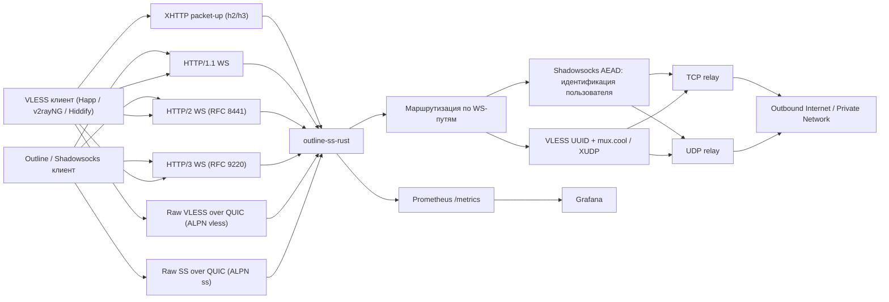

<p align="center">
  
</p>

# outline-ss-rust

`outline-ss-rust` — ориентированная на production Rust-реализация WebSocket-релея на базе Shadowsocks, вдохновлённая `outline-ss-server`.

Проект предназначен для инсталляций, которым нужны современные WebSocket-транспорты, маршрутизация по нескольким пользователям, управление политикой на уровне пользователя и наблюдаемость — без полного стека управления Outline.

---

*English version: [README.md](README.md)*

## Обзор

Сервер принимает Shadowsocks AEAD- или VLESS-трафик, инкапсулированный в бинарные фреймы WebSocket, и ретранслирует его к произвольным TCP- или UDP-назначениям.

Поддерживается:

- WebSocket over HTTP/1.1
- WebSocket over HTTP/2 — RFC 8441 Extended CONNECT
- WebSocket over HTTP/3 — RFC 9220 Extended CONNECT
- Shadowsocks AEAD (включая SS-2022) поверх WebSocket — TCP и UDP
- VLESS поверх WebSocket — TCP, UDP и mux.cool с XUDP per-packet addressing (совместимо с xray / Happ / Hiddify)
- VLESS поверх XHTTP — режимы `packet-up` (long-lived GET + POST'ы с инкрементным seq) и `stream-one` (один full-duplex POST), переключение per-session через `?mode=` в URL запроса; X-Padding и SSE-маскировка заголовков; для CDN, блокирующих WebSocket-апгрейд (совместимо с xray / sing-box / Hiddify)
- Cross-transport session resumption поверх XHTTP — припаркованный VLESS upstream переподключается через XHTTP reconnect, в том числе при смене carrier'а (h3→h2 fallback)
- Несколько пользователей с независимыми паролями Shadowsocks и/или VLESS UUID
- Выбор шифра на уровне пользователя
- Индивидуальные TCP-, UDP- и VLESS-пути WebSocket на пользователя
- Linux `fwmark` на исходящих сокетах на уровне пользователя
- IPv4 и IPv6: слушатели, upstream-цели и генерация client URL
- Метрики Prometheus и готовый дашборд Grafana
- Генерация Outline-совместимых динамических ключей доступа для Shadowsocks-клиентов и `vless://` ссылок для VLESS-клиентов
- Опциональный встроенный TLS для HTTP/1.1 и HTTP/2
- Опциональный встроенный QUIC/TLS-слушатель для HTTP/3

## Поддерживаемые возможности

| Область | Статус | Примечание |
| --- | --- | --- |
| Shadowsocks AEAD TCP | Поддерживается | Потоковый режим через бинарные WebSocket-фреймы |
| Shadowsocks AEAD UDP | Поддерживается | Один UDP-пакет на бинарный WebSocket-фрейм |
| Шифры | Поддерживается | `aes-128-gcm`, `aes-256-gcm`, `chacha20-ietf-poly1305`, `2022-blake3-aes-128-gcm`, `2022-blake3-aes-256-gcm`, `2022-blake3-chacha20-poly1305` |
| Multi-user | Поддерживается | Автоматическая идентификация по успешной расшифровке |
| Шифр на пользователя | Поддерживается | Каждый пользователь может переопределить глобальный |
| WebSocket-пути на пользователя | Поддерживается | Независимые `ws_path_tcp` и `ws_path_udp` |
| `fwmark` на пользователя | Поддерживается | Только Linux, требует привилегий для `SO_MARK` |
| HTTP/1.1 WebSocket | Поддерживается | Обычный `ws://` или `wss://` |
| HTTP/2 WebSocket | Поддерживается | RFC 8441 Extended CONNECT |
| HTTP/3 WebSocket | Поддерживается | RFC 9220 Extended CONNECT |
| Сырой VLESS поверх QUIC | Поддерживается | ALPN `vless`; bidi-стрим на TCP-таргет, QUIC datagram'ы для UDP с 4-байтным session_id |
| Сырой Shadowsocks поверх QUIC | Поддерживается | ALPN `ss`; bidi-стрим = одна SS-AEAD TCP-сессия, QUIC datagram = SS-UDP пакет |
| Встроенный TLS для h1/h2 | Поддерживается | Опционально, на основном TCP-слушателе |
| Встроенный QUIC/TLS для h3 | Поддерживается | Опционально, на `h3_listen`; может использовать тот же порт, что и `listen`, по UDP; список ALPN настраивается |
| IPv6 | Поддерживается | Слушатель, upstream-резолвинг, генерация ключей |
| Метрики Prometheus | Поддерживается | Отдельный слушатель, метки с низкой кардинальностью |
| Дашборд Grafana | Поддерживается | Готовый JSON-дашборд в репозитории |
| Outline динамические ключи | Поддерживается | `ssconf://` + генерируемый YAML |
| VLESS поверх WebSocket | Поддерживается | TCP, UDP, mux.cool с XUDP per-packet addressing (совместимо с xray/happ/hiddify), до 8 под-соединений одновременно; доступно поверх HTTP/1.1, HTTP/2 и HTTP/3 |
| VLESS поверх XHTTP packet-up | Поддерживается | Long-lived GET + POST'ы с seq-номерами на одном HTTP/2 (или HTTP/3) соединении; reorder-буфер на сервере склеивает out-of-order POST'ы; downlink-кольцо переживает обрыв GET'а в полёте (CDN ~100 c); `X-Padding` + SSE-style маскировка заголовков (`text/event-stream`, `Cache-Control: no-store`, `X-Accel-Buffering: no`) |
| VLESS поверх XHTTP stream-one | Поддерживается | Один bidirectional запрос: request body — uplink, response body — downlink. Включается через `?mode=stream-one` в URL запроса на том же base path. Требует h2 или h3 (h1 → 505). На h3 bidi-стрим разделяется через `RequestStream::split` на send/recv половинки на отдельных tasks |
| Resumption через XHTTP | Поддерживается | Сервер выдаёт `X-Outline-Session` на первом запросе, паркует VLESS-upstream при разрыве carrier'а и переподключает на следующем запросе с `X-Outline-Resume` — в том числе при смене carrier'а (например, fallback клиента с h3 на h2 с тем же токеном) |
| HTTP fallback (маскировка) | Поддерживается | Reverse-proxy неподходящих под наши маршруты HTTP/1.1 + HTTP/2 запросов на внешний бэкенд (haproxy / nginx / caddy) вместо `404`, чтобы листенер выглядел как обычный веб-сервис. Опциональный HAProxy PROXY-protocol v1/v2 prefix сохраняет реальный IP клиента для логов/ACL |
| SNI fallback (L4 маскировка) | Поддерживается | Подсматривает ClientHello на TLS-листенере и сплайсит коннекты с чужим SNI (сырое TCP вместе с захваченным ClientHello) на внешний бэкенд с собственным сертом. Сестра HTTP-fallback'а на уровень ниже OSI. nginx-style wildcards в `match_sni`; PROXY-protocol v1/v2 настоятельно рекомендуется, чтобы бэкенд видел реальный IP клиента |
| VLESS REALITY / XTLS / Vision | Не поддерживается | Вне области применения |
| VLESS / Shadowsocks raw поверх QUIC | Поддерживается | Без WebSocket / без HTTP/3 framing'а; выбирается по ALPN (`vless`, `ss`) на том же `h3_listen` |
| Outline management API | Не поддерживается | Только data plane |
| SIP003 plugin negotiation | Не поддерживается | Вне области применения |

## Архитектура

Подробная документация по архитектуре находится в [docs/ARCHITECTURE.md](docs/ARCHITECTURE.md).

Краткая схема:



## Структура репозитория

- [src/server/](src/server): транспортные слушатели, обработка WebSocket Upgrade, логика TCP и UDP relay
- [src/crypto/](src/crypto): шифрование/расшифровка Shadowsocks AEAD для потоков и UDP-пакетов
- [src/config/](src/config): загрузка конфигурации из CLI, переменных окружения и TOML
- [src/access_key.rs](src/access_key.rs): генерация Outline динамических ключей и YAML
- [src/metrics/](src/metrics): экспортёр Prometheus и семейства метрик
- [src/protocol.rs](src/protocol.rs): хелперы формата Shadowsocks (SOCKS-совместимый target address)
- [src/nat.rs](src/nat.rs): таблица UDP NAT-сессий
- [src/fwmark.rs](src/fwmark.rs): хелперы Linux SO_MARK для исходящих сокетов
- [config.toml](config.toml): пример production-конфигурации
- [systemd/outline-ss-rust.service](systemd/outline-ss-rust.service): production-ориентированный systemd unit
- [grafana/outline-ss-rust-dashboard.json](grafana/outline-ss-rust-dashboard.json): готовый Grafana-дашборд
- [PATCHES.ru.md](PATCHES.ru.md): локальные патчи крейтов для HTTP/3 стека

## Транспортная модель

### TCP

TCP-эндпоинт переносит стандартный Shadowsocks AEAD-поток в бинарных WebSocket-фреймах:

1. Клиент открывает WebSocket-соединение на TCP-пути пользователя или глобальном.
2. Клиент отправляет зашифрованные данные Shadowsocks-потока в бинарных фреймах.
3. Сервер буферизует и расшифровывает поток до получения полного целевого адреса.
4. Сервер подключается к цели и ретранслирует байты в обоих направлениях.

Границы WebSocket-фреймов игнорируются. Зашифрованный поток может быть фрагментирован произвольно.

### UDP

UDP-эндпоинт ожидает ровно один Shadowsocks AEAD UDP-пакет на бинарный WebSocket-фрейм:

1. Клиент открывает WebSocket-соединение на UDP-пути пользователя или глобальном.
2. Каждый бинарный фрейм содержит один зашифрованный UDP-пакет.
3. Сервер расшифровывает пакет, извлекает целевой адрес и пересылает датаграмму.
4. Каждый полученный ответ от upstream возвращается как отдельный зашифрованный WebSocket-фрейм.

Каждая входящая датаграмма отправляется в отдельную relay-задачу. Максимум 256 одновременных relay-задач на WebSocket-соединение. Датаграммы, поступающие при достижении лимита, молча отбрасываются и логируются на уровне `warn`.

**UDP NAT-таблица:** сервер поддерживает постоянный UDP-сокет на тройку `(user_id, fwmark, target_addr)`, разделяемый между всеми WebSocket-сессиями данного пользователя. Это означает:

- Upstream source port стабилен на протяжении жизни NAT-записи — статeful UDP-протоколы (QUIC, DTLS, игровые и VoIP-протоколы) работают корректно.
- Несолицитированные upstream-ответы доставляются в активную WebSocket-сессию даже при поступлении между датаграммами.
- После переподключения WebSocket существующий upstream-сокет используется повторно без новых UDP-рукопожатий.

NAT-записи вытесняются через `tuning.udp_nat_idle_timeout_secs` (по умолчанию 300 секунд в профиле `large`) отсутствия исходящего трафика. Фоновая задача сканирует неактивные записи каждые 60 секунд.

### Сырой VLESS / Shadowsocks поверх QUIC (без WebSocket)

Если в `[server.h3]` указан расширенный список ALPN, на одном QUIC-эндпоинте мультиплексируются не только HTTP/3-соединения. Каждое QUIC-подключение маршрутизируется по согласованному ALPN:

- `h3` — HTTP/3 + WebSocket-over-HTTP/3 (по умолчанию, без изменений).
- `vless` — VLESS поверх bidi QUIC-стримов напрямую. Один bidi-стрим = один VLESS-запрос: для TCP-таргета двунаправленный сплайс байтов на этом же стриме; для UDP bidi-стрим служит control'ом и якорем времени жизни сессии, а сами пакеты идут как QUIC datagram'ы с 4-байтным big-endian session_id'ом, который сервер выдаёт в ответе `[VERSION, 0x00, session_id]`. Команда `mux.cool` отклоняется — открывайте несколько QUIC-стримов вместо неё.
- `ss` — Shadowsocks AEAD напрямую поверх QUIC. Один bidi-стрим = одна SS-AEAD TCP-сессия (формат на проводе совпадает с обычным TCP-слушателем — пользователь идентифицируется первым chunk'ом); каждая QUIC datagram = один SS-AEAD UDP-пакет, идентичный обычному UDP-слушателю и проходящий через ту же NAT-таблицу.

Включается через `alpn = ["h3", "vless", "ss"]` в секции `[server.h3]`. Datagram'ы должны быть включены на QUIC-эндпоинте — сервер делает это автоматически, когда `h3_listen` сконфигурирован.

## Модель пользователей

Каждый пользователь может задать:

- `id`
- `password`
- `method`
- `fwmark`
- `ws_path_tcp`
- `ws_path_udp`

Если пользователь не указывает `method`, `ws_path_tcp` или `ws_path_udp`, сервер использует глобальные значения по умолчанию.

Это позволяет организовать:

- разных пользователей на разных WebSocket-путях
- разных пользователей с разными шифрами
- разных пользователей с разной политикой маршрутизации Linux через `fwmark`

## Конфигурация

По умолчанию сервер читает `config.toml` из текущего каталога. Переопределить путь можно флагом `--config`.

Пример запуска:

```bash
cargo run -- --config ./config.toml
```

Готовый пример конфигурации — в [config.toml](config.toml).

Модель листенеров теперь явная: если не задан ни один из `listen`, `h3_listen` или `ss_listen`, сервер завершится с ошибкой конфигурации. Поднимаются только те листенеры, которые явно указаны.

## Короткие команды сборки

Для musl cross-build в репозитории используются готовые Cargo aliases из `.cargo/config.toml`, которые запускают `cargo-zigbuild`. Это делает рабочий путь явным и не завязывает сборку на более хрупкий сценарий с обычным `cargo build --target ...`.

Доступные короткие aliases:

```bash
cargo build-musl-x86_64
cargo release-musl-x86_64
cargo build-musl-aarch64
cargo release-musl-aarch64
cargo build-musl-arm
cargo release-musl-arm
cargo build-musl-armv7
cargo release-musl-armv7
```

Эти команды разворачиваются в соответствующие вызовы `cargo zigbuild --target ...` для musl-таргетов, которые сейчас доступны на stable через Rustup: `x86_64`, `aarch64`, `arm` и `armv7`.

Примечание про legacy MIPS: таргеты `mips` и `mipsel` больше не входят в текущий stable-набор Rustup. Если они всё ещё нужны, используйте pinned старый toolchain или отдельный flow на базе `build-std`, а не стандартные stable-shortcuts и release-workflows.

### Параметры верхнего уровня

| Ключ | Назначение |
| --- | --- |
| `listen` | Опциональный основной TCP-слушатель для HTTP/1.1 и HTTP/2 |
| `ss_listen` | Опциональный plain Shadowsocks TCP+UDP слушатель для обычных `ss://` клиентов |
| `[server].cert_path` / `[server].key_path` | Опциональный встроенный TLS для основного слушателя (default-сертификат, когда SNI не совпал ни с одной записью). Старые ключи `tls_cert_path` / `tls_key_path` остаются как алиасы для обратной совместимости |
| `[[server.certs]]` | Опциональный массив дополнительных пар cert/key, выбираемых по SNI на основном слушателе. Каждая запись: `cert_path`, `key_path`, опционально `sni = [...]`. Если `sni` не указан — имена извлекаются из SAN сертификата (и Subject CN как последний фолбэк). Wildcard SAN-записи пропускаются (резолвер сравнивает SNI точно) — для них перечисляйте имена в `sni` явно |
| `h3_listen` | Опциональный QUIC-слушатель для HTTP/3 (а также для сырого VLESS/SS поверх QUIC, если расширен список ALPN); должен быть указан явно при включении QUIC |
| `[server.h3].cert_path` / `[server.h3].key_path` | Default-сертификат для QUIC-слушателя. Если они не заданы в `[server.h3]`, QUIC-слушатель наследует cert/key из `[server]`, так что один и тот же сертификат покрывает оба транспорта |
| `[[server.h3.certs]]` | Массив cert/key/sni для QUIC-слушателя, та же форма что и `[[server.certs]]`. Если массив целиком отсутствует в `[server.h3]`, наследуется `[[server.certs]]` |
| `[server.h3].alpn` | Список ALPN-протоколов на QUIC-эндпоинте. Допустимые значения: `"h3"` (HTTP/3 + WebSocket-over-HTTP/3), `"vless"` (сырой VLESS поверх QUIC-стримов), `"ss"` (сырой Shadowsocks AEAD поверх QUIC-стримов). По умолчанию `["h3"]` |
| `metrics_listen` | Опциональный Prometheus-слушатель |
| `metrics_path` | Путь Prometheus-эндпоинта |
| `prefer_ipv4_upstream` | Предпочитать IPv4 для upstream DNS и connect; полезно, если IPv6-путь ломает трафик |
| `outbound_ipv6_prefix` | Опциональный IPv6 CIDR (например `2001:db8:dead::/64`). Если задан, каждый upstream IPv6 TCP-connect и UDP NAT-сокет биндится на случайный адрес из этого префикса вместо kernel-default источника. Типовая настройка: `ip -6 addr add 2001:db8:dead::1/64 dev eth0`, тогда весь /64 считается on-link — `IPV6_FREEBIND` (включается автоматически на Linux) позволит `bind()` взять любой адрес из префикса. Фолбэк, когда FREEBIND недоступен: добавить AnyIP-маршрут `ip -6 route add local 2001:db8:dead::/64 dev lo`. IPv4 upstreams не затрагиваются |
| `outbound_ipv6_interface` | Альтернатива `outbound_ipv6_prefix` для DHCPv6 / SLAAC-развёртываний, где префикс заранее неизвестен. Имя сетевого интерфейса (например `eth0`); пул — это **реально назначенные** интерфейсу global-unicast IPv6-адреса (читаются через `getifaddrs(3)`), каждый исходящий сокет биндится к случайно выбранному из них. Используются только адреса, которые фактически присутствуют на хосте, поэтому обратный трафик корректно возвращается при обычном SLAAC — без AnyIP-маршрутов и без NDP-прокси. Отлично сочетается с kernel privacy extensions (`sysctl -w net.ipv6.conf.<iface>.use_tempaddr=2`): ядро само ротирует временные адреса, а демон подхватывает их на следующем refresh — получается ротация source по соединениям в стиле macOS/Android без написания netlink-кода. В пул попадают только адреса `2000::/3` — loopback, link-local, ULA (`fc00::/7`), multicast, IPv4-mapped, discard (`100::/64`) и прочие неглобальные диапазоны отфильтровываются. Взаимоисключим с `outbound_ipv6_prefix`. Если пул пуст в момент bind, сокет биндится wildcard kernel-default c записью `DEBUG`. Только Linux и macOS |
| `outbound_ipv6_refresh_secs` | Интервал в секундах между переэнумерациями пула адресов `outbound_ipv6_interface`. По умолчанию `30`. Игнорируется, если `outbound_ipv6_interface` не задан |
| `tuning_profile` | Именованный пресет ресурсных лимитов: `small` / `medium` / `large` (по умолчанию). Задаёт H2/H3 flow-control windows, лимиты стримов, таймауты сессий/NAT и глобальный cap UDP-relay-тасков |
| `[tuning]` | Per-field оверрайды поверх выбранного профиля. См. ключи `tuning.*` ниже |
| `tuning.client_active_ttl_secs` | TTL в секундах для вычисления `client_active` / `client_up` |
| `tuning.udp_nat_idle_timeout_secs` | Время жизни UDP NAT-записи после последней исходящей датаграммы (значение по умолчанию зависит от профиля; `300` для `large`) |
| `tuning.udp_max_concurrent_relay_tasks` | Глобальный cap на число одновременных UDP-relay-тасков по всем WebSocket-сессиям. `0` отключает cap |
| `tuning.udp_replay_max_sessions` | Максимум одновременных SS-2022 anti-replay окон (по умолчанию зависит от профиля; `262144` для `large`). Пакеты с новым `client_session_id` отбрасываются при достижении лимита — это ограничивает память от клиента, который вращает session ID, раздувая стор. `0` отключает cap |
| `tuning.ws_data_channel_capacity` | Per-session bounded mpsc capacity (в чанках) для WS-writer fan-in (upstream-reader → WS-writer для TCP-relay, NAT-reader → WS-writer для UDP-relay). Дефолты: `16` / `64` / `128` для `small` / `medium` / `large`. Слишком маленькое значение приводит к back-pressure от WS-writer'а на upstream-чтение при кратковременных задержках записи — видно как буферный underrun у видеоплеера; слишком большое — раздувает worst-case per-session residency (`capacity × 16 KiB` для TCP). Поднимайте для high-bandwidth single-tenant деплоев, снижайте для memory-constrained хостов со многими сессиями |
| `tuning.h2_*` / `tuning.h3_*` | Тонкие настройки flow-control windows, лимитов стримов и сокет-буферов — см. `TuningProfile` в `src/config/mod.rs` |
| `ws_path_tcp` | Глобальный TCP WebSocket-путь |
| `ws_path_udp` | Глобальный UDP WebSocket-путь |
| `ws_path_vless` | Опциональный VLESS-over-WebSocket путь на основном HTTP/1.1/HTTP/2 слушателе |
| `xhttp_path_vless` | Опциональный VLESS-over-XHTTP base-путь. Сервер регистрирует `<base>/{id}` для каждого base; `{id}` — opaque per-session токен, выбираемый клиентом. Должен отличаться от `ws_path_vless` |
| `http_root_auth` | Включить OpenConnect-подобный HTTP Basic challenge на `/`; после 3 неверных паролей сервер отдаёт `403`, а не-корневые пути остаются `404` |
| `http_root_realm` | Текст в HTTP Basic запросе пароля для `/`; по умолчанию `Authorization required` |
| `public_host` | Публичный хост для генерации Outline-ключей |
| `public_scheme` | `ws` или `wss` для генерируемых client URL |
| `access_key_url_base` | Базовый URL для хостинга генерируемых YAML-файлов |
| `access_key_file_extension` | Расширение для генерируемых файлов клиентской Outline-конфигурации; по умолчанию `.yaml` |
| `print_access_keys` | Вывести динамические Outline-конфигурации и завершить работу |
| `write_access_keys_dir` | Записать per-user Outline YAML-файлы в указанный каталог и завершить работу |
| `method` | Глобальный шифр Shadowsocks по умолчанию |
| `password` | Пароль в режиме одного пользователя или base64 PSK для `2022-*` |
| `fwmark` | `fwmark` в режиме одного пользователя |
| `users[].password` | Опциональный пароль Shadowsocks на пользователя |
| `users[].vless_id` | Опциональный VLESS UUID на пользователя |
| `users[].ws_path_vless` | Опциональный VLESS WebSocket-путь на пользователя; при отсутствии используется верхнеуровневый `ws_path_vless` |
| `users[].xhttp_path_vless` | Опциональный VLESS XHTTP base-путь на пользователя; при отсутствии используется верхнеуровневый `xhttp_path_vless` |
| `users[].enabled` | Опциональный переключатель. `false` блокирует пользователя (маршруты и аутентификация отключаются), не удаляя запись. По умолчанию `true` |
| `[control]` | Опциональный HTTP-эндпоинт управления пользователями в рантайме (фича `control`, включена по умолчанию). См. [Управляющий эндпоинт](#управляющий-эндпоинт) |
| `control.listen` | Адрес сокета управляющего слушателя, например `127.0.0.1:7001`. Отдельный сокет — не выставляйте в публичную сеть |
| `control.token` | Bearer-токен, обязательный в каждом запросе. Для секретов предпочтительнее `control.token_file` |
| `control.token_file` | Путь к файлу с bearer-токеном; взаимоисключим с `control.token` |
| `[dashboard]` | Опциональный браузерный UI на отдельном listener; проксирует запросы к настроенным control-серверам и не отдаёт токены браузеру |
| `dashboard.listen` | Адрес сокета dashboard listener, например `127.0.0.1:7002` |
| `dashboard.request_timeout_secs` | Таймаут dashboard-to-control запросов. По умолчанию `15` |
| `dashboard.refresh_interval_secs` | Интервал автообновления dashboard UI в секундах. По умолчанию `10` |
| `dashboard.instances[].name` | Отображаемое имя управляемого инстанса |
| `dashboard.instances[].control_url` | Базовый `http://` или `https://` URL control listener этого инстанса |
| `dashboard.instances[].token` / `token_file` | Bearer-токен, который dashboard использует server-side при проксировании |

### Параметры пользователя

```toml
[[users]]
id = "alice"
password = "change-me"
fwmark = 1001
method = "aes-256-gcm"
ws_path_tcp = "/alice/tcp"
ws_path_udp = "/alice/udp"
vless_id = "550e8400-e29b-41d4-a716-446655440000"
ws_path_vless = "/alice/vless"
xhttp_path_vless = "/alice/xh"
```

Для `2022-blake3-aes-128-gcm`, `2022-blake3-aes-256-gcm` и `2022-blake3-chacha20-poly1305` параметр `password` должен содержать base64-кодированный сырой PSK длиной ровно 16, 32 и 32 байта соответственно, например `openssl rand -base64 32`.

### VLESS поверх XHTTP

Для деплойментов за CDN, блокирующим WebSocket-апгрейд, можно настроить VLESS поверх XHTTP рядом с WS-путём (или вместо). Сервер регистрирует `<xhttp_path_vless>/{id}` для каждого base; `{id}` — opaque токен, выбираемый клиентом на сессию. Тот же `vless_id` работает на обоих несущих — клиент сам выбирает, на каком пути ему лучше в данный момент.

```toml
[server]
listen = "0.0.0.0:443"
cert_path = "/etc/letsencrypt/live/example/fullchain.pem"
key_path  = "/etc/letsencrypt/live/example/privkey.pem"

[websocket]
# Опционально: оставляем WS-путь для клиентов на прямых соединениях.
ws_path_vless = "/vless"
# Обязательно для XHTTP. Должен отличаться от `ws_path_vless`.
xhttp_path_vless = "/xh"

[[users]]
id = "alice"
vless_id = "550e8400-e29b-41d4-a716-446655440000"
```

Один и тот же `xhttp_path_vless` слушатель обслуживает оба XHTTP wire-режима; клиент выбирает carrier на сессию через query-параметр URL:

| Режим | URL клиента | Что куда |
| --- | --- | --- |
| `packet-up` (по умолчанию) | `https://example.com/xh/<id>` | `GET <id>` — long-lived downlink; короткие `POST <id>` с `X-Xhttp-Seq: N` несут uplink. Reorder-буфер склеивает out-of-order POST'ы. Downlink-кольцо переживает обрыв GET'а в полёте (CDN ~100 c) — следующий GET с тем же `<id>` продолжает с unread-курсора. |
| `stream-one` | `https://example.com/xh/<id>?mode=stream-one` | Один bidirectional `POST <id>?mode=stream-one`: request body = uplink, response body = downlink. Требует h2 или h3 (h1 → 505). На h3 bidi-стрим QUIC разделяется на send/recv половины на отдельных tasks. |

Cross-transport session resumption opt-in (`[session_resumption].enabled = true`) и работает через XHTTP reconnect, в том числе при смене carrier'а — например, клиент, у которого упал h3 dial, может откатиться на h2 с тем же `X-Outline-Resume` токеном, и сервер переподключит припаркованный VLESS-upstream вместо нового connect'а к таргету. Токен `X-Outline-Session`, который сервер выдаёт на первом запросе, появляется в каждом последующем GET/POST/stream-one ответе той же сессии — поэтому reconnect-attach забирает его без дополнительного state'а на клиенте.

Динамический генератор access-key выпускает два URI `vless://...?type=xhttp&path=...` на пользователя, когда `xhttp_path_vless` установлен: один с `mode=packet-up` (файл `<user>-vless-xhttp.<ext>`), второй с `mode=stream-one` (файл `<user>-vless-xhttp-stream-one.<ext>`). xray, sing-box, Hiddify, v2rayNG и Shadowrocket принимают оба URI как есть — клиент сам подбирает тот wire-режим, который проходит на его сети.

### VLESS поверх WebSocket/TLS

VLESS inbound принимает VLESS поверх WebSocket на основном HTTP/1.1 или HTTP/2 слушателе. Для публичных деплойментов используйте TLS (`[server].cert_path` / `[server].key_path`); сам VLESS-слой — это stateless UUID-аутентификация и шифрования не добавляет. Поддерживаемые команды: TCP CONNECT, UDP (длина-префиксированные датаграммы) и mux.cool с XUDP per-packet адресацией (xray-совместимое мультиплексирование, до 8 одновременных под-соединений на сессию; XUDP `GlobalID` парсится, но переиспользование между реконнектами пока не реализовано). REALITY, XTLS, Vision, flow, fallback и sniffing сознательно не реализованы.

```toml
[server]
listen = "0.0.0.0:443"
cert_path = "/etc/letsencrypt/live/example/fullchain.pem"
key_path  = "/etc/letsencrypt/live/example/privkey.pem"

[websocket]
ws_path_tcp = "/tcp"
ws_path_udp = "/udp"
ws_path_vless = "/vless"

[[users]]
id = "alice"
vless_id = "550e8400-e29b-41d4-a716-446655440000"
ws_path_vless = "/alice-vless"
```

Пример клиентского URI для Happ, v2rayNG или Hiddify:

```text
vless://550e8400-e29b-41d4-a716-446655440000@example.com:443?type=ws&security=tls&path=%2Falice-vless&encryption=none#example:alice
```

VLESS- и Shadowsocks-WebSocket-пути должны не пересекаться. Запись `[[users]]` может одновременно содержать `password` для Shadowsocks и `vless_id` для VLESS, либо только `vless_id` для VLESS-only-пользователя. `users[].ws_path_vless` перекрывает верхнеуровневый `ws_path_vless`.

### Управляющий эндпоинт

Опциональная фича `control` (включена по умолчанию) публикует небольшой HTTP API для управления `[[users]]` в рантайме. Изменения применяются атомарно к живому WebSocket data plane (через `ArcSwap`) и сохраняются обратно в тот же конфиг-файл, из которого был поднят сервер, так что переживают рестарт.

```toml
[control]
listen = "127.0.0.1:7001"
token_file = "/etc/outline-ss-rust/control.token"
```

Каждый запрос обязан содержать `Authorization: Bearer <token>` — биндим слушатель только на loopback или management-сеть. Эквивалентные CLI-флаги: `--control-listen`, `--control-token`, `--control-token-file` (и переменные `OUTLINE_SS_CONTROL_*`). Сборка `--no-default-features` полностью исключает модуль управления.

Та же фича может поднять браузерный dashboard на отдельном listener. Dashboard хранит control-токены серверов в конфиге процесса и проксирует действия браузера к настроенным `/control` endpoints.

```toml
[dashboard]
listen = "127.0.0.1:7002"
request_timeout_secs = 15
refresh_interval_secs = 10

[[dashboard.instances]]
name = "local"
control_url = "http://127.0.0.1:7001"
token_file = "/etc/outline-ss-rust/control.token"

[[dashboard.instances]]
name = "edge-02"
control_url = "https://10.0.0.12:7001"
token_file = "/etc/outline-ss-rust/edge-02.control.token"
```

Открывайте `http://127.0.0.1:7002/dashboard`.

| Метод | Путь | Назначение |
| --- | --- | --- |
| `GET` | `/control/users` | Список пользователей (только метаданные — секреты не отдаются) |
| `POST` | `/control/users` | Создать пользователя. Тело: `{ "id": "...", "password": "...", "vless_id": "...", "method": "...", "fwmark": 0, "ws_path_tcp": "/...", "ws_path_udp": "/...", "ws_path_vless": "/...", "enabled": true }` — требуется хотя бы одно из `password`/`vless_id` |
| `GET` | `/control/users/{id}` | Получить метаданные пользователя |
| `DELETE` | `/control/users/{id}` | Удалить пользователя |
| `POST` | `/control/users/{id}/block` | Заблокировать (`enabled = false`) без удаления |
| `POST` | `/control/users/{id}/unblock` | Разблокировать |

```bash
curl -H "Authorization: Bearer $TOKEN" http://127.0.0.1:7001/control/users
curl -XPOST -H "Authorization: Bearer $TOKEN" -H 'Content-Type: application/json' \
  -d '{"id":"carol","password":"s3cret"}' http://127.0.0.1:7001/control/users
curl -XPOST -H "Authorization: Bearer $TOKEN" http://127.0.0.1:7001/control/users/carol/block
```

Ограничения v1:

- Значения `ws_path_tcp` / `ws_path_udp` / `ws_path_vless` у создаваемого пользователя должны уже присутствовать в стартовом конфиге — Axum/H3 роутеры регистрируют пути только на старте. Ввод совершенно нового пути по-прежнему требует рестарта.
- Обычный Shadowsocks-слушатель (`ss_listen`) использует стартовый снимок ключей и в рантайме не обновляется. WebSocket-транспорты (TCP/UDP/VLESS) обновляются.
- Неявный пользователь, синтезируемый из верхнеуровневого `password`, через этот API не управляется — добавьте явную запись `[[users]]`.

Если `http_root_auth = true`, обычный `GET /` получает HTTP Basic challenge. Имя пользователя игнорируется, а пароль проверяется по настроенным Shadowsocks-пользователям. Параметр `http_root_realm` задаёт текст этого запроса пароля. После трёх неудачных попыток пароля в рамках одной браузерной сессии сервер начинает отвечать `403 Forbidden`. Обычные HTTP-запросы к любым не-корневым путям по-прежнему получают `404 Not Found`.

### Переменные окружения

- `OUTLINE_SS_CONFIG`
- `OUTLINE_SS_LISTEN`
- `OUTLINE_SS_SS_LISTEN`
- `OUTLINE_SS_TLS_CERT_PATH`
- `OUTLINE_SS_TLS_KEY_PATH`
- `OUTLINE_SS_H3_LISTEN`
- `OUTLINE_SS_H3_CERT_PATH`
- `OUTLINE_SS_H3_KEY_PATH`
- `OUTLINE_SS_METRICS_LISTEN`
- `OUTLINE_SS_METRICS_PATH`
- `OUTLINE_SS_PREFER_IPV4_UPSTREAM`
- `OUTLINE_SS_OUTBOUND_IPV6_PREFIX`
- `OUTLINE_SS_OUTBOUND_IPV6_INTERFACE`
- `OUTLINE_SS_OUTBOUND_IPV6_REFRESH_SECS`
- `OUTLINE_SS_UDP_NAT_IDLE_TIMEOUT_SECS`
- `OUTLINE_SS_WS_PATH_TCP`
- `OUTLINE_SS_WS_PATH_UDP`
- `OUTLINE_SS_HTTP_ROOT_AUTH`
- `OUTLINE_SS_HTTP_ROOT_REALM`
- `OUTLINE_SS_PUBLIC_HOST`
- `OUTLINE_SS_PUBLIC_SCHEME`
- `OUTLINE_SS_ACCESS_KEY_URL_BASE`
- `OUTLINE_SS_PRINT_ACCESS_KEYS`
- `OUTLINE_SS_METHOD`
- `OUTLINE_SS_PASSWORD`
- `OUTLINE_SS_FWMARK`
- `OUTLINE_SS_CONTROL_LISTEN`
- `OUTLINE_SS_CONTROL_TOKEN`
- `OUTLINE_SS_CONTROL_TOKEN_FILE`
- `OUTLINE_SS_USERS`

`OUTLINE_SS_USERS` использует записи вида `id=password`, разделённые запятыми:

```bash
OUTLINE_SS_USERS=alice=secret1,bob=secret2
```

Параметры `method`, `fwmark`, `ws_path_tcp` и `ws_path_udp` на уровне пользователя задаются только в TOML.

Если задан `ss_listen`, сервер поднимает ещё и классический Shadowsocks-сервис на этом адресе. Он слушает и TCP, и UDP на одном порту и использует тех же пользователей, шифры, `fwmark` и тот же UDP NAT, что и WebSocket-транспорты.

## Режимы развёртывания

### 1. Простой WebSocket

Для тестирования или доверенных приватных сетей:

```toml
listen = "0.0.0.0:3000"
ws_path_tcp = "/tcp"
ws_path_udp = "/udp"
method = "chacha20-ietf-poly1305"
```

### 2. Встроенный TLS для HTTP/1.1 и HTTP/2

```toml
[server]
listen = "0.0.0.0:5443"
cert_path = "/etc/outline-ss-rust/tls/fullchain.pem"
key_path  = "/etc/outline-ss-rust/tls/privkey.pem"

[websocket]
ws_path_tcp = "/tcp"
ws_path_udp = "/udp"
```

Обслуживает `wss://` на основном TCP-слушателе с поддержкой RFC 8441 на том же сокете.

Чтобы обслуживать **несколько доменов** на одном слушателе, перечислите дополнительные пары cert/key в `[[server.certs]]`. `cert_path` / `key_path` из `[server]` становится default-сертификатом и возвращается, когда входящий SNI не совпал ни с одной записью массива (или когда клиент SNI не прислал):

```toml
[server]
listen = "0.0.0.0:5443"
cert_path = "/etc/letsencrypt/live/default.example.com/fullchain.pem"
key_path  = "/etc/letsencrypt/live/default.example.com/privkey.pem"

[[server.certs]]
cert_path = "/etc/letsencrypt/live/api.example.com/fullchain.pem"
key_path  = "/etc/letsencrypt/live/api.example.com/privkey.pem"
sni = ["api.example.com", "api2.example.com"]   # явный список

[[server.certs]]
cert_path = "/etc/letsencrypt/live/shop.example.com/fullchain.pem"
key_path  = "/etc/letsencrypt/live/shop.example.com/privkey.pem"
# `sni` не указан — имена извлекаются из SAN сертификата (и Subject CN
# как последний фолбэк). Wildcard SAN-записи пропускаются.
```

То же касается QUIC-слушателя через `[[server.h3.certs]]`. Если в `[server.h3]` не заданы ни `cert_path`/`key_path`, ни массив `certs`, QUIC-слушатель целиком наследует cert-конфигурацию с TCP-листенера, поэтому в типичной развёртке достаточно сконфигурировать сертификаты один раз в `[server]`.

**Автоматическая перезагрузка сертификатов.** Каждый сконфигурированный файл cert/key — default-пара и любая запись `[[server.certs]]` / `[[server.h3.certs]]` — отслеживается на диске и перезагружается на месте при изменении содержимого, без перезапуска и без сигналов. Новые соединения подхватывают обновлённый сертификат в течение нескольких минут (файлы опрашиваются раз в 5 минут); уже установленные соединения продолжают использовать тот сертификат, по которому прошли handshake. Это работает «из коробки» с ACME-обновлениями (certbot, lego, acme.sh, Caddy): атомарный rename / подмена симлинка, которые делают эти инструменты, отслеживаются автоматически. Если перезагрузка не удалась — например, сертификат переписали раньше соответствующего ключа — продолжает обслуживать ранее загруженный сертификат, ошибка логируется, а следующая согласованная запись повторяется автоматически.

### 3. Чистый Shadowsocks-сокет

```toml
listen = "0.0.0.0:3000"
ss_listen = "0.0.0.0:8388"
ws_path_tcp = "/tcp"
ws_path_udp = "/udp"
method = "chacha20-ietf-poly1305"
```

Сохраняет существующий WebSocket-ingress и дополнительно поднимает нативный Shadowsocks TCP+UDP порт для клиентов без Outline.

### 4. Встроенный HTTP/3

```toml
[server]
listen = "0.0.0.0:5443"
cert_path = "/etc/outline-ss-rust/tls/fullchain.pem"
key_path  = "/etc/outline-ss-rust/tls/privkey.pem"

[server.h3]
listen = "0.0.0.0:5443"
# `cert_path` / `key_path` (и массив `[[server.h3.certs]]`) наследуются
# из `[server]`, если их не задавать здесь — поэтому в типовой
# развёртке сертификат конфигурируется один раз.
```

HTTP/3 всегда требует TLS и доступности UDP на выбранном порту.

### 5. HTTP fallback на внешний веб-сервер (маскировка)

По умолчанию на любой запрос, который не попал ни в один сконфигурированный WebSocket / XHTTP / metrics путь, сервер отвечает `404 Not Found`. Сканеры по этой реакции легко отличают наш листенер от обычного веб-сервиса. Блок `[http_fallback]` делает так, чтобы такие «не наши» запросы выглядели как ответы обычного сайта: они проксируются на внешний бэкенд (haproxy, nginx, caddy, …), и случайный `curl https://your-host/` или TLS-сканер видит то, что отдаёт этот бэкенд.

```toml
[http_fallback]
backend = "http://127.0.0.1:8080"   # пока только http://
# request_timeout_secs = 30
# add_x_forwarded_for = true
# add_x_forwarded_proto = true
# add_x_forwarded_host = true
# proxy_protocol = "v1"             # либо "v2"; пропустить — выкл.
```

Что именно проксируется:

- Любой запрос, который **не** попал ни в один сконфигурированный WebSocket / XHTTP / metrics / control / dashboard маршрут. Порядок приоритетов прежний: WebSocket и XHTTP-маршруты первыми, затем `http_root_auth` на `/`, и только потом fallback.
- Hop-by-hop заголовки (`Connection`, `Keep-Alive`, `TE`, `Trailers`, `Transfer-Encoding`, `Upgrade`, `Proxy-*`) срезаются в обе стороны, включая всё, что перечислено внутри `Connection:`. Тело стримится в обе стороны.
- `Host` заменяется на authority бэкенда — virtual host'ы на upstream'е резолвятся так, словно запрос пришёл напрямую к нему (поведение nginx-овского `proxy_set_header Host $proxy_host;`).
- `X-Forwarded-For`, `X-Forwarded-Proto`, `X-Forwarded-Host` добавляются/устанавливаются в зависимости от тумблеров выше. `X-Forwarded-Proto` отражает, терминировал ли входящий листенер TLS.

PROXY-protocol:

- `proxy_protocol = "v1"` (текстовый) или `"v2"` (бинарный) — добавит HAProxy PROXY-protocol заголовок в начало TCP-соединения с бэкендом. Бэкенд должен быть явно настроен на ровно эту версию (`proxy_protocol on;` в `listen`-директиве nginx, `accept-proxy` на bind у haproxy и т. п.).
- В качестве destination в заголовок пишется bind-адрес входящего листенера. Если он `0.0.0.0` / `[::]`, кодер деградирует до UNKNOWN (v1) / UNSPEC (v2) — per-connection local_addr пока не пробрасывается.

Ограничения:

- HTTP/3 fallback не реализован: на `h3_listen` не наши запросы по-прежнему возвращают `404`. Чисто пробросить h3-фреймы на h1/h2 бэкенд без отдельного h3-клиента и большого слоя трансляции framing'а нельзя, поэтому отложено до явного запроса.
- backend поддерживает только `http://host:port`. HTTPS-upstream и Unix-доменные сокеты добавим по запросу.
- При высокой частоте запросов fallback открывает по одному upstream TCP-соединению на каждый входящий (без пула). Для маскировочного трафика этого достаточно; если хочется использовать fallback как полноценный балансер — терминируйте на upstream'е напрямую.

### 6. SNI-роутинг для чужих TLS-доменов (L4-маскировка)

HTTP-fallback выше срабатывает *после* того, как мы оттерминировали TLS — полезно когда SNI наш, но путь / Host не подошёл ни под один маршрут. Блок `[sni_fallback]` добавляет уровень ниже: подсматриваем ClientHello *до* handshake, и если SNI не наш — сплайсим сырое TCP-соединение (вместе с захваченным ClientHello) на бэкенд, у которого свой собственный сертификат для чужих SNI. Со стороны пассивного наблюдателя листенер становится похож на SNI-маршрутизирующий haproxy frontend.

Требует встроенного TLS на основном TCP-листенере (`[server].cert_path` + `[server].key_path` или хотя бы одну запись `[[server.certs]]`).

`match_sni` — это **whitelist SNI, которые мы терминируем локально**. Всё, что попало в этот список, отдаётся в наш TLS-стек (там multi-cert резолвер из §7 выбирает сертификат); остальное сплайсится на бэкенд. Если добавляете домен в `[[server.certs]]`, продублируйте его в `match_sni` — иначе входящий трафик на этот SNI уйдёт на чужой бэкенд, хотя у нас есть сертификат для него.

**Правило роутинга (одной фразой)** — подсмотренный SNI сначала ищется в exact-`HashMap`'е, и только при промахе — по списку wildcards, в самом конце — catch-all бэкенд. **Точное совпадение всегда побеждает wildcard, в каком бы списке оно ни было объявлено.** Это позволяет вырезать один хост из-под wildcard-апекса без хитростей с порядком: wildcard `*.example.com` в `match_sni` оставляет апекс локальным, а exact `px.example.com` в `match_sni` бэкенда отщипывает именно этот хост на upstream (см. «Carve-out pattern» ниже).

Есть два формата бэкенда. Они взаимоисключающи.

**Single-backend** — все чужие SNI идут к одному upstream. Компактно, идеально для сценария «мы vs остальной мир»:

```toml
[server]
listen = "0.0.0.0:443"
cert_path = "/etc/letsencrypt/live/your-host/fullchain.pem"
key_path  = "/etc/letsencrypt/live/your-host/privkey.pem"

[sni_fallback]
backend = "127.0.0.1:8443"               # haproxy / nginx / caddy
match_sni = ["vpn.example.com",
             "*.api.example.com"]        # обязательно, nginx-style wildcards
# allow_no_sni = false                   # коннекты без SNI → на бэкенд
# proxy_protocol = "v2"                  # v1 / v2 / пропустить. НАСТОЯТЕЛЬНО
                                         # рекомендуется — иначе бэкенд не увидит
                                         # реальный IP клиента в логах
# max_client_hello_bytes = 8192          # коннект закрывается, если ClientHello
                                         # больше этого размера
```

**Multi-backend** — разные чужие SNI идут на разные upstream'ы. Заменяем `backend = "..."` одной или несколькими таблицами `[[sni_fallback.backends]]`. Побеждает первое совпадение; запись без `match_sni` — catch-all и должна быть последней. `proxy_protocol` в этом режиме указывается per-entry (top-level ключ запрещён):

```toml
[sni_fallback]
match_sni = ["vpn.example.com"]          # остаётся на нашем TLS-терминаторе
allow_no_sni = false
# max_client_hello_bytes = 8192

[[sni_fallback.backends]]
backend = "127.0.0.1:8443"
match_sni = ["nginx.example.com", "*.nginx.example.com"]
proxy_protocol = "v2"

[[sni_fallback.backends]]
backend = "127.0.0.1:9443"
match_sni = ["caddy.example.com"]

[[sni_fallback.backends]]
backend = "127.0.0.1:10443"
# `match_sni` нет → catch-all; должен быть последним
```

**Carve-out pattern** — exact-first lookup делает паттерн «wildcard на апекс, но один хост — на отдельный upstream» тривиальным. Локально обслуживаем всё под `*.example.com`, кроме `px.example.com`, который уходит на отдельный бэкенд:

```toml
[sni_fallback]
match_sni = ["*.example.com"]            # апекс → локальный TLS-терминатор
allow_no_sni = false

[[sni_fallback.backends]]
backend = "127.0.0.1:10443"
match_sni = ["px.example.com"]           # exact-вырезка побеждает апекс-wildcard
proxy_protocol = "v2"

[[sni_fallback.backends]]
backend = "127.0.0.1:11443"              # catch-all для всего, что вне *.example.com
proxy_protocol = "v1"
```

С таким конфигом: `cloud.example.com` и `m.example.com` идут в локальный TLS (попадание по wildcard в `match_sni`), `px.example.com` сплайсится на `:10443` (exact-hit бьёт wildcard на апексе), `evil.com` уходит на `:11443` (catch-all).

Как принимается решение:

1. Читаем с inbound-сокета ровно столько, сколько нужно `rustls::server::Acceptor`'у для парсинга полного ClientHello. Всё, что больше `max_client_hello_bytes`, считается малформированным и коннект закрывается (намеренно: junk не уходит на бэкенд и не засоряет его логи).
2. **Exact-таблица** — каждая точная запись из `match_sni` и из каждого `[[sni_fallback.backends]].match_sni` индексируется в один `HashMap` при старте. Подсмотренный SNI ищется сначала там; hit резолвит маршрут за O(1). Локальные записи вставляются раньше бэкендовых, поэтому SNI, заявленный обоими, выигрывает за локальный; среди бэкендов выигрывает порядок объявления (повторяет историческую приоритетность).
3. **Wildcard-скан** — при промахе диспатчер проходит по списку wildcards (`*.foo.bar`, case-insensitive, ровно один лейбл слева) в порядке приоритета: сначала локальные, затем бэкенды в порядке объявления. Первое совпадение — финал.
4. **Catch-all / отказ** — если и тут промах, проваливаемся в catch-all бэкенд (single-backend режим с `backend = "..."` всегда ведёт себя как catch-all; в multi-backend это запись без `match_sni`). Если catch-all'а нет и ничего не совпало — коннект закрывается с `WARN`-логом. Коннекты без SNI обрабатываются той же логикой через `allow_no_sni`: `true` → локально, `false` → catch-all.
5. Локальный маршрут → захваченные байты возвращаются в наш TLS-терминатор через обёртку `PrependStream`; multi-cert резолвер из §7 выбирает сертификат, всё ниже по стеку (`[http_fallback]`, websocket / xhttp, …) работает как на не-сплайснутом коннекте. Бэкенд → открываем новое TCP-соединение, опционально префиксим HAProxy PROXY-protocol header, пишем захваченный ClientHello и `tokio::io::copy_bidirectional` до закрытия одной из сторон.

PROXY-protocol на этом уровне намного полезнее, чем на `[http_fallback]`: мы форвардим сырой TCP, и без PROXY-header'а бэкенд будет видеть `127.0.0.1` как peer для каждого спайса — логи / ACL / rate-limit становятся бесполезны. Как и в `[http_fallback]`, в качестве destination в заголовке используется bind-адрес входящего листенера (деградирует до UNKNOWN / UNSPEC при `0.0.0.0` / `[::]`).

Ограничения:

- Только TLS. На plain (без TLS) `[server] listen` нельзя сделать SNI-dispatch — нет SNI. Валидация запрещает такую конфигурацию.
- В качестве destination в PROXY-header'е используется bind-port, не per-connection local port.
- Wildcards в `match_sni` — только один лейбл слева (nginx-style). Без mid-segment wildcards и без полноценных регексов. (Cert-резолвер из §7 матчит SNI точно — wildcard SAN-записи там пропускаются.)
- HTTP/3-листенер не задействован: SNI на h3 разбирает quinn до того, как мы его видим. Маршрутизация туда требует отдельного слоя.

### 7. Несколько сертификатов на одном листенере (выбор по SNI)

`[sni_fallback]` решает, *наш* ли это коннект или принадлежит чужому бэкенду. Дополнительная задача — обслуживать **несколько собственных доменов** на одном листенере, например `vpn.example.com` и `api.example.com` на одном `:443` сокете, каждый со своим Let's Encrypt сертификатом. Массивы `[[server.certs]]` и `[[server.h3.certs]]` решают это напрямую, причём с одинаковой формой на обоих транспортах:

```toml
[server]
listen = "0.0.0.0:443"
# Default-сертификат, возвращается когда SNI не совпал ни с одной
# записью ниже (и когда клиент SNI не прислал).
cert_path = "/etc/letsencrypt/live/default.example.com/fullchain.pem"
key_path  = "/etc/letsencrypt/live/default.example.com/privkey.pem"

[[server.certs]]
cert_path = "/etc/letsencrypt/live/vpn.example.com/fullchain.pem"
key_path  = "/etc/letsencrypt/live/vpn.example.com/privkey.pem"
sni = ["vpn.example.com"]                       # явный список

[[server.certs]]
cert_path = "/etc/letsencrypt/live/api.example.com/fullchain.pem"
key_path  = "/etc/letsencrypt/live/api.example.com/privkey.pem"
# `sni` не указан — имена возьмутся из SAN сертификата

[server.h3]
listen = "0.0.0.0:443"
# `cert_path` / `key_path` и `[[server.h3.certs]]` наследуются из
# `[server]`, если их не задавать здесь — поэтому QUIC-слушатель
# автоматически получает тот же набор доменов, что и TCP.
```

Как это работает:

- Слушатель ставит кастомный rustls `ResolvesServerCert`. На handshake'е сервер читает SNI из ClientHello, приводит к нижнему регистру и ищет по нему `CertifiedKey`. Сравнение **точное, case-insensitive** — wildcard SAN-записи вроде `*.example.com` пропускаются на этапе загрузки (резолвер `rustls` не матчит wildcards) и выводятся в `WARN`-лог; для таких сертификатов перечисляйте конкретные имена в `sni = [...]` явно.
- Если `sni = [...]` указан — регистрируются только эти имена (SAN сертификата **не** добавляются автоматически). Если `sni` опущен — имена извлекаются из `subjectAltName` DNS-записей сертификата (и Subject CN как последний фолбэк, только если DNS SAN отсутствует целиком).
- SNI, не совпавший ни с одной записью массива, — а также ClientHello без SNI-расширения — возвращает default `cert_path` / `key_path`. Если default не сконфигурирован, handshake падает с `unrecognized_name`.
- QUIC-слушатель наследует массив с TCP-листенера, если в `[server.h3]` массив `certs` не задан целиком. Явное `certs = []` в `[server.h3]` отключает наследование.
- Это выбор сертификата на **уровне 7** — разные сертификаты, один и тот же листенер, один и тот же процесс. Это независимо от `[sni_fallback]` (который форвардит чужие SNI **вообще не** терминируя TLS). Можно включать обе фичи сразу: чужие SNI уходят на склеенный backend, а каждый SNI из `match_sni` (или отсутствующий при `allow_no_sni = true`) терминируется локально с сертификатом, выбранным SNI-резолвером.

## Генерация клиентских конфигов

Shadowsocks WebSocket-клиенты используют динамические ключи доступа, ссылающиеся на YAML-документ конфигурации вместо простого `ss://` URI. Для VLESS-пользователей генерируются импортируемые `vless://` ссылки.

Генерация:

```bash
cargo run -- \
  --print-access-keys \
  --config ./config.toml
```

Или запись по одному конфигу на пару протокол/пользователь в каталог:

```bash
cargo run -- \
  --write-access-keys-dir ./keys \
  --config ./config.toml
```

Для каждого Shadowsocks-пользователя сервер выводит:

- YAML-конфигурацию транспорта
- предлагаемое имя файла, например `alice.yaml`
- `config_url`
- `ssconf://` URL ключа доступа

Для каждого VLESS-пользователя сервер выводит:

- `vless://` URI для Happ, v2rayNG и Hiddify
- предлагаемое имя файла, например `alice-vless.yaml`
- опциональный `config_url`, если задан `access_key_url_base`

Если задан `write_access_keys_dir`, сервер записывает конфиги в этот каталог и выводит полный путь к каждому сгенерированному клиентскому конфигу. Пользователь с `password` и `vless_id` получает два файла.

Расширение файлов по умолчанию — `.yaml`, но его можно изменить через `access_key_file_extension`, например на `.txt` или `.conf`.

Генерируемый Shadowsocks YAML автоматически отражает:

- эффективный шифр пользователя
- эффективный TCP-путь
- эффективный UDP-путь
- глобальный публичный хост и схему

Генерируемый VLESS URI автоматически отражает:

- `vless_id`
- эффективный VLESS WebSocket-путь
- глобальный публичный хост и схему
- `security=tls` для `public_scheme = "wss"` и `security=none` для `ws`

## Наблюдаемость

### Prometheus

Публикация метрик на отдельном слушателе:

```toml
metrics_listen = "127.0.0.1:9090"
metrics_path = "/metrics"

[tuning]
client_active_ttl_secs = 300
```

Пример конфигурации scrape:

```yaml
scrape_configs:
  - job_name: outline-ss-rust
    static_configs:
      - targets:
          - 127.0.0.1:9090
```

Набор метрик включает:

- WebSocket Upgrade и разрывы по транспорту и HTTP-протоколу
- Счётчики аутентифицированных сессий на клиента
- Временны́е метки `last seen` на клиента
- Счётчики `client_active` / `client_up` на основе настраиваемого TTL
- Активные WebSocket-сессии
- Продолжительность WebSocket-сессий
- Счётчики зашифрованных фреймов и байт WebSocket
- Счётчики TCP-сессий по пользователям
- Количество успешных/неуспешных TCP upstream-подключений и задержка
- Активные исходящие TCP-соединения
- Пропускная способность TCP payload по направлениям и пользователям
- Успешные/таймаут/ошибочные UDP-события по пользователям
- UDP replay drops по пользователям (anti-replay для Shadowsocks-2022)
- Задержка UDP relay по пользователям
- Пропускная способность UDP payload по пользователям
- Агрегированная пропускная способность на клиента по TCP и UDP
- Счётчики ответных UDP-датаграмм
- RSS/виртуальная память процесса
- Количество потоков процесса
- Категории виртуальной памяти: анонимные, file-backed, stack и специальные mapping'и
- Топ-размеры virtual mapping и gap'ов из `/proc/self/smaps`
- Информация о сборке и конфигурации

### Grafana

Импортируйте [grafana/outline-ss-rust-dashboard.json](grafana/outline-ss-rust-dashboard.json) в Grafana.

Дашборд охватывает:

- активные сессии и активные TCP upstream
- доля TCP connect error
- доля UDP timeout и error
- WebSocket upgrade и disconnect rate
- скорость сессий на клиента и `last seen`
- активные клиенты по TTL
- агрегированный трафик на клиента (TCP + UDP)
- TCP connect p95 latency
- TCP и UDP throughput по пользователям
- скорость UDP-запросов и ответных датаграмм
- UDP replay drops по пользователям и протоколу

## Настройка производительности HTTP/3

Сервер запрашивает у ОС UDP-сокетные буферы по 32 МБ (приём и отправка). На большинстве систем ядро молча ограничивает реальный размер. Если в логах появляется предупреждение вида:

```
HTTP/3 UDP receive buffer capped by OS — increase net.core.rmem_max
```

до запуска сервиса необходимо поднять системные лимиты.

**Linux:**

```bash
sysctl -w net.core.rmem_max=33554432
sysctl -w net.core.wmem_max=33554432
```

Для сохранения после перезагрузки добавьте в `/etc/sysctl.d/99-quic.conf`:

```
net.core.rmem_max=33554432
net.core.wmem_max=33554432
```

**macOS:**

```bash
sysctl -w kern.ipc.maxsockbuf=33554432
```

### Внутренние QUIC-константы

| Параметр | Значение | Назначение |
| --- | --- | --- |
| UDP socket buffer (отправка + приём) | 32 МБ | Поглощение всплесков пакетов; основная защита от дропов на уровне ОС |
| Окно приёма QUIC-потока | 16 МБ | Потолок пропускной способности на поток при высоком RTT |
| Окно приёма QUIC-соединения | 64 МБ | Агрегированный потолок пропускной способности на соединение |
| Буфер записи WebSocket | 512 КБ | Батчинг исходящих данных для снижения накладных расходов на syscall |
| Порог backpressure WebSocket | 16 МБ | Максимум буферизованных данных до дропа соединения с медленным клиентом |
| Максимальный размер UDP-payload | 1 350 байт | Безопасное значение для интернет-путей; исключает IP-фрагментацию |
| Интервал QUIC ping | 10 с | Поддерживает соединения через NAT и файрволы |
| QUIC idle timeout | 120 с | Максимальное время неактивности до закрытия соединения сервером |

## Production-эксплуатация

### `install.sh`

Для базовой production-установки на Linux можно использовать bundled-скрипт [install.sh](install.sh). Запускать его нужно от `root` на целевом хосте:

```bash
curl -fsSL https://raw.githubusercontent.com/balookrd/outline-ss-rust/main/install.sh -o install.sh
chmod +x install.sh
./install.sh --help
sudo ./install.sh
```

Режимы установки:

- По умолчанию ставится последний stable server release под текущую архитектуру
- `CHANNEL=nightly` ставит rolling prerelease nightly
- `VERSION=v1.2.3` фиксирует установку на конкретный stable-тег

Примеры:

```bash
./install.sh --help
sudo ./install.sh
sudo CHANNEL=nightly ./install.sh
sudo VERSION=v1.2.3 ./install.sh
```

Что делает скрипт:

- определяет архитектуру хоста и скачивает артефакт последнего GitHub release
- устанавливает бинарник в `/usr/local/bin/outline-ss-rust`
- создаёт системного пользователя и группу `outline-ss-rust`, если их ещё нет
- создаёт каталоги `/etc/outline-ss-rust` и `/var/lib/outline-ss-rust`
- скачивает `config.toml` и bundled systemd unit из того же release tag
- обновляет конфигурацию systemd через `daemon-reload`
- не запускает сервис автоматически при первой установке
- автоматически перезапускает сервис при обновлении, если он уже был запущен

После первой установки:

1. Отредактируйте `/etc/outline-ss-rust/config.toml`.
2. Запустите сервис вручную: `sudo systemctl enable --now outline-ss-rust`.
3. Проверьте статус: `systemctl status outline-ss-rust --no-pager`.
4. Проверьте логи: `journalctl -u outline-ss-rust -e --no-pager`.

Скрипт можно безопасно запускать повторно для обновления: он скачает выбранный release, заменит бинарник, сохранит существующий конфиг и автоматически перезапустит `outline-ss-rust.service`, если сервис уже был активен. Если сервис был остановлен, скрипт не будет запускать его сам.

Сейчас поддерживаются только те архитектуры, для которых GitHub CI публикует release-артефакты: `x86_64-unknown-linux-musl` и `aarch64-unknown-linux-musl`.

Полезные переопределения:

- `CHANNEL=stable|nightly`: выбор release-канала; по умолчанию `stable`
- `VERSION=v1.2.3`: зафиксировать установку на конкретном stable-теге
- `REPO=owner/name`: установка из другого GitHub-репозитория или форка
- `SERVICE_NAME=custom.service`: другое имя unit-файла
- `INSTALL_BIN_DIR=/path`: установить бинарник не в `/usr/local/bin`
- `CONFIG_DIR=/path`: хранить конфиг не в `/etc/outline-ss-rust`
- `STATE_DIR=/path`: использовать другой state-каталог
- `SERVICE_USER=name` и `SERVICE_GROUP=name`: запускать сервис от другого пользователя

`VERSION` и `CHANNEL=nightly` одновременно использовать нельзя.

### systemd

Production-ориентированный systemd unit находится в [systemd/outline-ss-rust.service](systemd/outline-ss-rust.service).

Типичная процедура установки:

1. Установить бинарник в `/usr/local/bin/outline-ss-rust`.
2. Установить конфигурацию в `/etc/outline-ss-rust/config.toml`.
3. Скопировать unit-файл в `/etc/systemd/system/outline-ss-rust.service`.
4. Создать выделенный системный аккаунт:
   `sudo useradd --system --home /var/lib/outline-ss-rust --shell /usr/sbin/nologin outline-ss-rust`
5. Создать необходимые каталоги:
   `sudo install -d -o outline-ss-rust -g outline-ss-rust /var/lib/outline-ss-rust /etc/outline-ss-rust`
6. Перечитать конфигурацию и включить сервис:
   `sudo systemctl daemon-reload && sudo systemctl enable --now outline-ss-rust`

Unit включает:

- автоматический перезапуск при сбое
- логирование через journald
- увеличенный `LimitNOFILE`
- `LimitSTACK=8M`, чтобы не раздувать anonymous thread-stack mappings
- `CAP_NET_BIND_SERVICE` и `CAP_NET_ADMIN`
- консервативные флаги hardening systemd

Если привилегированные порты и `fwmark` не используются, набор capabilities можно уменьшить.

На Linux bundled runtime также фиксирует размер стеков Tokio worker- и blocking-потоков на уровне 2 MiB, чтобы процесс не наследовал слишком большие виртуальные stack mappings от окружения хоста.

### Логирование

Сервис использует `tracing` для структурированных логов. Bundled systemd unit задаёт:

```text
RUST_LOG=outline_ss_rust=info,tower_http=info
```

Используйте уровень `debug` только при отладке — логи жизненного цикла WebSocket-соединений становятся значительно подробнее.

### Безопасность

- Используйте `wss://` в production, если только не работаете в доверенной приватной сети.
- Защитите `metrics_listen`; не публикуйте его без дополнительных средств контроля доступа.
- HTTP/3 требует публичной доступности UDP на выбранном порту.
- `fwmark` работает только на Linux и требует достаточных привилегий — обычно `CAP_NET_ADMIN` или root.
- TCP и UDP WebSocket-пути должны быть различными. Сервер проверяет это при запуске.
- UDP-трафик Shadowsocks-2022 защищён скользящим anti-replay фильтром по per-session ID; дубликаты `packet_id` отбрасываются и считаются в `outline_ss_udp_replay_dropped_total`. Стор хранит не более `tuning.udp_replay_max_sessions` сессий — пакеты с новым session ID сверх этого cap отбрасываются и считаются в `outline_ss_udp_replay_store_full_dropped_total`, ограничивая память против клиента, вращающего session ID.
- HTTP-аутентификация на корневом пути сравнивает пароли в constant-time.

## Замечания о совместимости

- Поддержка WebSocket через HTTP/2 опирается на RFC 8441 Extended CONNECT.
- Поддержка WebSocket через HTTP/3 опирается на RFC 9220.
- Репозиторий вендорит и патчит `h3` и `sockudo-ws` для поведения HTTP/3, необходимого проекту. Подробности — в [PATCHES.ru.md](PATCHES.ru.md).
- Вендоризованный патч `sockudo-ws` отправляет QUIC FIN (через `AsyncWriteExt::shutdown`) после доставки WebSocket Close-фрейма. Без этого дроп `SendStream` инициирует `RESET_STREAM`, который ряд H3-клиентов и промежуточных узлов трактует как ошибку уровня соединения и отвечает `H3_INTERNAL_ERROR`, разрывая всё QUIC-соединение.
- QUIC idle timeout — 120 секунд, интервал WebSocket ping — 10 секунд. Значения согласованы между QUIC transport layer и WebSocket idle-настройками.
- Следующие условия закрытия QUIC считаются штатными (не учитываются как ошибки): `ApplicationClose: H3_NO_ERROR`, `ApplicationClose: 0x0`, внутренние ошибки QUIC-стека из HTTP-слоя и idle timeout соединения.

## Ограничения

- Нет Outline management API
- Нет встроенного сервиса провизии пользователей
- Нет SIP003 plugin negotiation
- UDP NAT-записи разделяются между переподключениями, но не между разными пользователями и разными целевыми адресами
- UDP-транспорт: один зашифрованный Shadowsocks UDP-пакет на бинарный WebSocket-фрейм

## Разработка

Запуск тестов:

```bash
cargo test
```

Проект содержит unit- и smoke-тесты для:

- шифрования Shadowsocks-потоков и UDP-пакетов
- идентификации пользователей со смешанными шифрами
- поведения IPv6 TCP и UDP relay
- HTTP/2 RFC 8441 WebSocket upgrade flow
- HTTP/3 RFC 9220 WebSocket upgrade flow

## Лицензия

Смотрите [LICENSE](LICENSE).
