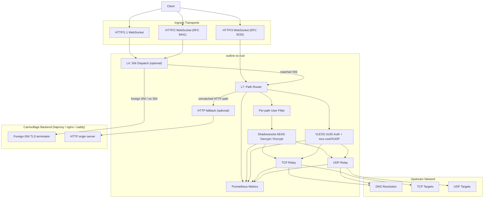
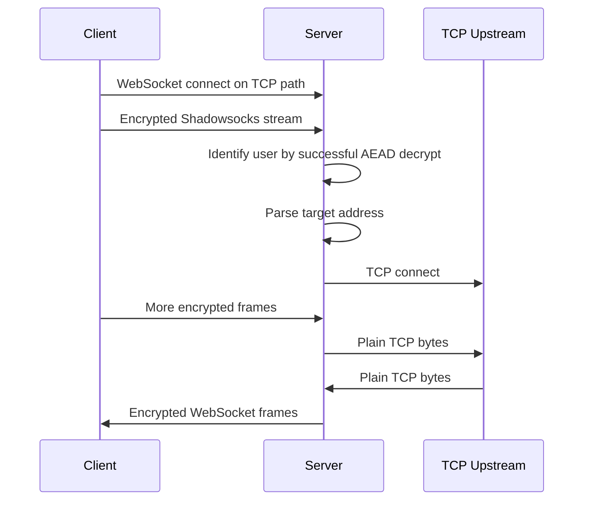
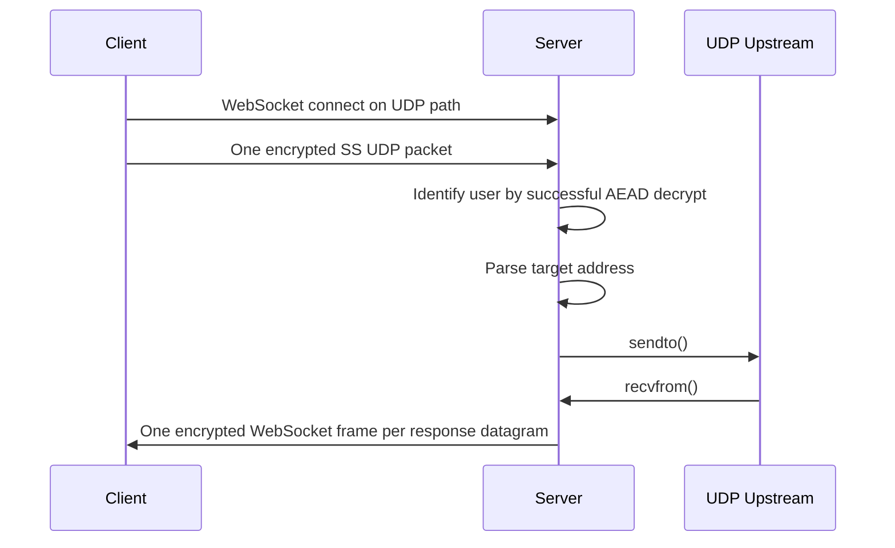
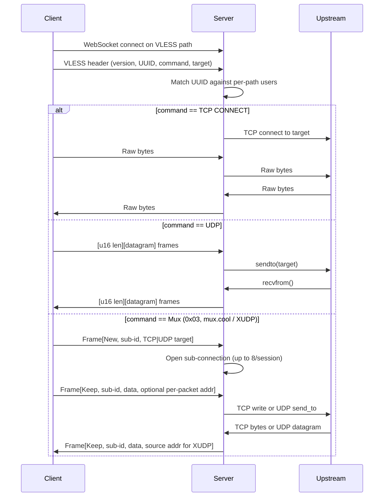

# Architecture

This document describes the runtime architecture of `outline-ss-rust` and how traffic flows through the server.

*Русская версия: [ARCHITECTURE.ru.md](ARCHITECTURE.ru.md)*

## Component Overview

## Listener Model

The server may run up to three listeners:

- Main TCP listener for HTTP/1.1 and HTTP/2
- Optional TLS on the main TCP listener
- Optional QUIC listener for HTTP/3

Prometheus metrics are served from a separate optional listener so that operational traffic does not share the WebSocket ingress path.

## Camouflage Layers

Two independent fallback knobs make the public listener look indistinguishable from a regular web frontend to passive scanners. Both are off by default.

### L4: SNI dispatch (`[sni_fallback]`)

Active only when the main TCP listener terminates TLS. Before `tokio_rustls::TlsAcceptor::accept` runs, every incoming stream is peeked with a throw-away `rustls::server::Acceptor`:

1. Read into a small buffer until the Acceptor delivers a parsed ClientHello (or `max_client_hello_bytes` is exceeded — malformed handshakes are closed locally so they never reach the backend logs).
2. The buffered bytes are kept verbatim and never re-read from the wire.
3. The peeked SNI is resolved against a precomputed `SniLookup` table built once at startup from the config. The table has three layers, consulted in order: an exact-match `HashMap<String, SniRoute>` (every `Exact` entry from `match_sni` and from each backend's `match_sni`), a wildcard `Vec<(SniMatcher, SniRoute)>` (every `Wildcard { suffix }` entry, in priority order: local first, then backends in declaration order), and a `catch_all: Option<usize>` pointing at the catch-all backend. Lookup is exact → wildcard scan → catch-all. The `HashMap` collapses the two old O(N) passes (`sni_matches_ours` over `match_sni`, then `find_backend` over `backends`) into a single O(1) probe on the hot path; wildcards stay O(N) but only run on miss. Local entries are inserted before backends, so an SNI claimed by both lists wins for `Local`; among backends, declaration order wins. Net effect for operators: an exact entry anywhere in the config beats any wildcard, regardless of declaration order — making "wildcard apex stays local, this one host goes to a backend" a one-line carve-out instead of an ordering puzzle.
4. If the route resolves to `Local`, captured bytes are replayed into the local TLS terminator via a `PrependStream` wrapper that drains the prefix on `poll_read` before falling through to the underlying socket. Handshake then continues normally and the dispatcher hands off to L7.
5. If the route resolves to `Backend(idx)`, the dispatcher splices to `config.backends[idx]`. Two config modes are supported:
   - **Single-backend** (`backend = "host:port"` at section level): the only backend is implicitly a catch-all, so every foreign SNI lands on it.
   - **Multi-backend** (`[[sni_fallback.backends]]` array): each entry carries its own `backend`, an optional per-backend `match_sni` list, and an optional `proxy_protocol`. An entry with no (or empty) `match_sni` is the catch-all and must be the last entry; a connection that matches no backend is silently dropped. This lets operators route different domains to different upstreams (e.g. nginx on `:8443` for one domain, caddy on `:9443` for another) without running a separate haproxy in front.

   In both modes a fresh TCP connection is opened to the selected upstream, an optional HAProxy PROXY-protocol v1/v2 header is prepended, the captured ClientHello is written, and `tokio::io::copy_bidirectional` runs until either side closes.

The HTTP/3 listener is unaffected — quinn parses SNI before our code sees the stream, and routing it would need separate plumbing.

### L7: HTTP fallback (`[http_fallback]`)

Active for every TLS-terminated (or plain) HTTP request that does not hit a configured WebSocket / XHTTP / metrics / control / dashboard route. Instead of returning `404`, the fallback adapter reverse-proxies the request to `backend`:

- Hop-by-hop headers (RFC 7230 §6.1 + anything listed in `Connection:`) are stripped on both directions.
- `Host` is rewritten to the backend authority (mirrors nginx's `proxy_set_header Host $proxy_host;`).
- The URI is rebuilt in origin-form so the backend parses it as a normal request, not a proxy CONNECT.
- `X-Forwarded-{For,Proto,Host}` are appended/set per per-feature toggles. `X-Forwarded-Proto` reflects whether the inbound listener terminated TLS for the TCP path; the HTTP/3 path always reports `https` since QUIC is encrypted by spec.
- Optional `proxy_protocol = "v1" | "v2"` prepends a HAProxy PROXY-protocol header to the upstream TCP connection so the backend logs the real client IP.
- `backend_proto = "h1" | "h2"` selects the HTTP wire-version the listener uses to talk to the upstream, independent of the inbound version. `"h1"` (default) uses `hyper::client::conn::http1`; `"h2"` uses `hyper::client::conn::http2` in prior-knowledge mode (h2c, no ALPN) — useful for gRPC gateways or h2c-configured nginx upstreams.

Two independent toggles select which inbound listeners the fallback applies to:

- `apply_to_h1 = true` (default) — wires the adapter into the axum router on the TCP listener as a 404-replacement handler that covers HTTP/1.1 and HTTP/2 (selected via ALPN).
- `apply_to_h3 = false` (default; opt-in) — extends the fallback to the QUIC listener. The h3 dispatch in `server::h3::http::handle_h3_request` invokes the adapter for every non-CONNECT request that does not match an XHTTP base path or the `/` auth-root challenge. Auth-root (`http_root.auth = true` for `/`) keeps priority over the fallback, mirroring the axum router pinning `/` ahead of the wildcard fallback on the TCP path. Request body is buffered up-front before forwarding; response body is streamed chunk-by-chunk back over QUIC. Trailers are forwarded both directions when `backend_proto` carries them.

PROXY-protocol headers emitted on the upstream TCP socket carry `Transport=STREAM` (`0x11` / `0x21`) for the h1/h2 inbound and `Transport=DGRAM` (`0x12` / `0x22`) for the h3 inbound, so the backend can tell the origin transport. v1 has no UDP form on the wire, so `proxy_protocol = "v1"` is rejected at config-load time when `apply_to_h3 = true` — use `"v2"` or disable PROXY-protocol.

Both fallbacks share `transport::proxy_protocol::encode_proxy_protocol` so v1/v2 wire form is identical between L4 splices and L7 connects. The destination address is the inbound listener's bind addr (TCP listener for `apply_to_h1`, h3 listener for `apply_to_h3`), degrading to UNKNOWN (v1) / UNSPEC (v2) when bound to `0.0.0.0` / `[::]`.

## Request Routing

The server registers all configured TCP and UDP WebSocket paths from the effective user set.

At request time:

1. The incoming request path is matched against registered TCP or UDP WebSocket routes.
2. The user list is filtered to only those users that are allowed on that path.
3. Decryption tries only the remaining user candidates.

This gives two useful properties:

- different users can be isolated on different URL paths
- user identification remains automatic even when users share a path but use different keys or different ciphers

## User Identification

There is no explicit username inside the Shadowsocks payload.

Instead, the server identifies the user by successfully decrypting:

- the first valid TCP stream chunk, or
- the first valid UDP packet

Because users may have different ciphers, the decryptor iterates across the per-path candidate set and attempts the correct cipher for each user independently.

To skip that O(N) AEAD probe at handshake time when the same client reconnects, each TCP/H3 route owns a bounded LRU mapping `peer_addr -> user_index`. The cache is populated only after a successful AEAD verification, so a spoofed source address cannot redirect another peer's hint, and a stale hint (cipher mismatch, user removed, list reorder) self-heals on the next full scan. The TLS path injects `ConnectInfo<SocketAddr>` per accepted connection so the upgrade handler keys the same cache.

## TCP Data Path

Important behaviors:

- WebSocket message boundaries are ignored for TCP
- the server buffers decrypted bytes until a full target address is available
- once the target is known, the relay becomes a bidirectional stream bridge
- per-user `fwmark` is applied before the outbound TCP connect when configured

## UDP Data Path

Important behaviors:

- each WebSocket binary frame is expected to contain exactly one Shadowsocks UDP packet
- each upstream UDP response becomes its own encrypted WebSocket binary frame
- per-user `fwmark` is applied to the outbound UDP socket when configured
- Shadowsocks-2022 UDP traffic is protected by a sliding-window anti-replay filter keyed on the per-session `client_session_id`; duplicate `packet_id`s are dropped before the relay step, and idle sessions are reaped on the same cadence as NAT-entry eviction

## VLESS Data Path

A separate WebSocket path (`ws_path_vless`, optionally per-user) accepts VLESS streams on the main HTTP/1.1 or HTTP/2 listener, and on the QUIC HTTP/3 listener when `h3_listen` is configured. VLESS authentication is stateless UUID matching against the per-path user set; the protocol layer itself adds no encryption, so TLS on the main listener (or the QUIC HTTP/3 endpoint) is required for public deployments.

Important behaviors:

- UUID lookup is linear over the per-path candidate set; the request is rejected and logged when the UUID is unknown
- for `COMMAND_UDP`, each client frame is length-prefixed (`u16` BE); each upstream response is re-framed the same way
- for `COMMAND_MUX` (mux.cool / XUDP), a single VLESS stream multiplexes up to 8 concurrent sub-connections, each with its own session id; sub-connections can be TCP or UDP, and UDP Keep frames carry a per-packet destination (XUDP), with replies tagged by the upstream source address
- the XUDP `GlobalID` on New frames is parsed and logged, but UDP sessions are not yet reused across WebSocket reconnects
- per-user `fwmark` is applied to both TCP connects and UDP sockets opened for a VLESS session

## Transport Support

### HTTP/1.1

Uses the standard WebSocket upgrade flow and supports plain `ws://` or `wss://`.

### HTTP/2

Uses RFC 8441 Extended CONNECT. This requires:

- server-side support for HTTP/2 CONNECT protocol enablement
- a client that implements WebSocket over HTTP/2
- any reverse proxy in front of the server to preserve Extended CONNECT rather than downgrading to HTTP/1.1

### HTTP/3

Uses RFC 9220 Extended CONNECT over QUIC. This requires:

- TLS
- UDP reachability
- HTTP/3-capable clients

The repository currently vendors and patches upstream crates to make this path practical. See [PATCHES.md](PATCHES.md).

### Raw VLESS / Shadowsocks over QUIC

Configurable via `[server.h3].alpn` (defaults to `["h3"]`). When the list also includes `"vless"` or `"ss"`, the same QUIC endpoint also accepts non-HTTP/3 protocols on the same UDP port. After the QUIC handshake, the server inspects the negotiated ALPN on `quinn::Connection::handshake_data()` and dispatches:

- `h3` — existing HTTP/3 + WebSocket-over-HTTP/3 path.
- `vless` — raw VLESS framing on QUIC bidi streams, plus QUIC datagrams for UDP. The per-connection UDP session table maps a server-allocated `session_id` (4-byte big-endian, prefixed on every datagram) to the upstream UDP socket; the originating bidi stream's recv side is the session's lifetime anchor and closing it tears the session down. The `mux.cool` command is rejected — every additional target opens its own bidi stream, letting QUIC's native multiplexing handle head-of-line isolation.
- `ss` — raw Shadowsocks AEAD on QUIC. A bidi stream carries one SS-AEAD TCP session; the handshake parser is identical to the plain `ss_listen` listener (auth by trial decrypt of the first chunk), so user identity, fwmark, NAT entries and metric labels behave the same. UDP is delivered as one QUIC datagram per SS-AEAD packet through the shared `handle_ss_udp_packet` helper, so the NAT table and replay store are reused unchanged.

The same `H3_MAX_CONCURRENT_CONNECTIONS` and `H3_MAX_CONCURRENT_STREAMS` semaphores bound the raw-QUIC paths. Datagram queues are sized off `tuning.h3_*` knobs.

## Observability Design

Metrics are intentionally low-cardinality and focused on production operations.

Labels include:

- `transport`: `tcp` or `udp`
- `protocol`: `http1`, `http2`, `http3`, `socket` (plain SS listeners), `quic` (raw VLESS/SS over QUIC)
- `user`: user identifier
- `result`: `success`, `timeout`, or `error` where applicable
- `direction`: traffic direction for byte counters

Notably absent:

- target hostname labels
- target IP labels
- per-connection identifiers

This keeps Prometheus cost predictable and avoids turning the metrics endpoint into an unbounded cardinality source.

## Failure Domains

The system can be thought of in four layers:

1. Ingress transport layer: HTTP/1.1, HTTP/2, HTTP/3, TLS, QUIC
2. User identification and decryption layer: per-path filtering and AEAD session setup
3. Relay layer: TCP connect or UDP send/receive
4. Egress routing layer: DNS, outbound reachability, and optional `fwmark`

This separation is helpful during incident response:

- handshake failures usually live in the ingress layer
- authentication mismatches live in the decryptor layer
- connection failures live in the relay or routing layer
- throughput and latency issues can be seen directly in Prometheus and Grafana

## Security Boundaries

- TLS termination for HTTP/1.1 and HTTP/2 can happen in-process
- HTTP/3 QUIC termination also happens in-process when enabled
- user isolation is based on independent secrets, optional independent ciphers, and optional independent paths
- outbound policy isolation is optionally strengthened with per-user `fwmark`

## Operational Guidance

Recommended production pattern:

1. Use built-in TLS for the main listener if you want direct `wss://` support.
2. Use a dedicated `metrics_listen` bound to loopback or a private network.
3. Keep TCP and UDP WebSocket paths distinct.
4. Use separate per-user paths when you want cleaner traffic segmentation or staged rollouts.
5. Reserve per-user cipher overrides for compatibility or migration scenarios rather than using them arbitrarily.
6. For public deployments add the camouflage layers — `[sni_fallback]` to splice foreign SNIs to a real TLS frontend (e.g. a default haproxy / nginx server block), `[http_fallback]` to reverse-proxy unmatched HTTP paths to a regular origin. Both replace the default `404` / TLS-handshake-fail signal that probes use to fingerprint VPN listeners. PROXY-protocol v1/v2 is strongly recommended on `[sni_fallback]` so the backend still sees the real client IP.
