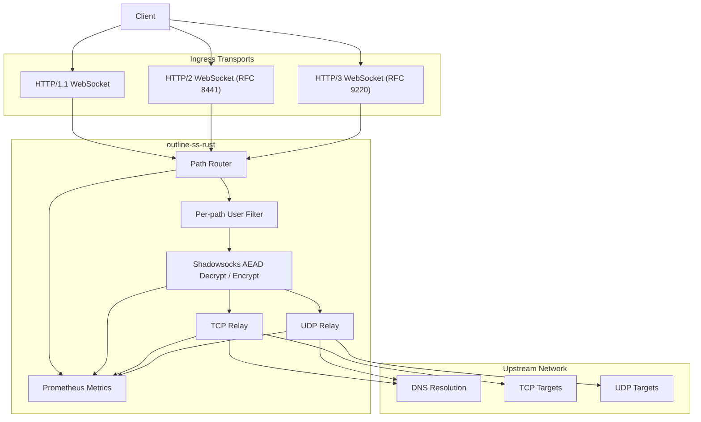
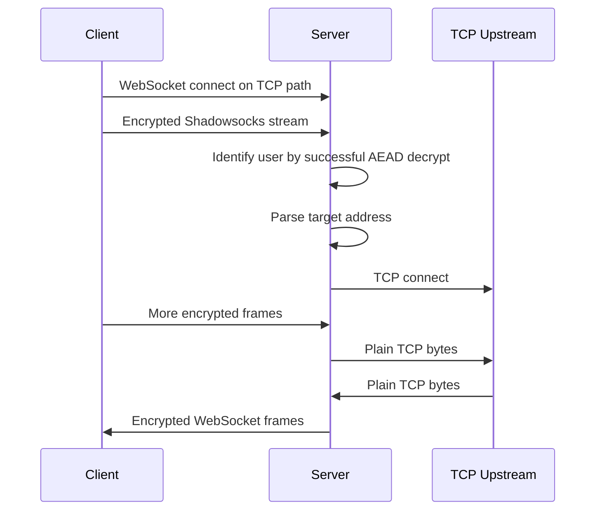
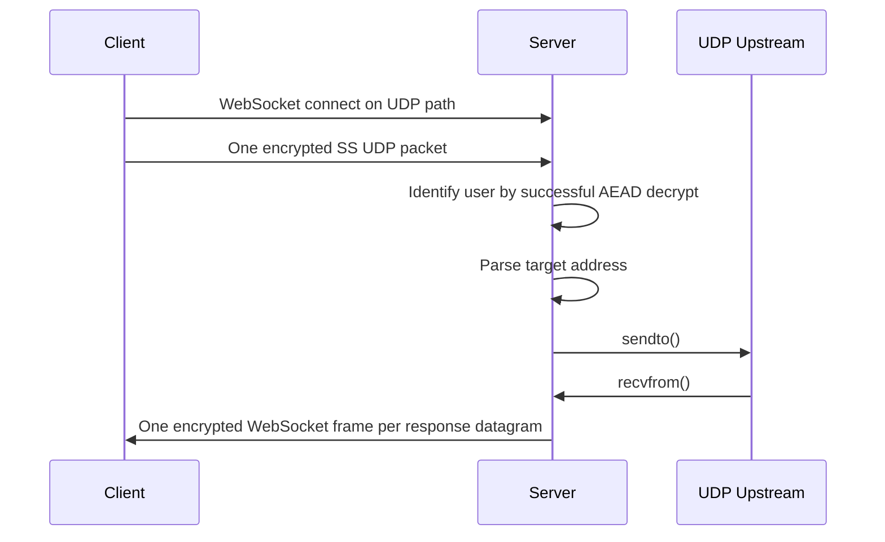

# Architecture

This document describes the runtime architecture of `outline-ss-rust` and how traffic flows through the server.

*Русская версия: [ARCHITECTURE.ru.md](ARCHITECTURE.ru.md)*

## Component Overview

## Listener Model

The server may run up to three listeners:

- Main TCP listener for HTTP/1.1 and HTTP/2
- Optional TLS on the main TCP listener
- Optional QUIC listener for HTTP/3

Prometheus metrics are served from a separate optional listener so that operational traffic does not share the WebSocket ingress path.

## Request Routing

The server registers all configured TCP and UDP WebSocket paths from the effective user set.

At request time:

1. The incoming request path is matched against registered TCP or UDP WebSocket routes.
2. The user list is filtered to only those users that are allowed on that path.
3. Decryption tries only the remaining user candidates.

This gives two useful properties:

- different users can be isolated on different URL paths
- user identification remains automatic even when users share a path but use different keys or different ciphers

## User Identification

There is no explicit username inside the Shadowsocks payload.

Instead, the server identifies the user by successfully decrypting:

- the first valid TCP stream chunk, or
- the first valid UDP packet

Because users may have different ciphers, the decryptor iterates across the per-path candidate set and attempts the correct cipher for each user independently.

## TCP Data Path

Important behaviors:

- WebSocket message boundaries are ignored for TCP
- the server buffers decrypted bytes until a full target address is available
- once the target is known, the relay becomes a bidirectional stream bridge
- per-user `fwmark` is applied before the outbound TCP connect when configured

## UDP Data Path

Important behaviors:

- each WebSocket binary frame is expected to contain exactly one Shadowsocks UDP packet
- each upstream UDP response becomes its own encrypted WebSocket binary frame
- per-user `fwmark` is applied to the outbound UDP socket when configured

## Transport Support

### HTTP/1.1

Uses the standard WebSocket upgrade flow and supports plain `ws://` or `wss://`.

### HTTP/2

Uses RFC 8441 Extended CONNECT. This requires:

- server-side support for HTTP/2 CONNECT protocol enablement
- a client that implements WebSocket over HTTP/2
- any reverse proxy in front of the server to preserve Extended CONNECT rather than downgrading to HTTP/1.1

### HTTP/3

Uses RFC 9220 Extended CONNECT over QUIC. This requires:

- TLS
- UDP reachability
- HTTP/3-capable clients

The repository currently vendors and patches upstream crates to make this path practical. See [PATCHES.md](PATCHES.md).

## Observability Design

Metrics are intentionally low-cardinality and focused on production operations.

Labels include:

- `transport`: `tcp` or `udp`
- `protocol`: `http1`, `http2`, `http3`
- `user`: user identifier
- `result`: `success`, `timeout`, or `error` where applicable
- `direction`: traffic direction for byte counters

Notably absent:

- target hostname labels
- target IP labels
- per-connection identifiers

This keeps Prometheus cost predictable and avoids turning the metrics endpoint into an unbounded cardinality source.

## Failure Domains

The system can be thought of in four layers:

1. Ingress transport layer: HTTP/1.1, HTTP/2, HTTP/3, TLS, QUIC
2. User identification and decryption layer: per-path filtering and AEAD session setup
3. Relay layer: TCP connect or UDP send/receive
4. Egress routing layer: DNS, outbound reachability, and optional `fwmark`

This separation is helpful during incident response:

- handshake failures usually live in the ingress layer
- authentication mismatches live in the decryptor layer
- connection failures live in the relay or routing layer
- throughput and latency issues can be seen directly in Prometheus and Grafana

## Security Boundaries

- TLS termination for HTTP/1.1 and HTTP/2 can happen in-process
- HTTP/3 QUIC termination also happens in-process when enabled
- user isolation is based on independent secrets, optional independent ciphers, and optional independent paths
- outbound policy isolation is optionally strengthened with per-user `fwmark`

## Operational Guidance

Recommended production pattern:

1. Use built-in TLS for the main listener if you want direct `wss://` support.
2. Use a dedicated `metrics_listen` bound to loopback or a private network.
3. Keep TCP and UDP WebSocket paths distinct.
4. Use separate per-user paths when you want cleaner traffic segmentation or staged rollouts.
5. Reserve per-user cipher overrides for compatibility or migration scenarios rather than using them arbitrarily.
