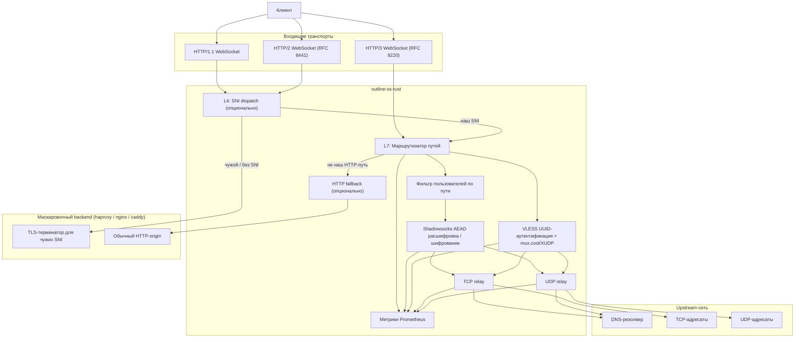
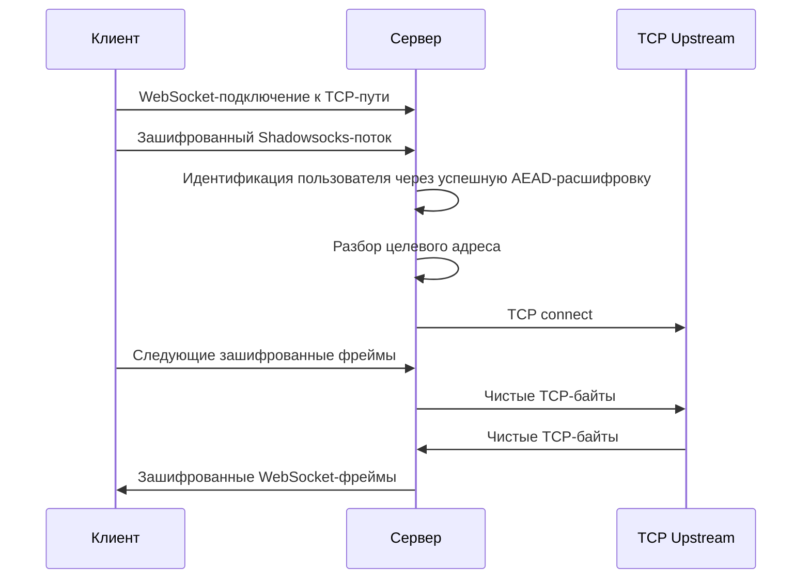
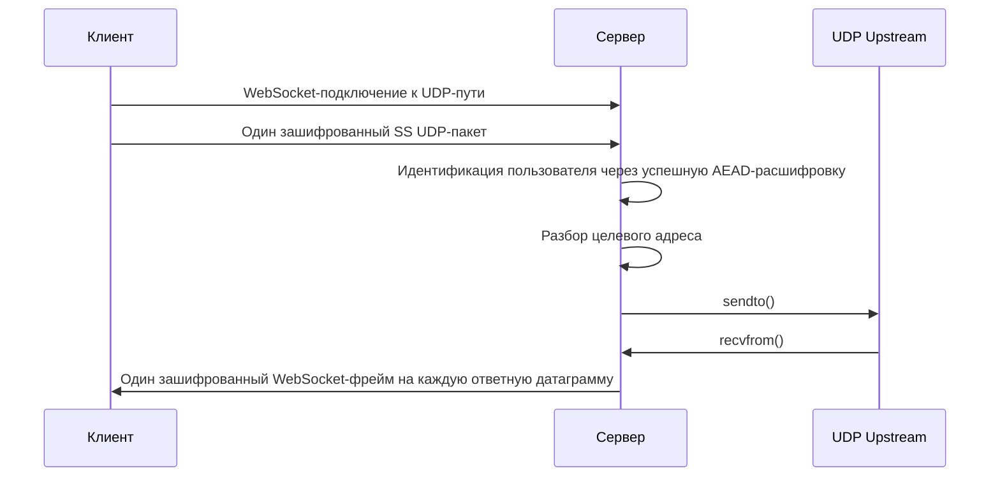
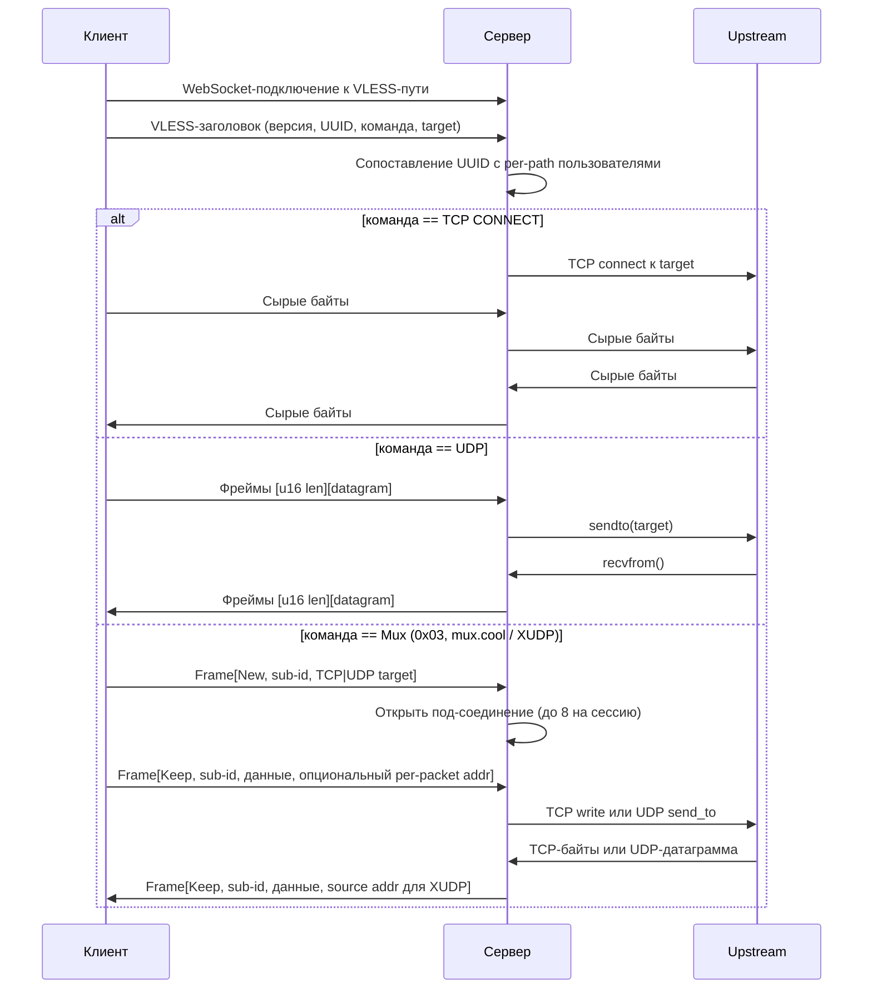

# Архитектура

Этот документ описывает архитектуру времени выполнения `outline-ss-rust` и то, как трафик проходит через сервер.

*English version: [ARCHITECTURE.md](ARCHITECTURE.md)*

## Обзор компонентов

## Модель слушателей

Сервер может запускать до трёх слушателей:

- Основной TCP-слушатель для HTTP/1.1 и HTTP/2
- Опциональный TLS на основном TCP-слушателе
- Опциональный QUIC-слушатель для HTTP/3

Метрики Prometheus обслуживаются отдельным опциональным слушателем, чтобы операционный трафик не делил WebSocket-путь с основным ingress.

## Слои маскировки

Две независимые ручки fallback'а делают публичный листенер неотличимым от обычного веб-фронтенда для пассивных сканеров. Обе по умолчанию выключены.

### L4: SNI dispatch (`[sni_fallback]`)

Активен только когда основной TCP-слушатель терминирует TLS. До вызова `tokio_rustls::TlsAcceptor::accept` каждый принятый стрим подсматривается одноразовым `rustls::server::Acceptor`'ом:

1. Читаем в небольшой буфер до тех пор, пока Acceptor не отдаст распарсенный ClientHello (или пока не превышен `max_client_hello_bytes` — малформированные handshake'и закрываются локально, чтобы не попасть в логи бэкенда).
2. Захваченные байты сохраняются дословно и больше с провода не считываются.
3. Если распарсенный SNI совпал с `match_sni` (case-insensitive; nginx-style `*.example.com` матчит ровно один лейбл слева), байты воспроизводятся в наш TLS-терминатор через обёртку `PrependStream`, которая на `poll_read` сначала отдаёт префикс, а потом проваливается в нижележащий сокет. Дальше handshake продолжается обычным путём, и dispatcher передаёт управление на L7.
4. Иначе (или если SNI не было и `allow_no_sni = false`), открывается новое TCP-соединение к `backend`, опционально префиксится HAProxy PROXY-protocol v1/v2 заголовок, дописывается захваченный ClientHello и запускается `tokio::io::copy_bidirectional` до закрытия одной из сторон.

HTTP/3 листенер в дёрже не участвует — quinn парсит SNI до того, как наш код видит соединение, а маршрутизация туда требует отдельного слоя.

### L7: HTTP fallback (`[http_fallback]`)

Активен для каждого TLS-терминированного (или plain) HTTP-запроса, который не попал ни в один сконфигурированный WebSocket / XHTTP / metrics / control / dashboard маршрут. Вместо `404` fallback-адаптер reverse-proxy'ит запрос в `backend`:

- Hop-by-hop заголовки (RFC 7230 §6.1 + всё перечисленное в `Connection:`) срезаются в обе стороны.
- `Host` заменяется на authority бэкенда (поведение nginx-овского `proxy_set_header Host $proxy_host;`).
- URI пересобирается в origin-form, чтобы бэкенд парсил его как обычный запрос, а не как proxy CONNECT.
- `X-Forwarded-{For,Proto,Host}` добавляются/выставляются по тумблерам. `X-Forwarded-Proto` для TCP-пути отражает, терминировал ли входящий листенер TLS; HTTP/3-путь всегда рапортует `https` — QUIC по спеке шифрован.
- Опциональный `proxy_protocol = "v1" | "v2"` префиксит HAProxy PROXY-protocol заголовок к upstream TCP-соединению, чтобы бэкенд логировал реальный IP клиента.
- `backend_proto = "h1" | "h2"` выбирает HTTP-версию, на которой листенер говорит с upstream, независимо от входящей версии. `"h1"` (default) использует `hyper::client::conn::http1`; `"h2"` — `hyper::client::conn::http2` в режиме prior-knowledge (h2c, без ALPN), полезно для gRPC-gateway или nginx-upstream'ов, настроенных на h2c.

Два независимых тумблера выбирают, к каким inbound-листенерам fallback применяется:

- `apply_to_h1 = true` (default) — врезает адаптер в axum-роутер на TCP-листенере как 404-replacement обработчик, покрывающий HTTP/1.1 и HTTP/2 (выбор по ALPN).
- `apply_to_h3 = false` (default; opt-in) — расширяет fallback на QUIC-листенер. h3-диспатч в `server::h3::http::handle_h3_request` зовёт адаптер для каждого не-CONNECT запроса, который не попал ни в XHTTP base path, ни в auth-root `/`. Auth-root (`http_root.auth = true` для `/`) сохраняет приоритет над fallback'ом — это симметрично тому, как axum-роутер пиннит `/` впереди wildcard-fallback'а на TCP-стороне. Тело запроса буферизуется до форвардинга; тело ответа стримится chunk-ами обратно через QUIC. Трейлеры пробрасываются в обе стороны, если выбранный `backend_proto` их умеет.

PROXY-protocol заголовки в upstream TCP-сокете несут `Transport=STREAM` (`0x11` / `0x21`) для h1/h2 inbound и `Transport=DGRAM` (`0x12` / `0x22`) для h3 inbound — бэкенд видит транспорт origin'а. У v1 на проводе нет UDP-формы, поэтому `proxy_protocol = "v1"` отвергается на старте при `apply_to_h3 = true` — используйте `"v2"` или отключите PROXY-protocol.

Оба fallback'а используют общий `transport::proxy_protocol::encode_proxy_protocol`, поэтому wire-форма v1/v2 идентична между L4-сплайсами и L7-коннектами. Адрес назначения берётся из bind-адреса входящего листенера (TCP — для `apply_to_h1`, h3 — для `apply_to_h3`) и деградирует до UNKNOWN (v1) / UNSPEC (v2), если bind на `0.0.0.0` / `[::]`.

## Маршрутизация запросов

Сервер регистрирует все настроенные TCP и UDP WebSocket-пути из актуального набора пользователей.

В момент поступления запроса:

1. Входящий путь запроса сопоставляется с зарегистрированными TCP или UDP WebSocket-маршрутами.
2. Список пользователей фильтруется до тех, кому разрешён данный путь.
3. Расшифровка перебирает только оставшихся кандидатов.

Это даёт два полезных свойства:

- разные пользователи могут быть изолированы на разных URL-путях
- идентификация пользователя остаётся автоматической даже когда они делят путь, но используют разные ключи или шифры

## Идентификация пользователя

Внутри полезной нагрузки Shadowsocks нет явного имени пользователя.

Вместо этого сервер идентифицирует пользователя по успешной расшифровке:

- первого корректного фрагмента TCP-потока, или
- первого корректного UDP-пакета

Поскольку пользователи могут использовать разные шифры, дешифратор перебирает кандидатов по пути и применяет правильный шифр для каждого пользователя независимо.

Чтобы избежать O(N) AEAD-проб на каждом handshake'е при повторном подключении того же клиента, каждый TCP/H3-маршрут владеет ограниченным LRU `peer_addr -> user_index`. Кеш заполняется только после успешной AEAD-верификации, поэтому подделка source-адреса не может перенаправить хинт другого peer'а; устаревший хинт (несоответствие cipher'а, удалённый пользователь, перестановка списка) самовосстанавливается при следующем полном скане. На TLS-пути в каждое принятое соединение прокидывается `ConnectInfo<SocketAddr>`, чтобы upgrade-хендлер ключевал тот же кеш.

## Путь данных TCP

Важные особенности поведения:

- Границы WebSocket-сообщений для TCP игнорируются
- Сервер буферизует расшифрованные байты до получения полного целевого адреса
- После определения адреса relay становится двунаправленным мостом потоков
- Пользовательский `fwmark` применяется перед исходящим TCP-подключением, если настроен

## Путь данных UDP

Важные особенности поведения:

- Ожидается, что каждый WebSocket binary frame содержит ровно один Shadowsocks UDP-пакет
- Каждый ответ upstream UDP становится отдельным зашифрованным WebSocket binary frame
- Пользовательский `fwmark` применяется к исходящему UDP-сокету, если настроен
- UDP-трафик Shadowsocks-2022 защищён скользящим anti-replay фильтром по `client_session_id`: дубликаты `packet_id` отбрасываются до шага relay, а простаивающие сессии вычищаются с той же частотой, что и эвикция NAT-записей

## Путь данных VLESS

Отдельный WebSocket-путь (`ws_path_vless`, опционально на пользователя) принимает VLESS-потоки на основном HTTP/1.1 или HTTP/2 слушателе, а также на QUIC HTTP/3 слушателе, если настроен `h3_listen`. Аутентификация VLESS — это stateless-сопоставление UUID с per-path набором пользователей; сам протокольный слой шифрования не добавляет, поэтому для публичных деплойментов обязателен TLS на основном слушателе (или QUIC HTTP/3 эндпоинте).

Важные особенности поведения:

- Поиск UUID — линейный по per-path набору кандидатов; неизвестный UUID отклоняется и логируется
- Для `COMMAND_UDP` каждый клиентский фрейм длина-префиксируется (`u16` BE); ответы upstream упаковываются в тот же формат
- Для `COMMAND_MUX` (mux.cool / XUDP) один VLESS-стрим мультиплексирует до 8 одновременных под-соединений с собственными session id; под-соединения могут быть TCP или UDP, UDP Keep-фреймы несут per-packet адрес получателя (XUDP), ответы помечаются адресом источника
- XUDP `GlobalID` на New-фреймах парсится и логируется, но переиспользование UDP-сессий между реконнектами WebSocket пока не реализовано
- Пользовательский `fwmark` применяется к TCP-подключениям и UDP-сокетам, открываемым в рамках VLESS-сессии

## Поддержка транспортов

### HTTP/1.1

Использует стандартный WebSocket upgrade flow, поддерживает `ws://` и `wss://`.

### HTTP/2

Использует RFC 8441 Extended CONNECT. Требования:

- Серверная поддержка HTTP/2 CONNECT protocol enablement
- Клиент с поддержкой WebSocket over HTTP/2
- Любой обратный прокси перед сервером должен сохранять Extended CONNECT, а не понижать до HTTP/1.1

### HTTP/3

Использует RFC 9220 Extended CONNECT over QUIC. Требования:

- TLS
- UDP-доступность
- HTTP/3-совместимые клиенты

В репозитории вендорятся и патчатся upstream-крейты для поддержки этого пути. Подробности — в [PATCHES.md](../PATCHES.md) ([Русский](../PATCHES.ru.md)).

### Сырой VLESS / Shadowsocks поверх QUIC

Настраивается через `[server.h3].alpn` (по умолчанию `["h3"]`). Если в списке также указаны `"vless"` или `"ss"`, тот же QUIC-эндпоинт принимает не только HTTP/3-соединения на том же UDP-порту. После QUIC handshake'а сервер смотрит согласованный ALPN через `quinn::Connection::handshake_data()` и направляет соединение в нужный обработчик:

- `h3` — существующий путь HTTP/3 + WebSocket-over-HTTP/3.
- `vless` — VLESS framing напрямую поверх bidi QUIC-стримов плюс QUIC datagram'ы для UDP. Per-connection таблица UDP-сессий маппит `session_id` (4 байта big-endian, префиксируется на каждой datagram'е), выданный сервером, в upstream UDP-сокет; recv-сторона исходного bidi-стрима — якорь времени жизни сессии, её закрытие сворачивает сессию. Команда `mux.cool` отклоняется — каждый дополнительный таргет открывает свой bidi-стрим, отдавая нативной мультиплексирующей логике QUIC обработку HoL-изоляции.
- `ss` — сырой Shadowsocks AEAD поверх QUIC. Один bidi-стрим = одна SS-AEAD TCP-сессия; парсер handshake'а тот же, что у обычного `ss_listen` (идентификация пользователя по trial decrypt первого chunk'а), поэтому идентификация пользователя, fwmark, NAT-записи и метки метрик работают одинаково. UDP проходит как одна QUIC datagram = один SS-AEAD пакет через общий хелпер `handle_ss_udp_packet`, поэтому NAT-таблица и replay store переиспользуются без изменений.

Те же семафоры `H3_MAX_CONCURRENT_CONNECTIONS` и `H3_MAX_CONCURRENT_STREAMS` ограничивают и raw-QUIC пути. Размеры datagram-очередей берутся из `tuning.h3_*`.

## Дизайн наблюдаемости

Метрики намеренно имеют низкую кардинальность и ориентированы на производственную эксплуатацию.

Метки включают:

- `transport`: `tcp` или `udp`
- `protocol`: `http1`, `http2`, `http3`, `socket` (обычные SS-слушатели), `quic` (сырой VLESS/SS поверх QUIC)
- `user`: идентификатор пользователя
- `result`: `success`, `timeout` или `error` там, где применимо
- `direction`: направление трафика для счётчиков байт

Намеренно отсутствуют:

- метки с именем хоста-адресата
- метки с IP адресата
- идентификаторы отдельных подключений

Это делает стоимость Prometheus предсказуемой и не превращает эндпоинт метрик в неограниченный источник высокой кардинальности.

## Границы отказов

Систему можно представить в виде четырёх слоёв:

1. Слой ingress-транспорта: HTTP/1.1, HTTP/2, HTTP/3, TLS, QUIC
2. Слой идентификации пользователя и расшифровки: фильтрация по пути и настройка AEAD-сессии
3. Слой relay: TCP connect или UDP send/receive
4. Слой egress-маршрутизации: DNS, исходящая доступность и опциональный `fwmark`

Это разделение помогает при расследовании инцидентов:

- сбои handshake обычно относятся к ingress-слою
- несоответствия аутентификации — к слою дешифратора
- ошибки подключения — к слою relay или маршрутизации
- проблемы с пропускной способностью и задержкой видны непосредственно в Prometheus и Grafana

## Границы безопасности

- Терминация TLS для HTTP/1.1 и HTTP/2 может происходить in-process
- Терминация HTTP/3 QUIC также происходит in-process, если включена
- Изоляция пользователей основана на независимых секретах, опциональных независимых шифрах и опциональных независимых путях
- Изоляция исходящей политики опционально усиливается пользовательским `fwmark`

## Рекомендации по эксплуатации

Рекомендуемый производственный шаблон:

1. Используйте встроенный TLS для основного слушателя, если нужна прямая поддержка `wss://`.
2. Привяжите `metrics_listen` к loopback или приватной сети.
3. Держите TCP и UDP WebSocket-пути раздельными.
4. Используйте отдельные пути на пользователя для более чёткой сегментации трафика или поэтапного развёртывания.
5. Резервируйте переопределения шифра на пользователя для сценариев совместимости или миграции, а не применяйте их произвольно.
6. Для публичных деплойментов включайте слои маскировки — `[sni_fallback]` сплайсит чужие SNI на полноценный TLS-фронтенд (например, default-блок haproxy / nginx), `[http_fallback]` reverse-proxy'ит «не наши» HTTP-пути на обычный origin. Оба убирают сигналы по умолчанию (`404` / TLS-handshake-fail), по которым сканеры fingerprint'ят VPN-листенеры. На `[sni_fallback]` настоятельно рекомендуется PROXY-protocol v1/v2, чтобы бэкенд по-прежнему видел реальный IP клиента.
