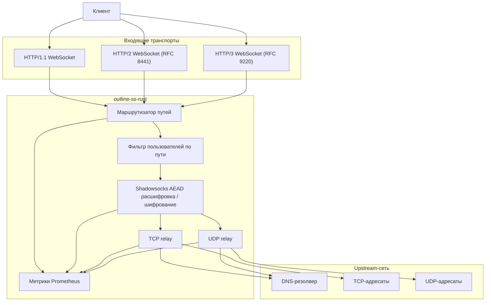
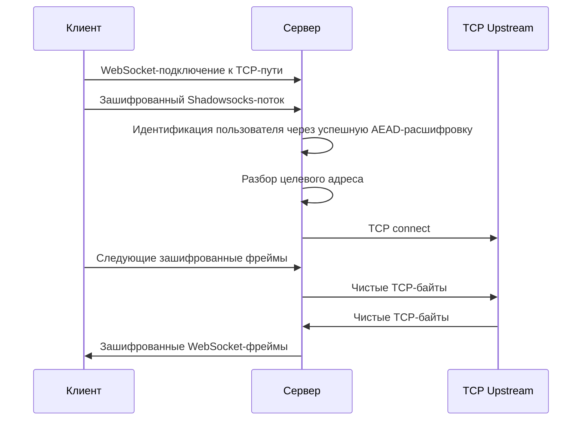
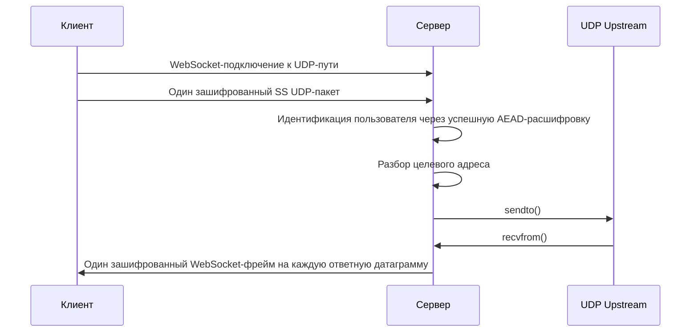

# Архитектура

Этот документ описывает архитектуру времени выполнения `outline-ss-rust` и то, как трафик проходит через сервер.

*English version: [ARCHITECTURE.md](ARCHITECTURE.md)*

## Обзор компонентов

## Модель слушателей

Сервер может запускать до трёх слушателей:

- Основной TCP-слушатель для HTTP/1.1 и HTTP/2
- Опциональный TLS на основном TCP-слушателе
- Опциональный QUIC-слушатель для HTTP/3

Метрики Prometheus обслуживаются отдельным опциональным слушателем, чтобы операционный трафик не делил WebSocket-путь с основным ingress.

## Маршрутизация запросов

Сервер регистрирует все настроенные TCP и UDP WebSocket-пути из актуального набора пользователей.

В момент поступления запроса:

1. Входящий путь запроса сопоставляется с зарегистрированными TCP или UDP WebSocket-маршрутами.
2. Список пользователей фильтруется до тех, кому разрешён данный путь.
3. Расшифровка перебирает только оставшихся кандидатов.

Это даёт два полезных свойства:

- разные пользователи могут быть изолированы на разных URL-путях
- идентификация пользователя остаётся автоматической даже когда они делят путь, но используют разные ключи или шифры

## Идентификация пользователя

Внутри полезной нагрузки Shadowsocks нет явного имени пользователя.

Вместо этого сервер идентифицирует пользователя по успешной расшифровке:

- первого корректного фрагмента TCP-потока, или
- первого корректного UDP-пакета

Поскольку пользователи могут использовать разные шифры, дешифратор перебирает кандидатов по пути и применяет правильный шифр для каждого пользователя независимо.

## Путь данных TCP

Важные особенности поведения:

- Границы WebSocket-сообщений для TCP игнорируются
- Сервер буферизует расшифрованные байты до получения полного целевого адреса
- После определения адреса relay становится двунаправленным мостом потоков
- Пользовательский `fwmark` применяется перед исходящим TCP-подключением, если настроен

## Путь данных UDP

Важные особенности поведения:

- Ожидается, что каждый WebSocket binary frame содержит ровно один Shadowsocks UDP-пакет
- Каждый ответ upstream UDP становится отдельным зашифрованным WebSocket binary frame
- Пользовательский `fwmark` применяется к исходящему UDP-сокету, если настроен

## Поддержка транспортов

### HTTP/1.1

Использует стандартный WebSocket upgrade flow, поддерживает `ws://` и `wss://`.

### HTTP/2

Использует RFC 8441 Extended CONNECT. Требования:

- Серверная поддержка HTTP/2 CONNECT protocol enablement
- Клиент с поддержкой WebSocket over HTTP/2
- Любой обратный прокси перед сервером должен сохранять Extended CONNECT, а не понижать до HTTP/1.1

### HTTP/3

Использует RFC 9220 Extended CONNECT over QUIC. Требования:

- TLS
- UDP-доступность
- HTTP/3-совместимые клиенты

В репозитории вендорятся и патчатся upstream-крейты для поддержки этого пути. Подробности — в [PATCHES.md](../PATCHES.md) ([Русский](../PATCHES.ru.md)).

## Дизайн наблюдаемости

Метрики намеренно имеют низкую кардинальность и ориентированы на производственную эксплуатацию.

Метки включают:

- `transport`: `tcp` или `udp`
- `protocol`: `http1`, `http2`, `http3`
- `user`: идентификатор пользователя
- `result`: `success`, `timeout` или `error` там, где применимо
- `direction`: направление трафика для счётчиков байт

Намеренно отсутствуют:

- метки с именем хоста-адресата
- метки с IP адресата
- идентификаторы отдельных подключений

Это делает стоимость Prometheus предсказуемой и не превращает эндпоинт метрик в неограниченный источник высокой кардинальности.

## Границы отказов

Систему можно представить в виде четырёх слоёв:

1. Слой ingress-транспорта: HTTP/1.1, HTTP/2, HTTP/3, TLS, QUIC
2. Слой идентификации пользователя и расшифровки: фильтрация по пути и настройка AEAD-сессии
3. Слой relay: TCP connect или UDP send/receive
4. Слой egress-маршрутизации: DNS, исходящая доступность и опциональный `fwmark`

Это разделение помогает при расследовании инцидентов:

- сбои handshake обычно относятся к ingress-слою
- несоответствия аутентификации — к слою дешифратора
- ошибки подключения — к слою relay или маршрутизации
- проблемы с пропускной способностью и задержкой видны непосредственно в Prometheus и Grafana

## Границы безопасности

- Терминация TLS для HTTP/1.1 и HTTP/2 может происходить in-process
- Терминация HTTP/3 QUIC также происходит in-process, если включена
- Изоляция пользователей основана на независимых секретах, опциональных независимых шифрах и опциональных независимых путях
- Изоляция исходящей политики опционально усиливается пользовательским `fwmark`

## Рекомендации по эксплуатации

Рекомендуемый производственный шаблон:

1. Используйте встроенный TLS для основного слушателя, если нужна прямая поддержка `wss://`.
2. Привяжите `metrics_listen` к loopback или приватной сети.
3. Держите TCP и UDP WebSocket-пути раздельными.
4. Используйте отдельные пути на пользователя для более чёткой сегментации трафика или поэтапного развёртывания.
5. Резервируйте переопределения шифра на пользователя для сценариев совместимости или миграции, а не применяйте их произвольно.
