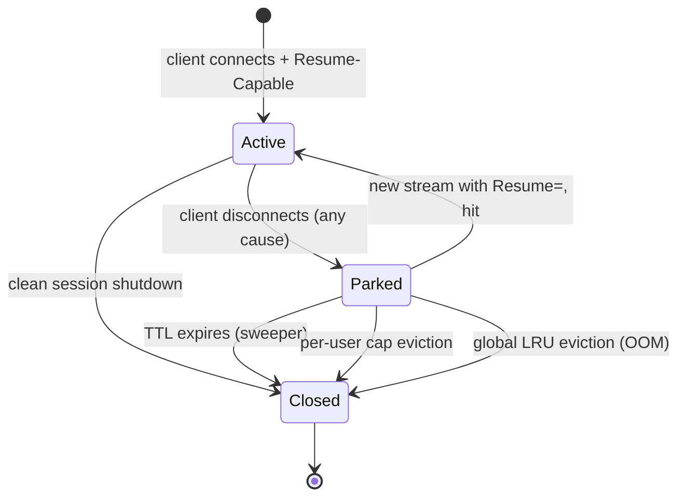

# Session Resumption

This document specifies the wire format and runtime semantics of the cross-transport session resumption feature in `outline-ss-rust`.

*Русская версия: [SESSION-RESUMPTION.ru.md](SESSION-RESUMPTION.ru.md)*

## Goal and Scope

Session resumption lets a compatible client move an existing logical session from one ingress transport to another (e.g. from raw QUIC to WebSocket-over-HTTP/2) **without re-establishing the upstream connection** to the destination host. This addresses environments where the network path between the client and the server suffers from intermittent UDP loss or path instability that breaks QUIC but tolerates TCP, and vice versa.

### What is preserved

- The `TcpStream` to the upstream target (for TCP relays).
- The `UdpSocket` and the corresponding NAT binding (for UDP relays).
- Per-user metric counters (these are already keyed by `user_id` and therefore survive transparently).
- For VLESS mux: the entire `MuxState` with all sub-connections (TCP and UDP), parked atomically.

### What is NOT preserved

- Cryptographic state of the inner protocol (Shadowsocks AEAD nonce / VLESS request). Each new transport stream performs a complete fresh handshake.
- Bytes that were in flight at the moment of the disconnect for TCP. They are not retransmitted at the application layer; the kernel buffer of the upstream socket retains whatever was already queued.
- UDP packets in flight from the upstream beyond the orphan back-buffer capacity (see [UDP back-buffer policy](#udp-back-buffer-policy)).
- Sessions across server restart. The orphan registry is in-memory only.

### Compatibility

Session resumption is a strict opt-in extension. Clients that do not advertise it MUST behave identically to today. Standard third-party clients (sing-box, v2ray-core, official Outline client) are unaffected because:

- HTTP-header-based negotiation uses unknown `X-Outline-*` headers that other clients ignore.
- The VLESS Addons opcode is reserved within the `opt_len` TLV section that other implementations skip without parsing.
- No bytes are added to handshakes that omit the negotiation.

The feature is intended for the `outline-ss-rust` ↔ `outline-ws-rust` pair. It is not a public protocol.

## Identifiers

A **Session ID** is 16 bytes of cryptographically random data, generated by the server upon the first successful handshake of a session. It is opaque to the client; the client treats it as a byte string and echoes it back on resume.

### Lifetime

| Event | Effect |
|---|---|
| First successful handshake with `Resume-Capable: 1` | Server allocates a fresh Session ID and returns it to the client |
| Client transport stream closes (any reason) | Server moves the upstream state into the orphan registry, indexed by Session ID, with a TTL |
| New stream arrives carrying `Resume: <id>` | Server takes the parked state from the registry and attaches it to the new stream |
| TTL expires without resume | Server destroys the parked state (closes upstream sockets, drops back-buffers) |

A Session ID is **owned** by exactly one authenticated user. Resume requests carrying a Session ID owned by a different user MUST be rejected (see [Security](#security-considerations)).

## Wire Format

### Negotiation

The client signals support and intent via two cooperating fields:

- `Resume-Capable: 1` — sent by the client on the first connect of a session, when no Session ID is yet known. Tells the server "if you can issue a Session ID, please do".
- `Resume: <hex32>` — sent by the client on a subsequent connect, asking the server to resume the parked session identified by the given Session ID.
- `Session: <hex32>` — sent by the server in response, carrying the Session ID that the client should use on the next reconnect.

The server response always echoes a `Session` value when it has an active session, regardless of which one the client requested. If the server could not honor a `Resume` (expired, owner mismatch, capacity), the response carries a fresh Session ID instead, and the client treats this as a brand-new session.

### WebSocket transports (HTTP/1.1, HTTP/2, HTTP/3)

The negotiation rides on HTTP request / response headers attached to the WebSocket Upgrade or HTTP/2 Extended CONNECT.

#### Request headers

| Header | Format | Meaning |
|---|---|---|
| `X-Outline-Resume-Capable` | `1` | Client advertises that it understands resumption |
| `X-Outline-Resume` | 32 lowercase hex chars | Client requests resumption of the named session |

Both headers are optional. `Resume-Capable` is sent on every connect for as long as the client wishes to receive Session IDs. `Resume` is sent only when the client wants to resume a specific parked session and SHOULD NOT be sent without a recently received Session ID.

#### Response headers

| Header | Format | Meaning |
|---|---|---|
| `X-Outline-Session` | 32 lowercase hex chars | The Session ID the client should associate with the now-established session |
| `X-Outline-Resume-Result` | `hit` \| `miss-expired` \| `miss-unknown` \| `miss-owner` \| `miss-capacity` \| `not-requested` | Outcome of the resume attempt, present only when the request carried `Resume` |

A `Resume-Result` of `hit` means the upstream state was attached. Any `miss-*` value means a fresh session was created instead.

### VLESS over raw QUIC

For raw QUIC (ALPN `vless` / `vless-mtu`) there are no HTTP headers. The negotiation rides inside the VLESS request Addons section (the `opt_len`-prefixed TLV block immediately after the user UUID).

Two new opcodes are reserved:

| Tag | Name | Length | Value |
|---|---|---|---|
| `0x10` | `RESUME_CAPABLE` | 1 | `0x01` (must be present to opt in) |
| `0x11` | `RESUME_ID` | 16 | Session ID bytes |

A request that contains `RESUME_ID` is interpreted as a resume attempt. A request that contains only `RESUME_CAPABLE` is a fresh session that wants a Session ID issued.

The VLESS response Addons section (introduced in this extension; the existing protocol does not encode response options for the request types we use) carries:

| Tag | Name | Length | Value |
|---|---|---|---|
| `0x10` | `SESSION_ID` | 16 | Session ID bytes assigned to this session |
| `0x11` | `RESUME_RESULT` | 1 | `0x00` hit, `0x01` miss-expired, `0x02` miss-unknown, `0x03` miss-owner, `0x04` miss-capacity |

Standard VLESS clients do not parse these tags and ignore the entire Addons block.

### Negotiation matrix

```
Client sends                Server returns                            Client behavior
───────────────────────────────────────────────────────────────────────────────────
(nothing)                   (nothing)                                 Vanilla session, no resume possible
Resume-Capable              Session=<new>                             Store Session ID
Resume-Capable + Resume=X   Session=<X>, Result=hit                   Continue using X
Resume-Capable + Resume=X   Session=<new>, Result=miss-*              Drop X, store new
Resume=X (no Capable)       Session=<X>, Result=hit                   Continue using X (no new ID needed)
Resume=X (no Capable)       Session=<new>, Result=miss-*              Discard new (client opted out)
```

## Server Semantics

### Orphan registry

A single in-memory registry per server instance:

```
struct OrphanRegistry {
    by_id:    DashMap<SessionId, Parked>,
    per_user: DashMap<UserId, SmallVec<[SessionId; 4]>>,
    sweeper:  JoinHandle<()>,
}
```

A `Parked` value carries one of four shapes, depending on the parked transport:

```
enum Parked {
    Tcp { upstream_writer, upstream_reader, target, owner, deadline }
    UdpSingle { nat_entry, backbuf, owner, deadline }
    VlessMux { sub_conns, owner, deadline }
    QuicUdpBundle { sessions, owner, deadline }
}
```

`sweeper` is a Tokio task that wakes every 5 seconds, iterates expired entries, and destroys them.

### Park sequence (on disconnect)

When a client transport stream closes and a Session ID was issued for it:

1. Drain the in-flight write path of the upstream so no bytes are lost in the writer's buffer.
2. Stop **active forwarding** to the (now closed) client side. For TCP this means dropping the relay task that copies from upstream-read to client-write. For UDP this means switching the `UdpResponseSender` slot to `None`.
3. Construct the appropriate `Parked` value carrying the upstream sockets, reader handles, and per-user counter handles.
4. Insert into `by_id` and append to the user's `per_user` list.
5. If the user is at capacity (`orphan_per_user_cap`), evict the oldest entry of that user before inserting.
6. If the global cap (`orphan_global_cap`) is exceeded, evict by global LRU.
7. Set `deadline = now + orphan_ttl_*`.

### Resume sequence (on a new stream with `Resume`)

1. Authenticate the new stream as usual (Shadowsocks key match or VLESS UUID).
2. Look up `Resume` in `by_id`. Possible outcomes:
   - **Not found**: respond `miss-unknown`, proceed as fresh session.
   - **Owner mismatch** (parked under a different user): respond `miss-owner`, do not reveal whether the ID exists. Proceed as fresh session.
   - **Expired** (deadline passed but sweeper has not yet run): respond `miss-expired`, evict, proceed as fresh session.
   - **Hit**: remove from `by_id` and `per_user`, atomically. Proceed to step 3.
3. Attach the parked upstream state to the new stream's relay path:
   - **TCP**: assign `upstream_writer`/`upstream_reader` to the new relay state, spawn copy tasks.
   - **UDP**: `nat_entry.sender.store(Some(new_sender))`, drain `backbuf` into `new_sender`, then resume normal reader operation.
   - **VLessMux**: walk `sub_conns`, attach each to the new mux dispatcher.
   - **QuicUdpBundle**: re-bind each `VlessUdpSession`'s datagram channel to the new QUIC `Connection`.
4. Respond with `Session = <same id>`, `Result = hit`.

### TCP behavior

The TCP path is the simplest. The upstream `TcpStream` is split into `OwnedReadHalf` / `OwnedWriteHalf`. While parked:

- The reader half is **idle** — no task is reading from it. The kernel's TCP receive window naturally back-pressures the upstream peer (RWND advertised stays where it was when parking happened, then drops to zero as the kernel buffer fills).
- The writer half is **idle** — no client traffic is flowing in.

On resume, both halves are spawned into fresh copy tasks against the new client stream.

### UDP behavior

UDP cannot be back-pressured the same way. While the client is gone:

- For each parked UDP entry, the reader task **continues running** on the upstream socket. Each received datagram is appended to a per-entry **back-buffer**.
- The back-buffer is a bounded FIFO measured in bytes. When full, the oldest datagram is dropped, and `orphan_udp_pkt_dropped_total{reason="backbuf_overflow"}` increments.
- The `UdpResponseSender` slot in the `NatEntry` is `None` while parked; the reader sees this and routes to the back-buffer instead of the client.

#### Why bytes, not packet count

UDP applications using session resumption are expected to be **streaming** workloads (video, large RTP, tunneled QUIC) where datagrams are at or near MTU. A packet-count cap creates wildly different memory budgets for DNS-like vs streaming traffic. A byte cap is uniform.

### VLESS mux

VLESS mux carries multiple sub-connections (TCP and UDP) over a single WebSocket frame stream. On disconnect:

- The `MuxState` is parked **atomically** as a whole. Individual sub-connections are not parkable independently.
- Each TCP sub-connection inside is treated like a parked TCP relay (idle reader/writer halves).
- Each UDP sub-connection inside is treated like a parked UDP single (back-buffer, sender slot).
- The `orphan_per_user_cap` counts **the mux as one** session, not its constituents.
- Resume restores the entire MuxState; partial resume is not supported.

Rationale: mixing partial parking with sub-connection-level reattach creates a tangle of session-ID-to-sub mapping that is fragile and has no clear use case (the client would have to remember per-sub state).

### Raw QUIC UDP bundle

Each QUIC connection carries a `DashMap<u32, Arc<VlessUdpSession>>` of UDP sessions, keyed by the client-assigned session number. On QUIC connection loss:

- The whole `udp_sessions` map is parked as a `QuicUdpBundle`.
- Each `VlessUdpSession` keeps its `UdpSocket` and back-buffer.
- Resume requires the new transport to also be a QUIC connection (so datagram routing works) **or** a switch to WebSocket mux. The cross-transport mapping rule:

  | Parked from | Resumed via | Behavior |
  |---|---|---|
  | Raw QUIC bundle | Raw QUIC | Re-bind each session's datagram sender to the new `Connection` |
  | Raw QUIC bundle | WebSocket VLESS mux | Sessions are re-numbered into the mux's `u16` namespace; client must know the mapping (sent in the resume response under tag `0x12 SESSION_REMAP`, TLV: pairs of `<old:u32><new:u16>`) |
  | VLESS mux | Raw QUIC | Mirror of the above; remap `u16` → `u32` |
  | TCP single | Anything | No remap needed |
  | UDP single (non-mux) | Anything | No remap needed |

The remap table is included only when the transport changes between QUIC-bundle and WS-mux. For same-transport resume the response carries no remap.

## Client Semantics

The client maintains a `(SessionId, IssuedAt)` per logical session. When the underlying transport stream closes:

1. If `now - IssuedAt < orphan_ttl - safety_margin` (default safety = 5s), attempt resume.
2. Open a new transport (possibly different from the previous one — this is the whole point) and include `Resume: <id>` in the negotiation.
3. If the response indicates `hit`, the upper layer of the client SHOULD NOT observe the disconnect — the resumed stream continues delivering bytes.
4. If the response indicates any `miss-*`, the upper layer is notified that the previous session is gone; the new session is fresh.

The client SHOULD bound the number of automatic resume attempts (recommended: 1–2) to avoid tight loops on a server that is repeatedly evicting.

## Ack-Prefix Protocol (v1)

The base resumption protocol parks the upstream `TcpStream` on disconnect and reattaches it on a subsequent connect with `X-Outline-Resume`. Bytes that the client sent over WebSocket frames but that never reached the server before the underlying TCP between client and server died are **not** retransmitted by the base protocol — the client cannot tell which of its outbound bytes were forwarded upstream and which were lost in flight, so naive replay would duplicate bytes.

The **Ack-Prefix Protocol** is an opt-in extension that closes this gap for the upstream direction: the server reports back, on every successful resume, the exact byte count it has forwarded upstream, so the client can replay only the bytes that did not make it.

### Capability negotiation

Two cooperating headers; both must be present on both sides for the protocol to engage. Either side missing the capability causes a graceful fall-through to base resume semantics (no replay; client must accept a session-level disconnect).

| Side | Header | Format | Meaning |
|---|---|---|---|
| Client request | `X-Outline-Resume-Ack-Prefix` | `1` | Client understands and will parse the ack-prefix control frame on resume hits |
| Server response | `X-Outline-Resume-Ack-Prefix` | `1` | Server understands the request and will emit the control frame on resume hits |

The capability is independent of `Resume-Capable` / `Resume`: a client that wants the protocol must advertise it on every connect, including the first connect of a session (so the server's response confirms support before the first parked-and-resumed cycle).

### Control frame wire format

When **all** of the following are true, the server emits a single SS-WS or VLESS-WS data frame ahead of any upstream→client relay bytes on a resumed session:

1. The connection is a resume request (`X-Outline-Resume: <id>`).
2. The orphan-take succeeded (`Resume-Result: hit`).
3. The owner check passed (authenticated user matches the parked session's owner).
4. The client advertised `X-Outline-Resume-Ack-Prefix: 1` in the request.
5. The server advertised `X-Outline-Resume-Ack-Prefix: 1` in the response.

The frame's plaintext payload is exactly 14 bytes:

```
+0  : magic        "ORSM"           4 bytes  ASCII
+4  : version      0x01             1 byte
+5  : flags        0x00             1 byte   reserved (must be 0 in v1)
+6  : up_acked     u64 BE           8 bytes  bytes the server forwarded upstream
                                              over the lifetime of this session
                                              (including all prior reattaches)
+14 : (end)
```

For SS-WS the 14 bytes go through the relay's normal AEAD encryption chain — same shape as any data frame. For VLESS-WS the 14 bytes are the WS frame payload directly.

#### Field semantics

- **`magic`** — fixed ASCII `"ORSM"` (Outline Resume Sync Message). Distinguishes the control frame from accidental upstream bytes that happen to start with the same prefix; no application-level upstream protocol is expected to begin with this exact 4-byte sequence at the start of a session, and the version + flags checks below add a second layer of assurance.
- **`version`** — `0x01` for this iteration. Future revisions bump this byte; clients that see a higher version they don't know how to parse MUST drop the session and reconnect without the capability rather than assume safe replay.
- **`flags`** — reserved; clients that see any non-zero bits in v1 MUST drop the session.
- **`up_acked`** — total bytes of upstream-direction payload the server has successfully written to the upstream `TcpStream` over the lifetime of this session. Counter is monotonic, accumulates across parks and reattaches, never resets. Lives on `ParkedTcp` and is preserved verbatim across the orphan registry.

### Server emission

On a resume hit (post-auth, post-orphan-take), before respawning the upstream→client relay task, the server:

1. Reads the parked state's `upstream_bytes_acked` counter.
2. Constructs the 14-byte control-frame payload as specified above.
3. Sends it as the first WS data frame on the new transport, through the SS / VLESS encryption layer of the resuming connection.

Only after the control frame has been written to the WS sink does the server hand off to the standard relay path that copies upstream bytes to the client.

The frame is **not** sent on:

- Fresh sessions (no resume requested).
- Resume misses (`miss-expired`, `miss-unknown`, `miss-owner`, `miss-capacity`) — the parked state was not attached, there is no meaningful counter.
- Resume hits where the client did not advertise the capability.

### Client parsing

When the client requested resume **and** advertised the capability, **and** the response carries `X-Outline-Resume-Ack-Prefix: 1`, the client treats the first decrypted data frame on the new transport as the control frame:

1. Validate `magic == "ORSM"` (4 bytes).
2. Validate `version == 0x01`.
3. Validate `flags == 0x00`.
4. Read `up_acked` (8 bytes, big-endian u64).

If validation fails on any check the client MUST drop the session and fall back to a fresh connect without the capability — the wire shape is unrecognised and continuing would risk upstream byte corruption.

If validation succeeds, the client uses `up_acked` as the offset into its replay buffer: bytes 0..`up_acked` were forwarded upstream by the server (already delivered) and MUST be skipped on replay; bytes `up_acked`..`client_up_sent` are in flight and SHOULD be replayed onto the new transport before resuming normal client→upstream forwarding.

If `up_acked > client_up_sent` the protocol invariant is violated (server claims more forwarded than client claims sent) and the client MUST drop the session. If `up_acked` is older than the client's replay buffer's oldest retained offset (the buffer was overwritten because the client sent too many bytes without server acks), the client cannot reconstruct the missing bytes and MUST drop the session.

### Downlink direction

v1 of the Ack-Prefix Protocol covers the **upstream** direction only. The downstream (server→client) direction has no equivalent guarantee — bytes the server emitted to WS that did not reach the client before disconnect are simply lost. Application protocols that require loss-free downstream delivery (e.g. SSH, raw TCP through SS without HTTP-layer retry) are best-effort under v1 resume; protocols with their own application-layer retry (HTTP request bodies, idempotent RPCs) are unaffected.

A future v2 may add a symmetric downstream prefix carrying the client's `down_received` counter, server-side back-buffer of recent downstream bytes, and offset-based replay; this is deferred until operational data shows the upstream-only v1 leaves measurable gaps in real-world traffic.

### Compatibility matrix

| Client capability | Server capability | Resume hit | Behaviour |
|---|---|---|---|
| Off | Any | Any | Base resume semantics (no replay; session drop on byte loss) |
| On | Off | Any | Server doesn't echo capability → client falls back to base |
| On | On | No (fresh / miss) | No control frame; fresh session; no replay needed |
| On | On | Yes | Server emits control frame; client parses & replays from offset |

## Lifecycle Diagram



## Errors and Edge Cases

| Case | Server behavior |
|---|---|
| Resume ID matches but owner differs | `miss-owner`; do not reveal existence; treat as fresh session |
| Two simultaneous resume requests for the same ID | `take()` is atomic; loser gets `miss-unknown` |
| Upstream socket died while parked | Resume succeeds at the protocol level; on first read after attach, the client receives EOF / error |
| Client disconnects again very fast (re-park) | New Session ID is issued; old ID is dropped |
| `Resume-Capable` sent without TLS / over plaintext path | Honored (resumption itself does not require TLS, but Shadowsocks / VLESS auth is unchanged) |
| Resume request lacks `Resume-Capable` | Allowed; client opts not to receive a future Session ID for this session |
| Mux child stream errors (in-band) without WS disconnect | Sub-connection is closed normally; the mux remains active and is NOT parked on this event |
| Server restart | All parked sessions vanish; resume requests after restart all return `miss-unknown` |

## Security Considerations

### Session ID confidentiality

A Session ID is a bearer token: anyone who learns it and has the user's credentials can steal the parked upstream socket. We mitigate by:

- **Owner check**: the resuming connection must authenticate as the same user that owns the parked session. An attacker therefore needs both the user's Shadowsocks key / VLESS UUID **and** the Session ID.
- **Length**: 128 bits of CSPRNG output, infeasible to brute-force.
- **Single-use semantic** at the registry level (`take()` removes from the registry on hit).

### Information disclosure

A response of `miss-owner` would reveal that an ID exists but is owned by someone else. To prevent oracle behavior, **the server returns `miss-unknown` for both genuinely missing IDs and owner-mismatched IDs**, but logs `miss-owner` internally (a security event). Only `miss-expired` and `miss-capacity` are reported as such, since they do not leak ownership.

### Resource exhaustion

Per-user cap (`orphan_per_user_cap`, default 4) prevents a single user from accumulating sessions. Global LRU eviction at `orphan_global_cap` prevents pathological aggregate consumption.

### Negotiation downgrade

A man-in-the-middle that strips `X-Outline-Resume-Capable` from the request can prevent resumption. This is no worse than today: the connection still works, just without resumption. There is no security-sensitive behavior tied to whether resumption is enabled.

## Configuration

All parameters are read from `config.toml` under a new `[session_resumption]` section. All are optional; absence disables the feature.

```toml
[session_resumption]
enabled = true
orphan_ttl_tcp_secs = 30
orphan_ttl_udp_secs = 30
orphan_per_user_cap = 4
orphan_global_cap = 10000
```

When `enabled = false`, all `X-Outline-Resume*` headers and VLESS Addons opcodes are ignored on the server side; clients see the same behavior as if talking to an old server.

## Metrics

All emitted via the existing Prometheus subsystem.

| Metric | Type | Labels | Description |
|---|---|---|---|
| `orphan_park_total` | counter | `transport`, `kind` | Sessions moved into the orphan registry |
| `orphan_resume_hit_total` | counter | `transport_from`, `transport_to` | Successful resumes, labeled by transport switch |
| `orphan_resume_miss_total` | counter | `reason` | Failed resumes (`expired`, `unknown`, `owner`, `capacity`) |
| `orphan_current` | gauge | `kind` | Current orphan count by kind (`tcp`, `udp_single`, `vless_mux`, `quic_bundle`) |
| `orphan_evicted_oom_total` | counter | `kind` | Evictions due to global cap or byte budget |
| `orphan_udp_pkt_dropped_total` | counter | `reason` | UDP packets dropped while parked (`backbuf_overflow`) |
| `orphan_udp_buf_bytes` | gauge | — | Current total bytes used by UDP back-buffers |

## Non-Goals

The following are out of scope for this revision and are intentionally not addressed:

- **Symmetric (downstream) zero-loss replay**. The Ack-Prefix Protocol v1 (documented above) closes the upstream-direction byte-loss gap (client→server→upstream) but leaves the downstream direction unchanged: bytes the server emitted to WS that did not reach the client before disconnect are lost. Adding symmetric downstream replay requires server-side back-buffering of recent downstream bytes and a client→server `down_received` header; deferred until operational data justifies the cost.
- **Persistent registry across restarts**. Resume after server restart is not supported. Doing so requires either FD-passing via systemd socket activation or upstream re-establishment from saved state, both of which add significant complexity for marginal benefit.
- **Server-initiated migration**. The server cannot push a "go to another transport" message to the client. Migration is always initiated by the client when its current transport fails.
- **Resumption for SS over raw QUIC**. The Shadowsocks protocol has no Addons-equivalent extension point. Clients that need resumption must use Shadowsocks-over-WebSocket, where headers carry the negotiation.
- **Resumption for direct SS UDP** (no WebSocket tunneling). Direct SS UDP identifies sessions by client `SocketAddr`; a transport switch implies a different client address, which already creates a fresh NAT entry. There is no useful state to preserve.
- **Cross-server resumption**. Resume is single-server only. Any load balancer in front MUST be sticky (by client IP or by an L4 hash that survives transport switches) for resumption to work.
- **Partial mux resume**. The entire `MuxState` is parked atomically. No facility exists for resuming only a subset of sub-connections.
