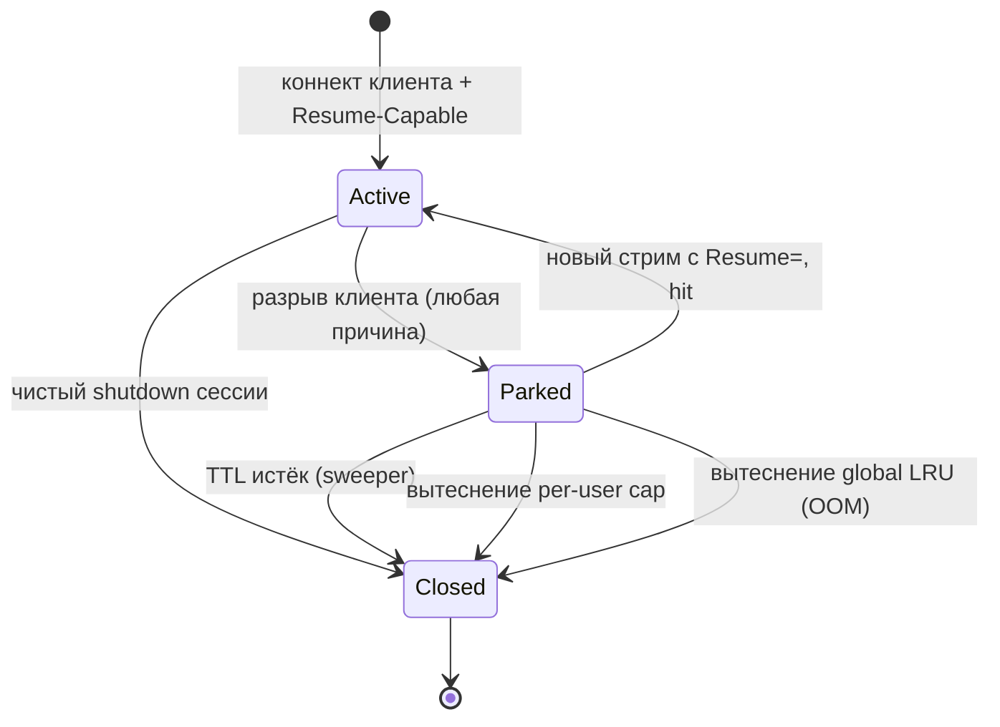

# Возобновление сессии (Session Resumption)

Документ описывает формат и runtime-семантику механизма возобновления сессии между разными транспортами в `outline-ss-rust`.

*English version: [SESSION-RESUMPTION.md](SESSION-RESUMPTION.md)*

## Цель и область применения

Возобновление сессии позволяет совместимому клиенту перенести существующую логическую сессию с одного входящего транспорта на другой (например, с raw QUIC на WebSocket-over-HTTP/2) **без переустановки upstream-соединения** к целевому хосту. Это решает сценарии, в которых сетевой путь между клиентом и сервером страдает от прерывистых потерь UDP или нестабильности пути, ломающих QUIC, но допускающих TCP, и наоборот.

### Что переносится

- `TcpStream` к upstream-цели (для TCP-релеев).
- `UdpSocket` и соответствующий NAT-binding (для UDP-релеев).
- Per-user счётчики метрик (они и так привязаны к `user_id` и переживают переезд автоматически).
- Для VLESS mux: целиком `MuxState` со всеми sub-сессиями (TCP и UDP), парковка атомарна.

### Что НЕ переносится

- Криптографическое состояние внутреннего протокола (Shadowsocks AEAD nonce / VLESS request). Каждый новый транспортный стрим выполняет полный свежий handshake.
- Байты, бывшие в полёте на момент разрыва TCP. На прикладном уровне они не пересылаются заново; буфер ядра upstream-сокета сохраняет то, что уже было поставлено в очередь.
- UDP-пакеты в полёте от upstream сверх ёмкости orphan-буфера (см. [Политика UDP back-buffer](#политика-udp-back-buffer)).
- Сессии через рестарт сервера. Реестр orphan'ов только in-memory.

### Совместимость

Возобновление сессии — строго opt-in расширение. Клиенты, которые его не объявляют, ОБЯЗАНЫ работать ровно как сегодня. Стандартные сторонние клиенты (sing-box, v2ray-core, официальный Outline) не затронуты, потому что:

- HTTP-header negotiation использует неизвестные `X-Outline-*` заголовки, которые остальные клиенты игнорируют.
- VLESS Addons opcode зарезервирован внутри TLV-секции `opt_len`, которую остальные реализации проходят без парсинга.
- В handshake'и без negotiation никаких байт не добавляется.

Фича рассчитана на пару `outline-ss-rust` ↔ `outline-ws-rust`. Это не публичный протокол.

## Идентификаторы

**Session ID** — 16 байт криптографически случайных данных, генерируемых сервером при первом успешном handshake'е сессии. Для клиента ID непрозрачен; клиент трактует его как байтовую строку и возвращает обратно при resume.

### Жизненный цикл

| Событие | Эффект |
|---|---|
| Первый успешный handshake с `Resume-Capable: 1` | Сервер выделяет свежий Session ID и возвращает клиенту |
| Транспортный стрим клиента закрывается (по любой причине) | Сервер переносит upstream-state в реестр orphan'ов, индексируемый по Session ID, с TTL |
| Приходит новый стрим с `Resume: <id>` | Сервер достаёт припаркованный state из реестра и привязывает к новому стриму |
| TTL истёк без resume | Сервер уничтожает припаркованный state (закрывает upstream-сокеты, дропает back-буферы) |

Session ID **принадлежит** ровно одному аутентифицированному пользователю. Resume-запросы с Session ID, принадлежащим другому пользователю, ОБЯЗАНЫ быть отвергнуты (см. [Безопасность](#соображения-безопасности)).

## Wire-формат

### Negotiation

Клиент сигнализирует поддержку и намерение через два кооперирующих поля:

- `Resume-Capable: 1` — отправляется клиентом в первом коннекте сессии, когда Session ID ещё не известен. Сообщает серверу: «если можешь выдать Session ID — выдай».
- `Resume: <hex32>` — отправляется клиентом в последующем коннекте, просит сервер возобновить припаркованную сессию по указанному Session ID.
- `Session: <hex32>` — отправляется сервером в ответе, несёт Session ID, который клиент должен использовать при следующем переподключении.

Ответ сервера всегда содержит `Session`, когда есть активная сессия, независимо от того, что запрашивал клиент. Если сервер не смог выполнить `Resume` (истёк, mismatch владельца, переполнение), ответ несёт свежий Session ID, и клиент трактует это как абсолютно новую сессию.

### WebSocket-транспорты (HTTP/1.1, HTTP/2, HTTP/3)

Negotiation едет через HTTP request/response заголовки, прикреплённые к WebSocket Upgrade или к HTTP/2 Extended CONNECT.

#### Заголовки запроса

| Заголовок | Формат | Смысл |
|---|---|---|
| `X-Outline-Resume-Capable` | `1` | Клиент объявляет, что понимает resumption |
| `X-Outline-Resume` | 32 строчных hex-символа | Клиент просит возобновить указанную сессию |

Оба заголовка опциональны. `Resume-Capable` отправляется в каждом коннекте, пока клиент хочет получать Session ID. `Resume` отправляется только когда клиент хочет возобновить конкретную припаркованную сессию и НЕ ДОЛЖЕН отправляться без недавно полученного Session ID.

#### Заголовки ответа

| Заголовок | Формат | Смысл |
|---|---|---|
| `X-Outline-Session` | 32 строчных hex-символа | Session ID, который клиент должен ассоциировать с установленной сессией |
| `X-Outline-Resume-Result` | `hit` \| `miss-expired` \| `miss-unknown` \| `miss-owner` \| `miss-capacity` \| `not-requested` | Результат resume-попытки, присутствует только когда запрос содержал `Resume` |

`Resume-Result = hit` означает, что upstream-state был привязан. Любое значение `miss-*` означает, что вместо этого создана свежая сессия.

### VLESS поверх raw QUIC

Для raw QUIC (ALPN `vless` / `vless-mtu`) HTTP-заголовков нет. Negotiation едет внутри секции Addons VLESS-запроса (TLV-блок с префиксом `opt_len` сразу после UUID пользователя).

Зарезервированы два новых opcode:

| Tag | Имя | Длина | Значение |
|---|---|---|---|
| `0x10` | `RESUME_CAPABLE` | 1 | `0x01` (должен присутствовать для opt-in) |
| `0x11` | `RESUME_ID` | 16 | Байты Session ID |

Запрос, содержащий `RESUME_ID`, интерпретируется как resume-попытка. Запрос, содержащий только `RESUME_CAPABLE`, — это свежая сессия, которая хочет получить Session ID.

Секция Addons VLESS-ответа (введена этим расширением; существующий протокол не кодирует response options для используемых нами типов запроса) несёт:

| Tag | Имя | Длина | Значение |
|---|---|---|---|
| `0x10` | `SESSION_ID` | 16 | Байты Session ID, назначенного этой сессии |
| `0x11` | `RESUME_RESULT` | 1 | `0x00` hit, `0x01` miss-expired, `0x02` miss-unknown, `0x03` miss-owner, `0x04` miss-capacity |

Стандартные VLESS-клиенты эти теги не парсят и игнорируют весь Addons-блок.

### Матрица negotiation

```
Клиент шлёт                 Сервер возвращает                         Поведение клиента
───────────────────────────────────────────────────────────────────────────────────
(ничего)                    (ничего)                                  Обычная сессия, resume невозможен
Resume-Capable              Session=<new>                             Сохранить Session ID
Resume-Capable + Resume=X   Session=<X>, Result=hit                   Продолжать использовать X
Resume-Capable + Resume=X   Session=<new>, Result=miss-*              Сбросить X, сохранить new
Resume=X (без Capable)      Session=<X>, Result=hit                   Продолжать использовать X (новый ID не нужен)
Resume=X (без Capable)      Session=<new>, Result=miss-*              Отбросить new (клиент opt-out)
```

## Серверная семантика

### Реестр orphan'ов

Один in-memory реестр на инстанс сервера:

```
struct OrphanRegistry {
    by_id:    DashMap<SessionId, Parked>,
    per_user: DashMap<UserId, SmallVec<[SessionId; 4]>>,
    sweeper:  JoinHandle<()>,
}
```

Значение `Parked` имеет одну из четырёх форм в зависимости от припаркованного транспорта:

```
enum Parked {
    Tcp { upstream_writer, upstream_reader, target, owner, deadline }
    UdpSingle { nat_entry, backbuf, owner, deadline }
    VlessMux { sub_conns, owner, deadline }
    QuicUdpBundle { sessions, owner, deadline }
}
```

`sweeper` — Tokio-задача, просыпающаяся каждые 5 секунд, проходящая по истёкшим записям и уничтожающая их.

### Последовательность парковки (на разрыв)

Когда транспортный стрим клиента закрывается, и для него был выдан Session ID:

1. Слить in-flight write-путь upstream'а, чтобы байты в буфере writer'а не потерялись.
2. Остановить **активную пересылку** в (закрывшийся) клиентский конец. Для TCP это значит дропнуть relay-задачу, копирующую upstream-read → client-write. Для UDP это переключить слот `UdpResponseSender` в `None`.
3. Сконструировать соответствующее значение `Parked`, несущее upstream-сокеты, reader-handles и per-user counter handles.
4. Вставить в `by_id` и добавить в `per_user`-список пользователя.
5. Если пользователь на лимите (`orphan_per_user_cap`), вытеснить самую старую запись этого пользователя перед вставкой.
6. Если глобальный лимит (`orphan_global_cap`) превышен, вытеснить по global LRU.
7. Установить `deadline = now + orphan_ttl_*`.

### Последовательность resume (на новый стрим с `Resume`)

1. Аутентифицировать новый стрим как обычно (Shadowsocks key match или VLESS UUID).
2. Посмотреть `Resume` в `by_id`. Возможные исходы:
   - **Не найден**: ответить `miss-unknown`, продолжить как свежая сессия.
   - **Mismatch владельца** (припаркована под другим пользователем): ответить `miss-owner`, не раскрывая существование ID. Продолжить как свежая сессия.
   - **Истёк** (deadline прошёл, но sweeper ещё не прошёлся): ответить `miss-expired`, удалить, продолжить как свежая сессия.
   - **Hit**: атомарно удалить из `by_id` и `per_user`. Перейти к шагу 3.
3. Привязать припаркованный upstream-state к relay-пути нового стрима:
   - **TCP**: назначить `upstream_writer`/`upstream_reader` в новый relay-state, заспавнить copy-задачи.
   - **UDP**: `nat_entry.sender.store(Some(new_sender))`, дренировать `backbuf` в `new_sender`, потом возобновить нормальную работу reader'а.
   - **VlessMux**: пройти `sub_conns`, привязать каждый к новому mux-диспетчеру.
   - **QuicUdpBundle**: пере-привязать datagram-канал каждой `VlessUdpSession` к новому QUIC `Connection`.
4. Ответить `Session = <тот же id>`, `Result = hit`.

### Поведение TCP

TCP-путь самый простой. Upstream `TcpStream` разделён на `OwnedReadHalf` / `OwnedWriteHalf`. Во время парковки:

- Reader-half **простаивает** — никакая задача из него не читает. TCP receive window ядра естественно создаёт back-pressure для upstream-партнёра (RWND, объявленное в момент парковки, остаётся таким; затем падает до нуля по мере заполнения буфера ядра).
- Writer-half **простаивает** — никакого клиентского трафика не идёт.

При resume оба half'а заспавниваются в свежие copy-задачи против нового клиентского стрима.

### Поведение UDP

UDP нельзя back-pressure-ить тем же способом. Пока клиента нет:

- Для каждой припаркованной UDP-записи reader-задача **продолжает работать** на upstream-сокете. Каждая принятая дейтаграмма дописывается в per-entry **back-buffer**.
- Back-buffer — bounded FIFO, измеренный в байтах. Когда полон, самая старая дейтаграмма дропается, и инкрементируется `orphan_udp_pkt_dropped_total{reason="backbuf_overflow"}`.
- Слот `UdpResponseSender` в `NatEntry` равен `None` во время парковки; reader видит это и направляет в back-buffer вместо клиента.

#### Почему байты, а не количество пакетов

UDP-приложения, использующие resumption, ожидаются как **стримящие** нагрузки (видео, большой RTP, туннелированный QUIC), где дейтаграммы около MTU. Лимит по числу пакетов создаёт радикально разные бюджеты памяти для DNS-подобного и для streaming-трафика. Лимит по байтам единообразен.

### VLESS mux

VLESS mux несёт несколько sub-соединений (TCP и UDP) в одном WebSocket frame stream. На разрыв:

- `MuxState` паркуется **атомарно** целиком. Отдельные sub-соединения не парковываются независимо.
- Каждое TCP sub-соединение внутри обрабатывается как припаркованный TCP-релей (idle reader/writer halves).
- Каждое UDP sub-соединение внутри обрабатывается как припаркованный UDP single (back-buffer, sender slot).
- `orphan_per_user_cap` считает **mux как одну** сессию, не его компоненты.
- Resume восстанавливает целиком MuxState; частичный resume не поддерживается.

Обоснование: смешение частичной парковки с переподцеплением на уровне sub-соединений создаёт тангль маппинга session-ID → sub, который хрупок и не имеет ясного use-case (клиенту пришлось бы помнить per-sub state).

### Bundle UDP-сессий raw QUIC

Каждое QUIC-соединение несёт `DashMap<u32, Arc<VlessUdpSession>>` UDP-сессий, ключ — назначенный клиентом session number. На потерю QUIC-соединения:

- Вся map `udp_sessions` паркуется как `QuicUdpBundle`.
- Каждая `VlessUdpSession` сохраняет свой `UdpSocket` и back-buffer.
- Resume требует, чтобы новый транспорт тоже был QUIC-соединением (чтобы datagram-routing работал) **или** переключения на WebSocket mux. Правило cross-transport маппинга:

  | Припаркован из | Возобновляется через | Поведение |
  |---|---|---|
  | Raw QUIC bundle | Raw QUIC | Пере-привязать datagram-sender каждой сессии к новому `Connection` |
  | Raw QUIC bundle | WebSocket VLESS mux | Сессии перенумеровываются в `u16`-namespace mux'а; клиент должен знать маппинг (отправляется в resume-ответе под тегом `0x12 SESSION_REMAP`, TLV: пары `<old:u32><new:u16>`) |
  | VLESS mux | Raw QUIC | Зеркально вышеуказанному; remap `u16` → `u32` |
  | TCP single | Что угодно | Remap не нужен |
  | UDP single (не-mux) | Что угодно | Remap не нужен |

Таблица remap включается только при смене транспорта между QUIC-bundle и WS-mux. При resume на тот же транспорт ответ remap не несёт.

## Клиентская семантика

Клиент держит `(SessionId, IssuedAt)` на каждую логическую сессию. Когда нижний транспортный стрим закрывается:

1. Если `now - IssuedAt < orphan_ttl - safety_margin` (default safety = 5 с), пытаться сделать resume.
2. Открыть новый транспорт (возможно, отличающийся от предыдущего — в этом весь смысл) и включить `Resume: <id>` в negotiation.
3. Если ответ говорит `hit`, верхний слой клиента НЕ ДОЛЖЕН наблюдать разрыв — возобновлённый стрим продолжает доставлять байты.
4. Если ответ говорит любое `miss-*`, верхний слой нотифицируется, что предыдущая сессия ушла; новая сессия — свежая.

Клиент ДОЛЖЕН ограничить число автоматических resume-попыток (рекомендуется 1–2), чтобы не уйти в плотный цикл против сервера, который повторно вытесняет.

## Ack-Prefix протокол (v1)

Базовый resumption-протокол паркует upstream `TcpStream` на разрыв и реаттачит его на следующем коннекте с `X-Outline-Resume`. Байты, которые клиент успел отправить через WebSocket-фреймы, но которые не дошли до сервера до того как нижележащий TCP между клиентом и сервером умер — **не** ретранслируются базовым протоколом: клиент не знает, какие из его исходящих байтов сервер форварднул upstream'у, а какие потерялись в полёте, поэтому наивный replay приведёт к дублированию.

**Ack-Prefix протокол** — это opt-in расширение, которое закрывает этот gap для upstream-направления: сервер сообщает обратно при каждом успешном resume точное число байт, которое он форварднул upstream'у, чтобы клиент мог replay'ить только те байты, что не дошли.

### Negotiation capability'ев

Два кооперирующих заголовка; оба должны присутствовать с обеих сторон, чтобы протокол активировался. Отсутствие любой стороны вызывает graceful fall-through на базовую resume-семантику (без replay'я; клиент должен принять разрыв на уровне сессии).

| Сторона | Заголовок | Формат | Значение |
|---|---|---|---|
| Запрос клиента | `X-Outline-Resume-Ack-Prefix` | `1` | Клиент понимает фичу и распарсит ack-prefix control frame на resume-hit'ах |
| Ответ сервера | `X-Outline-Resume-Ack-Prefix` | `1` | Сервер понимает запрос и эмитнет control frame на resume-hit'ах |

Capability независим от `Resume-Capable` / `Resume`: клиент, который хочет протокол, должен анонсировать его на каждом коннекте, включая первый коннект сессии (чтобы ответ сервера подтвердил поддержку до первого parked-and-resumed цикла).

### Wire-формат control frame'а

Когда **все** следующие условия истинны, сервер эмитит один SS-WS или VLESS-WS data frame перед любыми upstream→client relay-байтами на возобновлённой сессии:

1. Коннект — это resume-запрос (`X-Outline-Resume: <id>`).
2. Orphan-take прошёл (`Resume-Result: hit`).
3. Owner check прошёл (аутентифицированный пользователь совпадает с владельцем parked-сессии).
4. Клиент анонсировал `X-Outline-Resume-Ack-Prefix: 1` в запросе.
5. Сервер анонсировал `X-Outline-Resume-Ack-Prefix: 1` в ответе.

Plaintext payload фрейма — ровно 14 байт:

```
+0  : magic        "ORSM"           4 байта  ASCII
+4  : version      0x01             1 байт
+5  : flags        0x00             1 байт   зарезервировано (must be 0 in v1)
+6  : up_acked     u64 BE           8 байт   байт, форварднутых сервером upstream'у
                                              за всю жизнь этой сессии
                                              (включая все предыдущие реаттачи)
+14 : (end)
```

Для SS-WS 14 байт идут через стандартный AEAD-encryption chain relay'я — та же форма, что у любого data frame'а. Для VLESS-WS 14 байт — это payload WS frame'а напрямую.

#### Семантика полей

- **`magic`** — фиксированный ASCII `"ORSM"` (Outline Resume Sync Message). Отличает control frame от случайных upstream-байт, которые могут начинаться с такого же префикса; никакой application-level upstream-протокол не ожидается начинающимся с этой 4-байтной последовательности в начале сессии, а проверки `version` + `flags` ниже добавляют второй слой гарантии.
- **`version`** — `0x01` для текущей итерации. Будущие ревизии бампят этот байт; клиенты, которые видят более высокую версию, которую не знают как парсить, ОБЯЗАНЫ дропнуть сессию и переконнектиться без capability'я, а не предполагать безопасный replay.
- **`flags`** — зарезервированы; клиенты, которые видят любые ненулевые биты в v1, ОБЯЗАНЫ дропнуть сессию.
- **`up_acked`** — общее число байт upstream-направления payload'а, которые сервер успешно записал в upstream `TcpStream` за всю жизнь этой сессии. Счётчик монотонный, аккумулируется через парковки и реаттачи, никогда не сбрасывается. Живёт на `ParkedTcp` и сохраняется verbatim в orphan-реестре.

### Эмиссия на сервере

На resume-hit'е (post-auth, post-orphan-take), перед re-spawn'ом upstream→client relay-таска, сервер:

1. Читает `upstream_bytes_acked` из parked-state.
2. Конструирует 14-байтный control-frame payload по спецификации выше.
3. Шлёт его как первый WS data frame на новом транспорте, через SS / VLESS encryption-слой возобновляющейся коннекции.

Только после того как control frame записан в WS sink, сервер передаёт управление standard relay-пути, копирующему upstream-байты клиенту.

Frame **не** шлётся на:

- Свежие сессии (без resume-запроса).
- Resume-промахи (`miss-expired`, `miss-unknown`, `miss-owner`, `miss-capacity`) — parked state не был приаттачен, нет осмысленного счётчика.
- Resume-hit'ы, где клиент не анонсировал capability.

### Парсинг на клиенте

Когда клиент запросил resume **и** анонсировал capability **и** ответ несёт `X-Outline-Resume-Ack-Prefix: 1`, клиент трактует первый расшифрованный data frame на новом транспорте как control frame:

1. Валидирует `magic == "ORSM"` (4 байта).
2. Валидирует `version == 0x01`.
3. Валидирует `flags == 0x00`.
4. Читает `up_acked` (8 байт, big-endian u64).

Если валидация упала на любой проверке, клиент ОБЯЗАН дропнуть сессию и откатиться на свежий коннект без capability'я — wire-форма не распознана, продолжение рискует upstream byte corruption.

Если валидация прошла, клиент использует `up_acked` как offset в свой replay-буфер: байты 0..`up_acked` форварднуты сервером upstream'у (уже доставлены), и ОБЯЗАТЕЛЬНО должны быть пропущены при replay'е; байты `up_acked`..`client_up_sent` — в полёте, и ДОЛЖНЫ быть replay'ены на новый транспорт перед возобновлением нормального forwarding'а client→upstream.

Если `up_acked > client_up_sent` — нарушен инвариант протокола (сервер заявляет о большем числе forwarded'нутых байт, чем клиент о посланных), и клиент ОБЯЗАН дропнуть сессию. Если `up_acked` старше самого старого retained offset'а в буфере клиента (буфер был перезаписан, потому что клиент отправил слишком много байт без серверных ack'ов), клиент не может реконструировать недостающие байты и ОБЯЗАН дропнуть сессию.

### Downstream-направление

v1 Ack-Prefix Протокола покрывает **только upstream**-направление. Downstream (server→client) не имеет эквивалентной гарантии — байты, которые сервер эмитнул в WS, но которые не дошли до клиента до разрыва, просто теряются. Application-протоколы, требующие loss-free downstream-доставки (например, SSH, raw TCP через SS без HTTP-layer retry), best-effort под v1 resume; протоколы со своим application-layer retry (HTTP request bodies, идемпотентные RPC) не страдают.

Будущая v2 может добавить симметричный downstream prefix, несущий `down_received` счётчик клиента, server-side back-buffer недавних downstream-байт, и offset-based replay; отложено до тех пор, пока операционные данные не покажут, что upstream-only v1 оставляет измеримые gap'ы в реальном трафике.

### Матрица совместимости

| Capability клиента | Capability сервера | Resume hit | Поведение |
|---|---|---|---|
| Off | Any | Any | Базовая resume-семантика (без replay; разрыв сессии при потере байт) |
| On | Off | Any | Сервер не эхо'ит capability → клиент откатывается на базу |
| On | On | No (fresh / miss) | Control frame не шлётся; свежая сессия; replay не нужен |
| On | On | Yes | Сервер эмитит control frame; клиент парсит и replay'ит из offset'а |

## Диаграмма жизненного цикла



## Ошибки и пограничные случаи

| Случай | Поведение сервера |
|---|---|
| Resume ID совпал, но владелец другой | `miss-owner`; не раскрывать существование; трактовать как свежую сессию |
| Два одновременных resume-запроса на тот же ID | `take()` атомарен; проигравший получит `miss-unknown` |
| Upstream-сокет умер во время парковки | Resume на уровне протокола успешен; на первом read после привязки клиент получит EOF / ошибку |
| Клиент очень быстро снова разрывается (re-park) | Выдан новый Session ID; старый ID дропается |
| `Resume-Capable` отправлен без TLS / по plaintext-пути | Принимается (resumption сам по себе TLS не требует, но Shadowsocks / VLESS auth не меняется) |
| Resume-запрос без `Resume-Capable` | Допустимо; клиент opt-out от получения будущего Session ID для этой сессии |
| Ошибка sub-стрима в mux'е (in-band) без разрыва WS | Sub-соединение закрывается обычно; mux остаётся активным и НЕ паркуется этим событием |
| Рестарт сервера | Все припаркованные сессии исчезают; resume-запросы после рестарта возвращают `miss-unknown` |

## Соображения безопасности

### Конфиденциальность Session ID

Session ID — bearer-токен: тот, кто его узнает и имеет креды пользователя, может украсть припаркованный upstream-сокет. Митигация:

- **Owner check**: возобновляющее соединение должно аутентифицироваться как тот же пользователь, которому принадлежит припаркованная сессия. Атакующему нужно и Shadowsocks key / VLESS UUID пользователя, **и** Session ID.
- **Длина**: 128 бит CSPRNG-вывода, brute-force невозможен.
- **Single-use на уровне реестра** (`take()` удаляет из реестра при hit'е).

### Раскрытие информации

Ответ `miss-owner` раскрыл бы, что ID существует, но принадлежит кому-то другому. Чтобы избежать oracle-поведения, **сервер возвращает `miss-unknown` и для действительно отсутствующих ID, и для ID с mismatch владельца**, но логирует `miss-owner` внутренне (security event). Только `miss-expired` и `miss-capacity` сообщаются как есть, поскольку не раскрывают владения.

### Исчерпание ресурсов

Per-user cap (`orphan_per_user_cap`, default 4) не даёт одному пользователю накопить сессии. Global LRU eviction по `orphan_global_cap` предотвращает патологическое суммарное потребление.

### Downgrade negotiation

MITM, удаляющий `X-Outline-Resume-Capable` из запроса, может предотвратить resumption. Это не хуже сегодняшнего положения: соединение всё равно работает, просто без resumption. Ни одно security-чувствительное поведение не привязано к тому, включён ли resumption.

## Конфигурация

Все параметры читаются из `config.toml` под новой секцией `[session_resumption]`. Все опциональны; отсутствие отключает фичу.

```toml
[session_resumption]
enabled = true
orphan_ttl_tcp_secs = 30
orphan_ttl_udp_secs = 30
orphan_per_user_cap = 4
orphan_global_cap = 10000
```

При `enabled = false` все `X-Outline-Resume*` заголовки и VLESS Addons opcode'ы игнорируются на серверной стороне; клиенты видят то же поведение, как если бы говорили со старым сервером.

## Метрики

Все эмитятся через существующий Prometheus-подсистему.

| Метрика | Тип | Метки | Описание |
|---|---|---|---|
| `orphan_park_total` | counter | `transport`, `kind` | Сессии, перенесённые в реестр orphan'ов |
| `orphan_resume_hit_total` | counter | `transport_from`, `transport_to` | Успешные resume, размечены сменой транспорта |
| `orphan_resume_miss_total` | counter | `reason` | Неудачные resume (`expired`, `unknown`, `owner`, `capacity`) |
| `orphan_current` | gauge | `kind` | Текущий счёт orphan'ов по виду (`tcp`, `udp_single`, `vless_mux`, `quic_bundle`) |
| `orphan_evicted_oom_total` | counter | `kind` | Вытеснения из-за глобального cap'а или байтового бюджета |
| `orphan_udp_pkt_dropped_total` | counter | `reason` | UDP-пакеты, дропнутые во время парковки (`backbuf_overflow`) |
| `orphan_udp_buf_bytes` | gauge | — | Текущий суммарный объём, занятый UDP back-буферами |

## Что вне охвата (Non-Goals)

Следующее намеренно не покрывается этой ревизией:

- **Симметричный (downstream) zero-loss replay**. Ack-Prefix Протокол v1 (документирован выше) закрывает gap byte-loss в upstream-направлении (client→server→upstream), но оставляет downstream без изменений: байты, которые сервер эмитнул в WS, но не дошли до клиента до разрыва, теряются. Добавление симметричного downstream-replay'я требует server-side back-buffer'а недавних downstream-байт и client→server `down_received` заголовка; отложено до тех пор, пока операционные данные не оправдают стоимость.
- **Persistent registry через рестарт**. Resume после рестарта сервера не поддерживается. Реализация требует либо передачи FD через systemd socket activation, либо переустановки upstream'а из сохранённого состояния, оба варианта добавляют значительную сложность ради маргинальной выгоды.
- **Server-initiated migration**. Сервер не может отправить клиенту сообщение «иди на другой транспорт». Миграция всегда инициируется клиентом, когда его текущий транспорт ломается.
- **Resumption для SS поверх raw QUIC**. У протокола Shadowsocks нет точки расширения, эквивалентной Addons. Клиенты, нуждающиеся в resumption, должны использовать Shadowsocks-over-WebSocket, где negotiation несут заголовки.
- **Resumption для прямого SS UDP** (без WebSocket-туннелирования). Прямой SS UDP идентифицирует сессии по `SocketAddr` клиента; смена транспорта подразумевает другой клиентский адрес, что и так создаёт свежую NAT-запись. Полезного state'а сохранять нечего.
- **Cross-server resumption**. Resume только в пределах одного сервера. Любой балансировщик нагрузки спереди ОБЯЗАН быть sticky (по client IP или по L4-хешу, переживающему смену транспорта), чтобы resumption работал.
- **Частичный mux resume**. Целиком `MuxState` паркуется атомарно. Возможности возобновить только подмножество sub-соединений нет.
